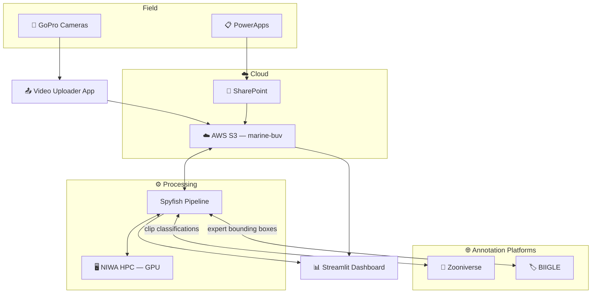
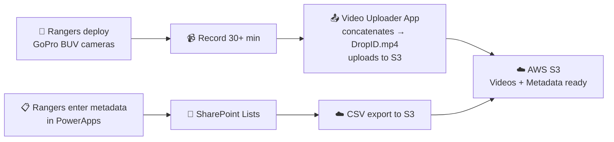
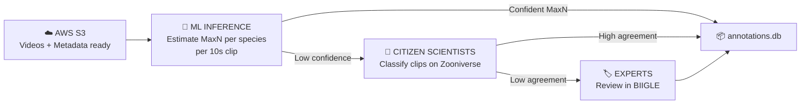
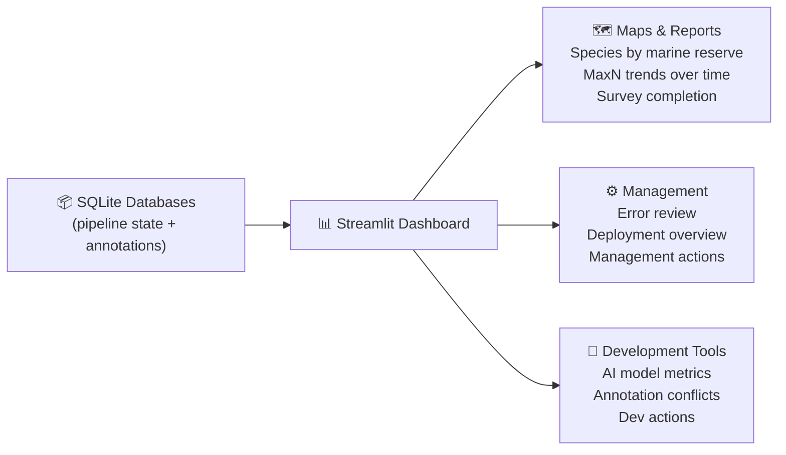
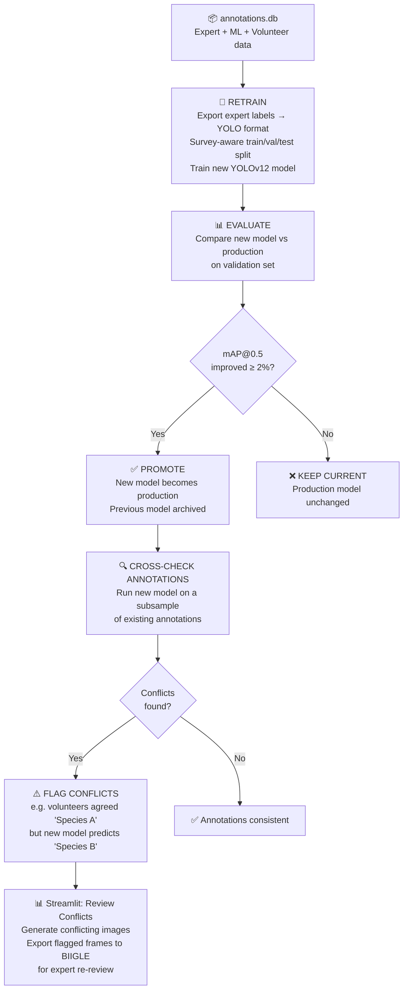

# 🐟 Spyfish — System Architecture

> **North Star Reference** · Last updated: 15 May 2026
>
> This document is the single source of truth for Spyfish.
> Every stakeholder — rangers, scientists, engineers, and contributors — should
> refer to this to understand what we're building and where we're headed.

---

## What is Spyfish?

**Spyfish** is a methodology for turning underwater footage into structured
biological observations. It is not tied to any specific tool, platform, or
location — any group collecting underwater video can follow the same steps.

**Spyfish Aotearoa** is the first implementation of Spyfish, built for
New Zealand's marine protected areas using AWS, YOLO, Zooniverse, BIIGLE,
and a Streamlit dashboard.

---

## The Big Picture

```
  1. Fieldwork         2. Storage         3. Annotation         4. Dashboard         5. Sharing
  Collect footage  ──► Upload to     ──► ML / CitSci /     ──► View results   ──► Publish insights
  and metadata         storage           Expert review          privately           and data
```

### Spyfish Aotearoa — System Context



---

## Who Uses What

| Stakeholder | What they do | Primary tools | Secondary tools |
|---|---|---|---|
| **DOC Rangers** | Deploy cameras, enter field metadata, view survey status. | PowerApps, Video Uploader App | Streamlit Dashboard (survey status, view-only) |
| **DOC Scientists** | Analyse data, monitor species trends, generate reports. | **Streamlit Dashboard** (Maps & Reports) | SharePoint |
| **Core Team** | Keep the pipeline running, manage errors, retrain models. | **Streamlit Dashboard** + CLI, GitHub, Notion | — |
| **External Researchers / Ecologists** | Contribute expertise (species ID, fish sizing, bounding boxes). | **Streamlit Dashboard**, Notion, BIIGLE | — |
| **Citizen Scientists** | Classify 10-second video clips into species categories. | **Zooniverse** | — |

---

## Technology Stack

| Layer | Technology | Why |
|---|---|---|
| **Language** | Python 3.12+ | ML ecosystem, data manipulation, all external API clients |
| **ML Model** | Ultralytics YOLOv12 | Real-time object detection; active development |
| **Video Processing** | OpenCV + FFmpeg | OpenCV for frame extraction (pixel parity with YOLO); FFmpeg for clip encoding |
| **Database** | SQLite (2 files) | Zero infrastructure, file-based, synced to S3; fits ~1k deployments/year |
| **Cloud Storage** | AWS S3 (`marine-buv`) | DOC-managed shared store for videos, databases, and outputs |
| **GPU Compute** | NIWA Mahuika HPC (Slurm) | NeSI allocation for NZ-based research; GPU acceleration |
| **Citizen Science** | Zooniverse + Caesar | Volunteer classification with automated retirement rules |
| **Expert Annotation** | BIIGLE (REST API) | Full species list, bounding boxes, future substrate/size review |
| **Dashboard & Reporting** | Streamlit | Pipeline ops, maps, graphs, species reporting — serves all audiences |
| **Metadata Entry** | PowerApps | Mobile-first field data entry for rangers |
| **Video Upload** | Video Uploader App (BytesNZ) | Concatenates GoPro segments, uploads to S3 |
| **Configuration** | YAML + python-dotenv | Non-secret config in `config.yaml`; secrets in `.env` |

---

## Data Pipeline — End to End (Spyfish Aotearoa)

This is the journey of a single underwater video from the ocean to a conservation report.

### Phase 1 — Field to Cloud



### Phase 2 — Automated Pipeline




### Phase 3 — Dashboard



### Phase 4 — Sharing

Publish insights and data back to the wider community:
- Export standardised data to **OBIS** or other biodiversity platforms
- Generate semi-automated reports for conservation stakeholders
- Share results with citizen science volunteers who contributed

---

## Streamlit Dashboard Pages

The Streamlit app (`app/`) is the **single reporting and operations interface** for all stakeholders.

| Page | Audience | Purpose |
|---|---|---|
| 🐟 **Home** | Everyone | Navigation and quick links |
| 🗺️ **Maps & Reports** | DOC Scientists + Rangers + Everyone | Map with deployments/MaxN per reserve, time-series of species counts (year × MaxN, filter by species) |
| ⚙️ **Management** | Core Team + Scientists | Error review, deployment/survey/annotations overview, shortcuts to management actions (status updates, data export, etc.) |
| 📺 **View Deployment Videos** | Core Team | Browse and play deployment videos |
| 🔧 **Development Tools** | Core Team | AI model overview (metrics, confusion matrix, promotion), annotation conflict review, shortcuts to development actions (retrain, cross-check, BIIGLE export) |

> **Access control**: Different pages will have different access levels.
> Rangers can view survey status but cannot trigger pipeline actions.
> Scientists can access Maps & Reports. Core Team has full access.

---

## Data Architecture

### Two Databases, Two Concerns

```
spyfish_pipeline.db              spyfish_annotations.db
────────────────────             ──────────────────────
deployments  (pipeline state)    annotations  (what was observed)
sites        (reference data)
validation_errors (data quality)
```

**Why separate?** Pipeline state (where is this deployment in the workflow?) and
observation data (what species were seen?) have different access patterns.
Separating them lets annotation data be queried and exported without locking
pipeline state during processing.

### What goes into annotations.db

All three annotation sources write to the same `annotations` table:

| Source | When | `annotated_by` value |
|---|---|---|
| **ML inference** | After YOLO runs (Step 2-3) | Model name (e.g. `cfd_binary_water_20260301`) |
| **Volunteer agreement** | After Zooniverse sync (Step 5) | `citsci` |
| **Expert annotation** | After BIIGLE sync (Step 7) | `expert` |

### Pipeline Status Model

Each deployment tracks **five independent sections** that progress separately:

```
Section       States
─────────     ──────
ingest        ok → excluded / validation_error
ml            ml_pending → ml_ready → ml_running → ml_complete
citsci        citsci_pending → clips_uploaded → citsci_complete
biigle        expert_pending → expert_uploaded → expert_complete
reporting     reporting_pending → reporting_complete
```

Each section has its own `_error` state. Sections advance independently —
Zooniverse and BIIGLE can run in parallel on the same deployment.

### Annotation Trust Hierarchy

Three sources of annotation, with a clear hierarchy:

```
ML annotations  ──►  Citizen Science  ──►  Expert annotations
(automated)          (crowd-validated)      (ground truth — wins)
```

All three are stored in the same `annotations` table. When expert annotations
exist for a deployment, they are the authoritative record for reporting and
model retraining. ML and citsci annotations remain for comparison and auditing.

---

## S3 Bucket Layout

```
marine-buv/                           (production, DOC-managed)
├── spyfish_metadata/
│   └── sharepoint_lists/             ← Deployment, Survey, Site, Species CSVs
│       ├── BUV Deployment.csv
│       ├── BUV Survey Metadata.csv
│       ├── BUV Survey Sites.csv
│       └── BUV Species.csv
│
├── media/
│   └── {SurveyID}/{DropID}/          ← Raw concatenated videos
│       └── {DropID}.mp4
│
└── process_files/                    ← Pipeline outputs, synced after each run
    ├── db/                           ← SQLite databases
    ├── deployment_data/
    │   └── {SurveyID}/{DropID}/
    │       ├── annotations/          ← MaxN CSVs, raw detections, COCO JSON
    │       ├── clips/                ← 10s MP4 clips (Zooniverse)
    │       ├── frames/               ← JPEGs (Zooniverse + BIIGLE)
    │       └── qa_frames/            ← ML-annotated frames with boxes (QA)
    └── models/                       ← YOLO weights (production + base)
```

---

## Naming Conventions

```
AHE_20250513_BUV_AHE_057_01
│   │         │   │   │   └─ Replicate (01, 02, ...)
│   │         │   │   └───── Site number (057)
│   │         │   └───────── Location code (AHE)
│   │         └───────────── Always "BUV"
│   └─────────────────────── Date (YYYYMMDD)
└─────────────────────────── Location code
```

- **DropID** = one camera deployment = one video
- **SurveyID** = `AHE_20250513_BUV` (groups drops from the same trip)
- **SiteID** = `AHE_057` (the physical monitoring site)

---

## ML Model Strategy

The model starts as a **binary classifier** (fish vs no-fish) and evolves into a
**multi-class detector** as training data accumulates for each species.

Species with fewer than 200 annotated frames are automatically merged into a
generic "fish" class (the *floor*) during training — they'll be promoted to
their own class once enough expert annotations exist.

### Model Versioning

Each model version is identified by its **weight filename stem**, which encodes
the training context:

```
cfd_binary_water_20260301
│   │      │     └──────── Date trained (YYYYMMDD)
│   │      └────────────── Training data domain
│   └───────────────────── Model type (binary / species)
└───────────────────────── Project prefix
```

| Artifact | Location | Purpose |
|---|---|---|
| **Production weights** | `process_files/models/pipeline_model/` | Active model used by all inference runs |
| **Base weights** | `process_files/models/base_model/` | Starting checkpoint for retraining |
| **Archived weights** | `process_files/models/archived_models/` | Previous production models (rollback) |
| **Training results** | `process_files/training/{type}/results/` | Metrics, curves, confusion matrices per run |

The model name is embedded in every output it produces — raw detection CSVs are
named `{DropID}_{model_name}_raw.csv` and annotation records in `annotations.db`
store the model name in the `annotated_by` / `external_id` fields. This makes
every annotation traceable to the exact model version that produced it.

### Dataset Versioning

Each retraining run produces a **reproducible snapshot** of the data used:

| Artifact | What it captures |
|---|---|
| `data.yaml` | Class list, train/val/test paths — the YOLO contract |
| `class_map.json` | Species → class ID mapping (including floor remaps) |
| `excluded_drops.txt` | DropIDs removed from training |
| `force_val_drops.txt` | DropIDs pinned to the validation split |
| `split_seed` in config | Seed for reproducible train/val/test assignment |

- **Survey-aware splits**: Train/val/test are split at the drop level, with
  surveys contributing drops proportionally. No data leakage across splits.
- **Curated exclusion lists**: Bad drops and specific drops can be pinned to val
  or excluded entirely via text files.
- **Per-drop frame cap**: Each drop contributes at most N frames (default 100)
  to prevent overrepresented deployments from dominating training.

### Retraining, Evaluation & Cross-Check

Retraining is a **separate workflow** triggered after new expert annotations
are available.



- **Annotation conflict detection**: After promotion, the new model runs inference
  on a subsample of existing volunteer and ML annotations. Where the new model
  disagrees (e.g. volunteers agreed "Species A" but the model predicts "Species B"),
  those frames are flagged. The Streamlit Development Tools page can generate
  these conflicting images and export them to BIIGLE for expert re-review.

---

## Security & Sensitive Data

> ⚠️ **Before sharing any data or dashboard access, review against these categories:**

| Category | Example | Risk |
|---|---|---|
| **Locations** | GPS lat/lon of deployment sites | Could enable illegal fishing |
| **Rare species** | Presence of protected species | Could attract poaching |
| **PII** | Names, contracts, team details | Privacy obligation |

**Credentials:** All secrets in `.env` (never committed). AWS keys, BIIGLE tokens,
Zooniverse credentials are loaded at startup via `python-dotenv`.

---

## Contributing

For detailed technical documentation (state machines, module reference,
configuration reference), see [`design_doc.md`](design_doc.md).

For issues and feature requests:
[github.com/wildlifeai/Spyfish-Aotearoa-toolkit/issues](https://github.com/wildlifeai/Spyfish-Aotearoa-toolkit/issues)
