# Spyfish Software Architecture - Design Document

**Last changed:** 08. April 2026

**Primary stakeholders:** DOC (Department of Conservation), Rangers, Spyfish team

**Source references:** Spyfish Notion overview, [How to Spyfish](https://www.notion.so/How-to-Spyfish-1b28b68cc7b480238352fd84b064c976?pvs=21) guide , [Software Architecture](https://www.notion.so/Software-Architecture-1a88b68cc7b480bc9a18dab525a3c064?pvs=21) and the codebase [TODO add link]

---

## Table of Contents

1. [Background & Context](#1-background--context)
   - [Mission](#mission)
   - [The problem](#the-problem)
   - [Physical setup](#physical-setup)
   - [Domain concepts](#domain-concepts)
   - [Scale](#scale)
2. [Goals & Success Criteria](#2-goals--success-criteria)
   - [Objectives](#objectives)
   - [Success criteria](#success-criteria)
3. [System Context](#3-system-context)
   - [Data flow](#data-flow-1)
   - [Who uses what](#who-uses-what)
   - [Actors](#actors)
   - [Two dashboards, two audiences](#two-dashboards-two-audiences)
4. [Technical Architecture](#4-technical-architecture)
   - [Technology stack](#technology-stack)
   - [ML model strategy](#ml-model-strategy)
   - [Config and orchestration](#config-and-orchestration)
   - [Processing modules](#processing-modules)
5. [Data Flow](#5-data-flow)
   - [Pre-pipeline: how videos reach S3](#pre-pipeline-how-videos-reach-s3)
   - [End-to-end pipeline data flow](#end-to-end-pipeline-data-flow)
   - [Annotation sources and trust](#annotation-sources-and-trust)
   - [File artifacts per deployment](#file-artifacts-per-deployment)
6. [Data Modeling](#6-data-modeling)
   - [Entity relationships](#entity-relationships)
   - [Two-database design](#two-database-design)
   - [Two orthogonal status dimensions](#two-orthogonal-status-dimensions)
7. [Pipeline State Machine](#7-pipeline-state-machine)
   - [Error and hold recovery](#error-and-hold-recovery)
   - [Transition rules](#transition-rules)
8. [Component Design](#8-component-design)
   - [Declarative stage framework](#declarative-stage-framework)
   - [Configuration design](#configuration-design)
   - [Clip selection strategy](#clip-selection-strategy)
9. [Security & Sensitive Data](#9-security--sensitive-data)
   - [Sensitive data categories](#sensitive-data-categories)
   - [Credential management](#credential-management)
   - [S3 access](#s3-access)
   - [Path safety](#path-safety)
10. [Alternatives Considered](#10-alternatives-considered)
    - [Database: SQLite vs cloud database](#database-sqlite-vs-cloud-database)
    - [Architecture: monolithic vs microservices](#architecture-monolithic-pipeline-vs-microservices)
    - [ML compute: local vs cloud GPU vs HPC](#ml-compute-local-vs-cloud-gpu-vs-hpc)
    - [Clip selection: random vs ML-guided](#clip-selection-random-sampling-vs-ml-guided)
    - [Reporting: Streamlit vs PowerBI](#reporting-dashboard-streamlit-vs-powerbi)
11. [Milestones](#11-milestones)
    - [Phase 1 — Core Pipeline](#phase-1--core-pipeline--near-complete)
    - [Phase 2 — Annotation Platforms](#phase-2--annotation-platforms--in-progress)
    - [Phase 3 — Model Improvement Loop](#phase-3--model-improvement-loop)
    - [Phase 4 — User Interaction & Admin](#phase-4--user-interaction--admin)
    - [Phase 5 — Production Hardening](#phase-5--production-hardening)
    - [Phase 6 — DOC Reporting](#phase-6--doc-reporting)
12. [Known Gaps & Future Work](#12-known-gaps--future-work)
    - [Zooniverse volunteer sync (step 5b)](#zooniverse-volunteer-sync--step-5b-pipeline-wiring)
    - [PowerBI annotation data feed](#powerbi--annotation-data-feed-is-manual)
    - [User interaction with database and pipeline](#user-interaction-with-the-database-and-pipeline)
    - [SharePoint → S3 metadata download](#sharepoint--s3-metadata-download)
    - [GoPro video concatenation](#gopro-video-concatenation--upstream-of-this-pipeline)
    - [BIIGLE future scope](#biigle-future-scope-substrate-and-size-review)
    - [NeSI crontab scheduling](#nesi-crontab-scheduling--hardening-in-progress)
13. [Setup & Prerequisites](#13-setup--prerequisites)
14. [Running the Pipeline](#14-running-the-pipeline)
15. [Admin & Debugging](#15-admin--debugging)
16. [Configuration Reference](#16-configuration-reference)
17. [Module Reference](#17-module-reference)
18. [Model Retraining](#18-model-retraining)
19. [Web Dashboard](#19-web-dashboard)
20. [Testing](#20-testing)
21. [Adding a New Pipeline Stage](#21-adding-a-new-pipeline-stage)
22. [Legacy Data Retrieval](#22-legacy-data-retrieval)

---

## 1. Background & Context

### Mission

> **Spyfish Aotearoa is a citizen science and machine learning approach to classify baited underwater video (BUV) footage collected from New Zealand marine reserves, allowing the Department of Conservation (DOC) to streamline Marine Reserve reporting.**

### The problem

New Zealand's marine reserves are monitored using **Baited Underwater Video (BUV)** cameras — underwater rigs that record ~30-minute videos around a bait station to attract fish. Analysing these videos manually is extremely time-consuming: a single survey season can produce hundreds of videos, each requiring frame-by-frame review by a trained ecologist to count species and record the maximum observed count (MaxN — maximum number of individuals visible in any single video frame).

The Spyfish Aotearoa project turns this into a semi-automated pipeline by combining:

- **Machine learning** (YOLO object detection) to pre-screen videos and find frames of interest
- **Citizen science** (Zooniverse) to engage the public in verifying detections
- **Expert annotation** (BIIGLE) to produce ground-truth labels for model improvement

The output is a structured, quality-controlled dataset of fish observations that DOC uses for marine reserve monitoring reports and biodiversity assessments.

### Physical setup

BUV cameras are GoPros mounted on a triangular metal frame with a bait at the bottom. Key characteristics:

- **Resolution:** typically 1920×1080 at 60fps (varies across GoPro generations)
- **Duration:** 30+ minutes per deployment
- **File splitting:** GoPro cameras automatically split long recordings into ~15-minute / 4GB segments

> **Note — GoPro concatenation:** Before videos arrive in S3, the separate GoPro segments for a single deployment must be concatenated into a single `.mp4` file named `{DropID}.mp4`. This is handled by the **video-uploader app** (a separate desktop application, not part of this repository). The pipeline assumes a single pre-concatenated file already exists in S3. See §12 for the upload workflow.

### Domain concepts


| Term                  | Meaning                                                                                                     |
| --------------------- | ----------------------------------------------------------------------------------------------------------- |
| **BUV / BRUV**        | Baited (Remote) Underwater Video — the camera deployment rig                                                |
| **Drop / DropID**     | One camera deployment = one video. Format: `AHE_20250513_BUV_AHE_057_01`                                    |
| **Survey / SurveyID** | A group of deployments from the same survey trip. Format: `AHE_20250513_BUV`                                |
| **MaxN**              | Maximum number of individuals of a species visible in any single frame — the standard fish abundance metric |
| **Sampling window**   | The portion of the video processed, defined by `SamplingStart` and `SamplingEnd` (seconds)                  |


### Timestamp convention

All time values in CSVs, databases, and code follow two reference frames:

| Suffix | Meaning | Example columns |
|---|---|---|
| **AbsSeconds** | Seconds from the start of the video file | `TimeOfMaxAbsSeconds`, `TimeAbsSeconds`, `SamplingStart`, `SamplingEnd` |
| **DeploySeconds** | Seconds relative to `SamplingStart` (the deployment window) | `ClipStartDeploySeconds`, `ClipEndDeploySeconds` |

**Rule:** `seek_position = SamplingStart + ClipStartDeploySeconds` always gives an absolute video timestamp.
`TimeOfMaxAbsSeconds` is always used directly as a seek position without adding `SamplingStart`.

`SamplingStart` and `SamplingEnd` are stored in the database as absolute seconds from video start.
The raw ML CSV (`time_seconds` column) and MaxN CSV (`TimeOfMaxAbsSeconds`) are both absolute.

---

### Naming convention

```
AHE_20250513_BUV_AHE_057_01
│   │         │   │   │   └─ Replicate within site (zero-padded, 2 digits)
│   │         │   │   └───── Site number within location (3 digits)
│   │         │   └───────── Location code (3 letters)
│   │         └───────────── Dataset type (always BUV)
│   └─────────────────────── Date (YYYYMMDD)
└─────────────────────────── Location code (3 letters)
```

`SurveyID` groups deployments from the same trip: `AHE_20250513_BUV`.
`SiteID` identifies the monitoring site: `AHE_057`.

### Scale

- Approximately **~1,000 new deployments per year**
- Each video is exactly **30 minutes**
- Videos are typically **~10 GB** each (resolution dependent)
- The pipeline is designed to run regularly (e.g. daily or weekly) as new videos arrive in S3

---

## 2. Goals & Success Criteria

### Objectives

1. **Automate and standardise** the BUV data workflow, from field collection to final reporting
2. **Enhance data integrity and traceability** throughout the data lifecycle
3. **Significantly reduce reliance on manual data processing**, enabling a scalable increase in monitoring capacity

### Success criteria


| Criterion                 | Description                                                                                                                                                  |
| ------------------------- | ------------------------------------------------------------------------------------------------------------------------------------------------------------ |
| **Pipeline reliability**  | New deployments flow through all stages without errors or manual restarts                                                                                    |
| **Data completeness**     | All deployments in source metadata are tracked; none silently skipped                                                                                        |
| **Model quality**         | YOLO model reliably detects fish across species, environments, and lighting. New model versions must improve by ≥2% mAP over previous version to be promoted |
| **Annotation throughput** | Expert and citizen science review cycles complete within a survey season                                                                                     |
| **Auditability**          | Every state transition is logged; every annotation is traceable to its source (`ml`, `expert`, or `citsci`)                                                  |
| **Reproducibility**       | Re-running any pipeline stage on the same input produces the same output                                                                                     |
| **DOC accessibility**     | Fish count data is accessible to DOC/Rangers through the reporting dashboard without requiring pipeline access                                               |


---

## 3. System Context

### The broader Spyfish ecosystem

The pipeline repository (`spyfish-aotearoa-toolkit`) is **one component** within a larger ecosystem of tools. It is important to understand what sits outside this codebase:

#### Data flow

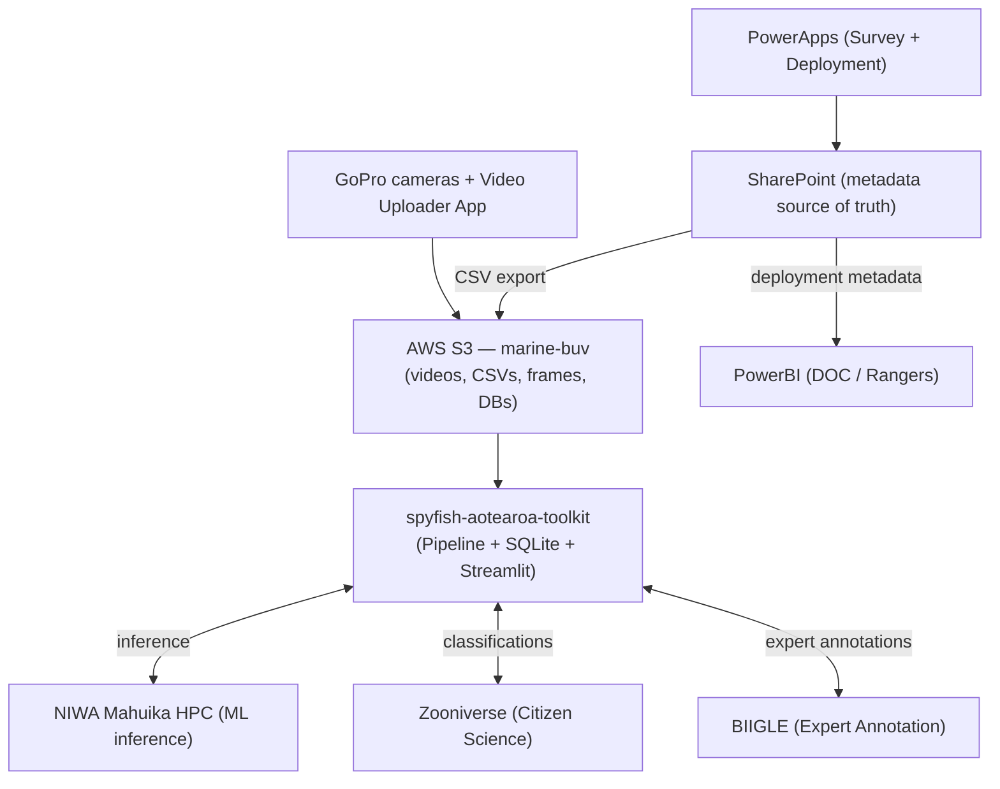


> **PowerBI data sources:** PowerBI connects to SharePoint for deployment metadata. How annotation data (MaxN counts) flows to PowerBI is still being defined — this is a known gap (see §12).

#### Who uses what

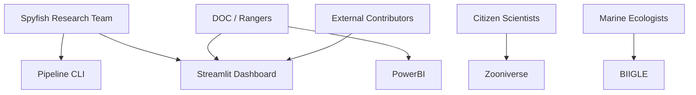


### Actors


| Actor                           | Role                                                                                                           | Primary tool        |
| ------------------------------- | -------------------------------------------------------------------------------------------------------------- | ------------------- |
| **DOC / Rangers**               | Primary data consumers. View fish counts, species distributions, survey progress. Do not operate the pipeline. | PowerBI dashboard   |
| **Spyfish Research Team**       | Pipeline operators. Run ingestion, monitor errors, trigger stages, manage BIIGLE volumes, retrain model.       | Streamlit + CLI     |
| **External contributors**       | Community members without DOC system access who support the project.                                           | Streamlit dashboard |
| **Citizen Scientists**          | Zooniverse volunteers who classify 10-second video clips and image frames into top species + "other".          | Zooniverse          |
| **Marine Ecologists / Experts** | Expert annotators who draw bounding boxes and identify species using the full species list in BIIGLE.          | BIIGLE              |


### Two dashboards, two audiences


| Dashboard              | Technology         | Audience                     | Purpose                                                                                   |
| ---------------------- | ------------------ | ---------------------------- | ----------------------------------------------------------------------------------------- |
| **Streamlit** (`app/`) | Python / Streamlit | Team + external contributors | Pipeline ops: deployment status, error review, annotation export, model metrics           |
| **Reporting app**      | PowerBI            | DOC / Rangers                | Conservation reporting: MaxN counts by species, time, and marine reserve on maps & graphs |


These are complementary tools, not alternatives to each other.

---

## 4. Technical Architecture

### Technology stack


| Layer                    | Technology                                     | Rationale                                                                               |
| ------------------------ | ---------------------------------------------- | --------------------------------------------------------------------------------------- |
| Language                 | Python 3.12+                                   | Ecosystem for ML, data manipulation, and all external platforwhom clients               |
| ML inference             | Ultralytics YOLOv12                            | State-of-the-art real-time object detection; active upstream development                |
| Video processing         | OpenCV + FFmpeg                                | OpenCV for frame extraction (frame parity with YOLO); FFmpeg for clip encoding          |
| Database                 | SQLite (via `sqlite3`)                         | Zero-infrastructure, file-based, trivially synced to S3; sufficient for ~1k/year scale  |
| Cloud storage            | AWS S3 (`marine-buv` bucket, managed by DOC)   | Shared file store for videos, databases, and outputs                                    |
| HPC (ML)                 | NIWA Mahuika (Slurm + GPU)                     | GPU acceleration for YOLO inference; NeSI allocation for NZ-based research              |
| Citizen science          | Zooniverse (panoptes_client)                   | Volunteers classify clips/frames into top species + "other"; intentionally simplified   |
| Volunteer data reduction | Caesar (Zooniverse)                            | Subject-level reduction rules; determines when a subject has sufficient classifications |
| Expert annotation        | BIIGLE (REST API)                              | Full expert species list; bounding boxes; future: substrate analysis + size review      |
| Ops dashboard            | Streamlit                                      | Python-native; suitable for team + external contributors without DOC system access      |
| Reporting dashboard      | PowerBI                                        | DOC-facing; connects to SharePoint for deployment metadata; MaxN maps & graphs          |
| Metadata input           | PowerApps (BUV Survey app, BUV Deployment app) | Mobile-first field data entry for rangers                                               |
| Video upload             | Video Uploader App (desktop, Gitlab/BytesNZ)   | Concatenates GoPro segments and uploads to S3                                           |
| Configuration            | YAML + python-dotenv                           | Non-secret config in `config.yaml`; secrets in `.env` (never committed)                 |


> **S3 bucket note:** The production bucket is `marine-buv` (DOC-managed). A separate test bucket (`marine-buv-kalindi`) is used for development. The bucket name is configured in `.env`.

### ML model strategy

The ML model starts as a **binary classifier** (fish vs no-fish). Species-specific classes are added incrementally as training data for each species grows to a point where the model can reliably detect that species. This means the model naturally becomes multi-class over time as the annotation pipeline accumulates expert labels, without forcing multi-class detection before the training data supports it.

### Config and orchestration

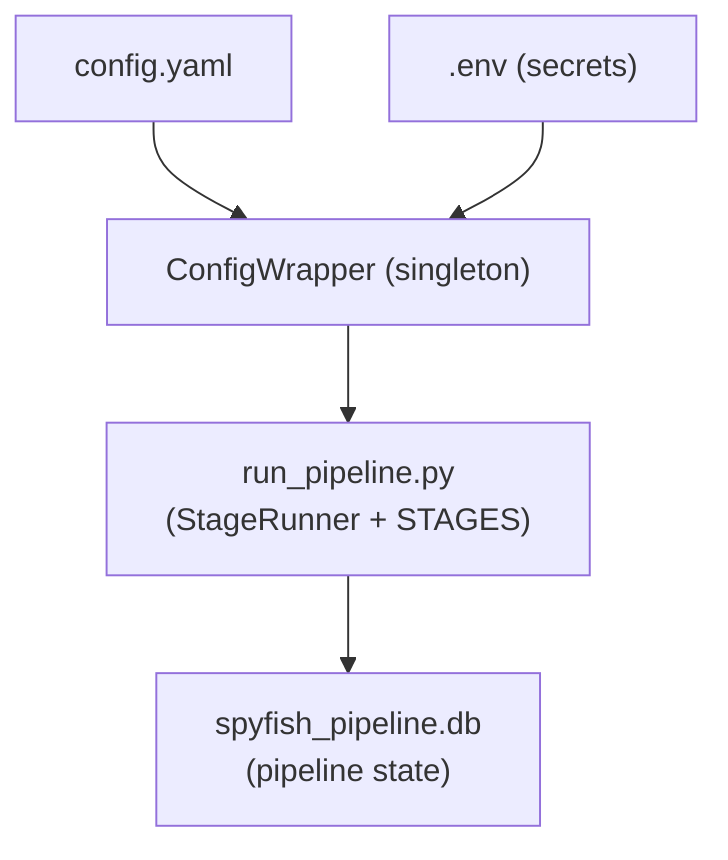


### Processing modules

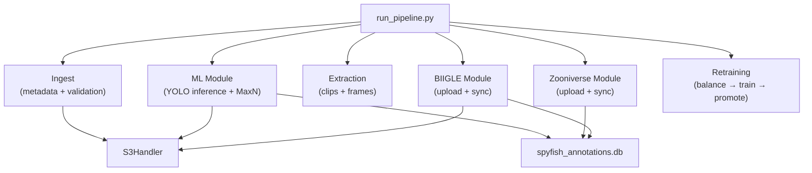


---

## 5. Data Flow

### Pre-pipeline: how videos reach S3

Before the pipeline runs, two independent processes must have completed:

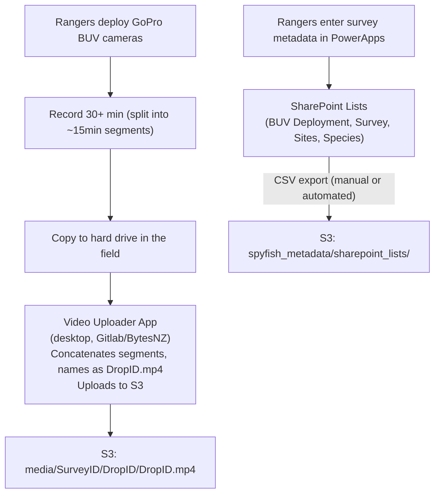


### End-to-end pipeline data flow

```mermaid
flowchart TD
    A["S3: Videos + Metadata CSVs available"]

    A --> D["Step 1: Ingest<br/>Download CSVs from S3<br/>Validate structure and formats<br/>Populate deployments DB<br/>Status: PENDING_ARRIVAL"]

    D --> E["Check Arrivals<br/>Poll S3 for video files<br/>Status: READY_FOR_ML"]

    E --> F["Step 2: ML Inference<br/>Download video from S3<br/>YOLO at 3 FPS → raw detections CSV<br/>Status: PROCESSING_ML → ML_COMPLETE"]

    F --> G["Step 3: Post-processing<br/>Aggregate into 10s intervals<br/>Apply confidence threshold 0.50<br/>Compute MaxN per interval × species<br/>Store in annotations DB<br/>annotated_by = model_name"]

    G --> H{"Annotation<br/>path"}

    H -->|"Zooniverse path"| I["Step 4: Zooniverse Clips<br/>Select representative 10s clips<br/>MaxN peaks, confusing, empty, start<br/>Extract MP4 clips via FFmpeg<br/>Upload to Zooniverse subject sets<br/>Status: CITSCI_CLIPS_COMPLETE"]

    I --> J["Step 5: Zooniverse Frames<br/>Extract JPEG frames at MaxN timestamps<br/>Generate COCO JSON with boxes<br/>Upload to Zooniverse<br/>Status: AWAITING_CITSCI_FRAMES"]

    J --> K["Step 5b: Volunteer Sync<br/>Caesar checks classification counts<br/>When threshold met: download and parse<br/>annotated_by = citsci<br/>Status: CITSCI_COMPLETE"]

    H -->|"Biigle-direct path<br/>(skip Zooniverse)"| L

    K --> L["Step 6: BIIGLE Upload<br/>Select frames (denser, frame_multiplier=2)<br/>Extract JPEGs + COCO JSON<br/>Upload frames to S3<br/>Create BIIGLE image volume<br/>Status: AWAITING_EXPERT_REVIEW"]

    L --> M["Expert annotates in BIIGLE<br/>Draws bounding boxes<br/>Marks volume Done"]

    M --> N["Step 7: BIIGLE Sync<br/>Detect Done volumes<br/>Download annotation CSV<br/>Parse to annotations DB<br/>annotated_by = expert<br/>Status: PIPELINE_COMPLETE"]

    N --> O["Step 8: Retrain<br/>Export BIIGLE labels → YOLO format<br/>Balance classes (ceiling 40%, floor 2%)<br/>Split 70/15/15 train/val/test<br/>Train YOLOv12<br/>Evaluate vs base model<br/>Promote if mAP improvement ≥ 2%"]

    O --> P["Updated production model<br/>All future inference uses new weights"]
```


### Annotation sources and trust

Three sources of annotation exist. There is **no formal merge step** — expert annotations simply win. When expert annotations exist for a deployment, they are the authoritative record for reporting and retraining. ML and citsci annotations remain in the database for comparison and auditing.

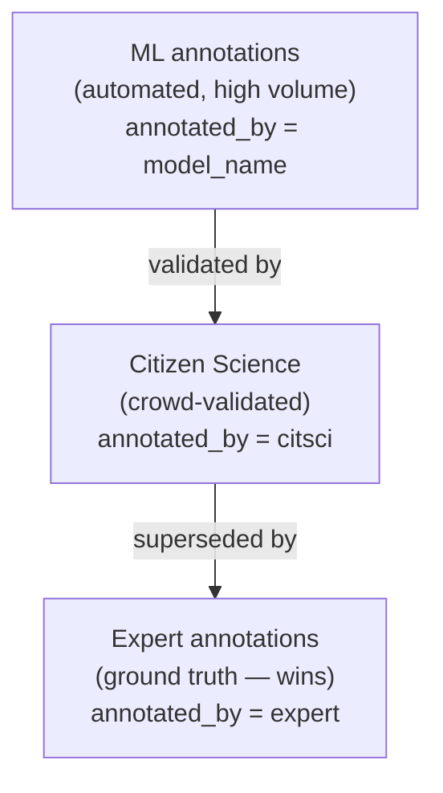


All three are stored in the same `annotations` table. The `annotated_by` field contains `'citsci'` or `'expert'` for those sources, and the **model name** (e.g. `cfd_binary_water_20260301`) for ML annotations — so model versioning is preserved per-record in the `external_id` column.

**Expert review model:** Experts aim to review approximately **~10 frames per deployment** (or at survey level). If the ML + citsci signal looks wrong, a closer per-frame review can be triggered. This keeps expert effort tractable at ~1,000 deployments/year while still producing ground-truth labels for model retraining.

**BIIGLE future scope:** Beyond species identification, BIIGLE is planned for **substrate analysis** and **size review** using the same upload/sync pipeline steps — only the downstream parsing logic changes when downloading annotations.

### S3 bucket layout

```
marine-buv/   (production, DOC-managed)
├── spyfish_metadata/
│   └── sharepoint_lists/
│       ├── BUV Deployment.csv                  # One row per camera drop
│       ├── BUV Survey Metadata.csv             # One row per survey trip
│       ├── BUV Survey Sites.csv                # Site reference data
│       ├── BUV Species.csv                     # Species lookup (AphiaID, common, scientific)
│       ├── Marine Reserves.csv                 # Marine reserve reference
│       └── BUV Annotations Legacy Experts.csv  # Pre-BIIGLE expert annotations (TODO: clarify)
│
├── media/
│   └── {SurveyID}/{DropID}/{DropID}.mp4        # Raw concatenated videos
│
├── biigle_images/
│   └── {SurveyID}/{DropID}/                    # JPEG frames served to BIIGLE (disk 134)
│
└── process_files/                              # Synced from local after each run
    ├── spyfish_pipeline.db
    ├── spyfish_annotations.db
    ├── annotations/{DropID}/                   # MaxN CSVs, raw CSVs
    ├── data_quality/{DropID}/                  # Clips, frames, selections
    ├── models/                                 # YOLO weights
    └── training/                              # Retraining results
```

### File artifacts per deployment

```
annotations/{DropID}/
  {DropID}_{model}_raw.csv              Raw YOLO detections (one row per bounding box)
  {DropID}_ml_{model}_maxn.csv          ML MaxN aggregations (one row per interval × species)
  {DropID}_zooniverse_maxn.csv          Volunteer MaxN (same 8-column schema as ML MaxN)

  MaxN CSV schema (both ML and Zooniverse):
    DropID, ScientificName, TimeOfMax, MaxInterval, AnnotatedBy,
    IntervalAnnotation, ConfidenceAgreement, TimeOfMaxAbsSeconds
    (TimeOfMaxAbsSeconds = absolute seconds from video start)

  Selections CSV schema (clips and frames):
    DropID, SamplingStart, ClipStartDeploySeconds, ClipEndDeploySeconds,
    TimeOfMaxAbsSeconds, ScientificName, SelectionReason, MaxInterval, ConfidenceAgreement
    (ClipStart/End = relative to SamplingStart; TimeOfMaxAbsSeconds = absolute)

data_quality/{DropID}/
  clips/                                 10s MP4 clips for Zooniverse
  frames/                                JPEG frames for Zooniverse
  biigle_frames/                         JPEG frames for BIIGLE (denser selection)
  {DropID}_selections.csv                Clip selection manifest
  {DropID}_biigle_selections.csv         Frame selection manifest (BIIGLE)
  {DropID}_coco_annotations.json         COCO-format bounding boxes from ML

models/
  pipeline_model/                        Active production YOLO weights
  base_model/                            Baseline for retraining evaluation

zooniverse/
  legacy_classifications/                Downloaded Zooniverse classifications export CSVs
  legacy_subjects/                       Downloaded Zooniverse subjects export CSVs
  last_run.json                          Tracks last API fetch timestamp for --since auto
  zooniverse_review.csv                  Audit log of all aggregated subjects (every run)
  zooniverse_nothing_here_sample.csv     Sampled NOTHINGHERE subjects for review

S3: biigle_images/{SurveyID}/{DropID}/   JPEG frames served to BIIGLE (disk 134)
```

---

## 6. Data Modeling

### Entity relationships

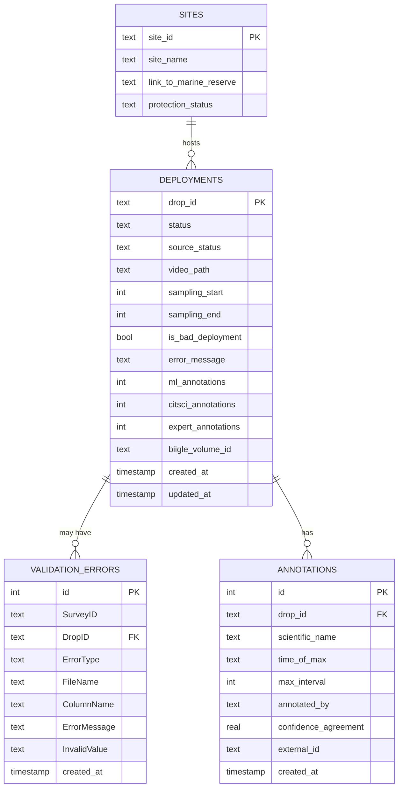


#### `deployments` table columns (`spyfish_pipeline.db`)

| Column | Type | Description |
|---|---|---|
| `drop_id` | TEXT PK | Unique deployment identifier (`{Reserve}_{YYYYMMDD}_BUV_{Reserve}_{Site}_{Rep}`) |
| `status` | TEXT | Current pipeline stage (see state machine) |
| `source_status` | TEXT | Data quality flag: `OK`, `EXCLUDED`, `MISSING_METADATA`, `VALIDATION_ERROR`, `REMOVED_FROM_SOURCE` |
| `video_path` | TEXT | Local path to the downloaded video file |
| `sampling_start` | INTEGER | Start of valid sampling window (seconds) — set from PowerApps metadata |
| `sampling_end` | INTEGER | End of valid sampling window (seconds) |
| `is_bad_deployment` | BOOLEAN | Flagged as problematic in the source CSV |
| `error_message` | TEXT | Last pipeline error message for this drop |
| `ml_annotations` | INTEGER | Count of ML annotations — **owned by `sync_annotation_counts()`, never set by ingestion** |
| `citsci_annotations` | INTEGER | Count of volunteer annotations — same ownership rule |
| `expert_annotations` | INTEGER | Count of expert annotations |
| `biigle_volume_id` | TEXT | BIIGLE volume ID, set when the volume is created in step 6 |
| `created_at` | TIMESTAMP | Record creation time |
| `updated_at` | TIMESTAMP | Last update time |

#### `annotations` table columns (`spyfish_annotations.db`)

| Column | Type | Description |
|---|---|---|
| `id` | INTEGER PK | Auto-increment |
| `drop_id` | TEXT FK | Links back to `deployments` |
| `scientific_name` | TEXT | Species name |
| `time_of_max` | TEXT | `HH:MM:SS` timestamp of the MaxN moment |
| `max_interval` | INTEGER | Fish count at the MaxN moment |
| `annotated_by` | TEXT | Source: model name (ML), `'citsci'` (Zooniverse), `'expert'` (BIIGLE) |
| `confidence_agreement` | REAL | YOLO confidence (ML) or volunteer agreement % as decimal (citsci) |
| `external_id` | TEXT | Model name for ML records; BIIGLE annotation ID for expert records |
| `created_at` | TIMESTAMP | Record creation time |

> **`external_id` dual role:** For ML annotations, `external_id` stores the model name (e.g. `cfd_binary_water_20260301`). For expert annotations, it stores the BIIGLE annotation ID. This allows model versioning to be traced per-record without a separate column.

### Two-database design

```
spyfish_pipeline.db          spyfish_annotations.db
────────────────────         ──────────────────────────
deployments  (state)         annotations (observations)
sites        (reference)
validation_errors (QA)
```

**Why two databases?** The pipeline DB tracks *where a deployment is* in the workflow. The annotations DB tracks *what was observed*. Keeping them separate allows annotation data to be queried and exported without locking pipeline state.

### Two orthogonal status dimensions

Each deployment carries two independent status fields:

```
source_status  (data quality)        status  (processing stage)
──────────────────────────────       ──────────────────────────
OK                                   PENDING_ARRIVAL
EXCLUDED                             READY_FOR_ML
MISSING_METADATA                     PROCESSING_ML
VALIDATION_ERROR                     ML_COMPLETE
REMOVED_FROM_SOURCE                  AWAITING_CITSCI_CLIPS
                                     CITSCI_CLIPS_COMPLETE
                                     AWAITING_CITSCI_FRAMES
                                     CITSCI_COMPLETE
                                     AWAITING_EXPERT_REVIEW
                                     PIPELINE_COMPLETE
                                     ON_HOLD
                                     ERROR
```

A deployment can be `READY_FOR_ML` (pipeline) while simultaneously being `VALIDATION_ERROR` (source). A data quality flag records what we know about the *source data* and should not block the pipeline status from being meaningful.

---

## 7. Pipeline State Machine

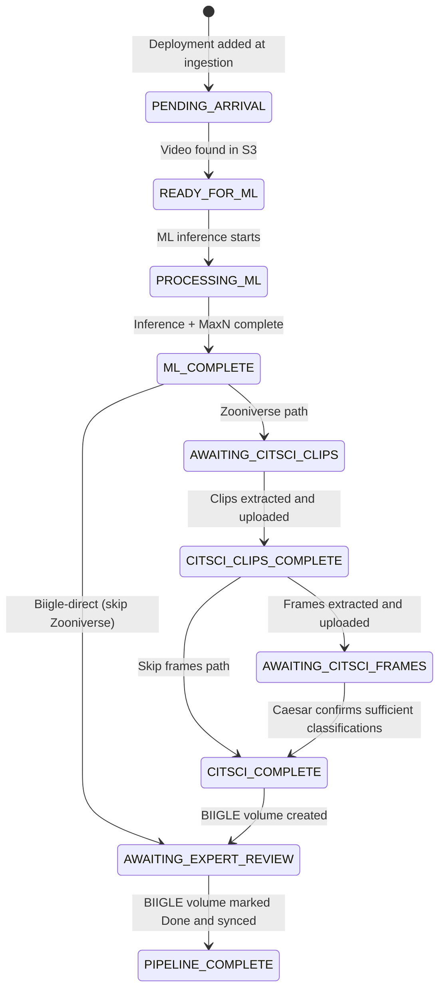

> **ON_HOLD:** Any status can transition to `ON_HOLD` (manual pause) and resume to any status — not shown above to keep the diagram readable. See transition rules below.

### Error and hold recovery

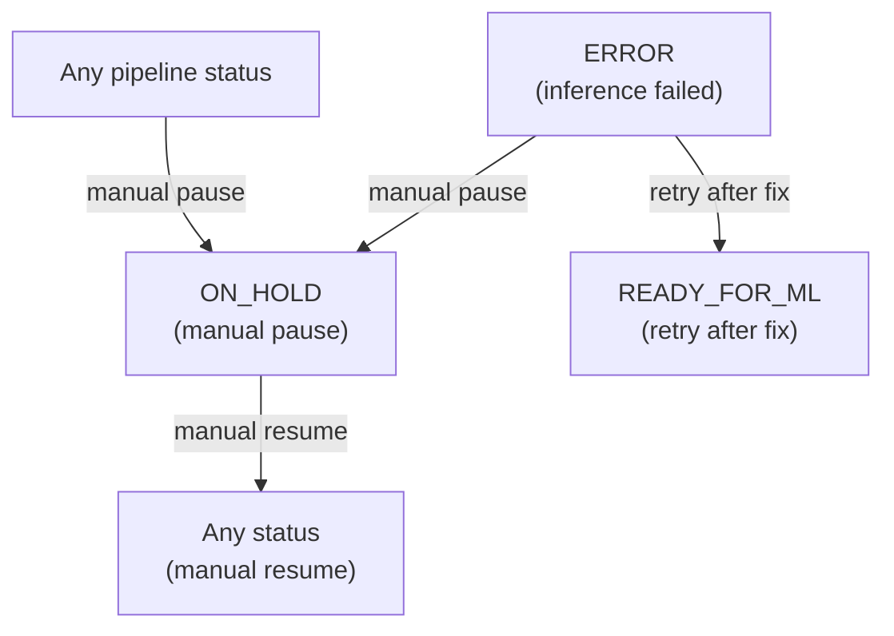

### Transition rules

- Transitions are validated by `DatabaseManager.advance_status()`, which raises `InvalidTransitionError` for disallowed moves. The full valid transition map is in `PipelineStatus.VALID_TRANSITIONS` in `spyfish/config/base.py`.
- `ON_HOLD` can transition to **any** status — safe for investigation without losing where the drop was.
- `ERROR` can only return to `READY_FOR_ML` or `ON_HOLD`. Moving out of `ERROR` automatically clears `PIPELINE_ERROR` rows for that drop.
- The `set_status` admin tool bypasses transition validation — for manual fixes and testing only.

---

## 8. Component Design

### Declarative stage framework

Every pipeline stage is declared in a single `STAGES` list in `run_pipeline.py`. The `StageRunner` auto-generates CLI flags, queries eligible drops, advances status, and captures errors. Adding a new stage requires one list entry and a step function.

```python
# Global stage — runs once, manages own iteration
GlobalStage("ingest", "Step 1: metadata ingestion", _run_ingestion)

# Drop stage — called once per eligible drop; return value = next status
DropStage("zooniverse-clips", "Step 4: ...", _step4_process_drop,
          input_statuses=[PipelineStatus.ML_COMPLETE])
```

### Configuration design

All non-secret configuration lives in `config.yaml` and is accessed through a singleton `ConfigWrapper`. Key rules:

- **No silent defaults** — missing keys raise `ValueError` immediately
- **No hardcoded strings in business logic** — column names, regex patterns, S3 prefixes, confidence thresholds all live in `config.yaml`
- **No manual path construction** — all file paths generated by config methods
- **Secrets in `.env`** — never committed to git

### Clip selection strategy

The ML-guided clip selection concentrates human review on the most valuable moments. Numbers are configured in `config.yaml` and are initially set higher to maximise manual review coverage:

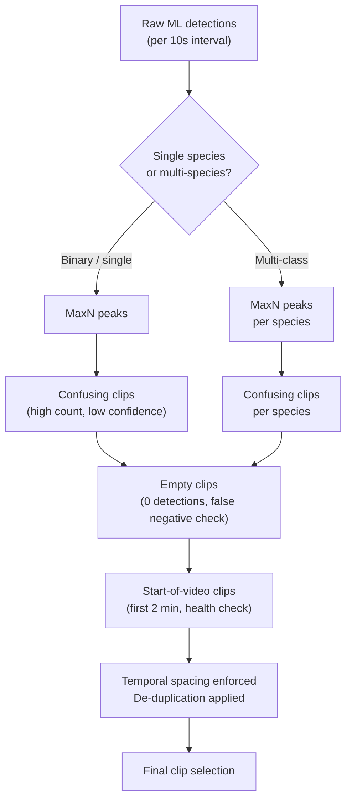


### Two specific technical choices

**OpenCV for frame extraction (not FFmpeg):** The YOLO inference stream and frame extraction use the same OpenCV video reader. This guarantees frame parity — the exact pixel values seen by the model are what human annotators see. FFmpeg and OpenCV can produce slightly different frames from the same video.

**CRF probing for clip encoding:** Zooniverse enforces a ~12 MB upload limit. Rather than a fixed quality setting, the pipeline probes a short segment to estimate the CRF value that hits the size target, then encodes the full clip at that quality.

---

## 9. Security & Sensitive Data

### Sensitive data categories

Per the Spyfish project guidelines, the following data must be handled carefully and not exposed in publicly-facing systems:


| Category         | Example                                                  | Risk                                                     |
| ---------------- | -------------------------------------------------------- | -------------------------------------------------------- |
| **Locations**    | GPS lat/lon of deployment sites                          | Could enable targeted illegal fishing at monitored sites |
| **Rare species** | Presence/absence of protected or critically rare species | Could attract poaching or collection                     |
| **PII**          | People's names, contracts, team member details           | Standard privacy obligation                              |


The Streamlit dashboard and any exported data should be reviewed against these categories before being shared externally.

### Credential management

All secrets live in `.env`, loaded at startup via `python-dotenv`. Never committed to git. The `.env_sample` file documents required variables without values.

Required secrets:

- `AWS_ACCESS_KEY_ID` / `AWS_SECRET_ACCESS_KEY` / `AWS_REGION` — S3 access
- `BIIGLE_API_EMAIL` / `BIIGLE_API_TOKEN` — BIIGLE REST API
- `ZOONIVERSE_USER` / `ZOONIVERSE_PASSWORD` — Panoptes upload

### S3 access

The production S3 bucket (`marine-buv`) is DOC-managed. S3 operations never use `--delete` — the bucket is treated as a permanent backup of record. Frames uploaded to `biigle_images/` are served directly to BIIGLE via a configured S3 disk mount.

### Path safety

DropIDs are validated against a strict regex (`^[A-Z]{3}_\d{8}_BUV_[A-Z]{3}_\d{3}_\d{2}$`) before being used in path construction, preventing path traversal.

### BIIGLE API timeouts

All BIIGLE API requests enforce a configurable timeout (`request_timeout_secs: 30`) to prevent indefinite hangs if the BIIGLE server is unresponsive.

---

## 10. Alternatives Considered

### Database: SQLite vs cloud database

**Chosen:** SQLite, synced to S3 after each run.

SQLite was chosen because the dataset is small (≤1,000 rows of pipeline state), zero infrastructure is required, and it is trivially backed up by copying to S3. A PostgreSQL or DynamoDB instance would add cost and operational overhead without benefit at this scale. The trigger to migrate would be a need for concurrent writes from multiple workers.

### Architecture: monolithic pipeline vs microservices

**Chosen:** Monolithic pipeline with a declarative stage registry.

A microservices architecture (one Lambda per pipeline stage, event-driven via SQS) would offer independent scaling. However, the team is small, pipeline stages are sequential, and operational complexity would dominate. A well-structured monolith with a declarative stage registry is easy to reason about and extend.

### ML compute: local vs cloud GPU vs HPC

**Current:** NIWA Mahuika HPC (Slurm + GPU).

AWS EC2 GPU instances were considered. HPC was chosen because the research team has existing NeSI allocations, and GPU instance costs at ~1,000 videos/year × ~2 hours each are non-trivial. The pipeline is portable: the ML module can run locally on an NVIDIA GPU without code changes.

### Clip selection: random sampling vs ML-guided

**Chosen:** ML-guided selection (MaxN peaks + confusing + empty + start).

Random sampling would be simpler but wastes volunteer effort on uninformative footage. The ML-guided approach concentrates human review on scientifically and ML-valuable segments. A 30-minute video (180 intervals) is reduced to ~37–100 representative clips.

### Reporting dashboard: Streamlit vs PowerBI

Both are used — for different audiences.

- **Streamlit** serves the research team and external contributors who need pipeline-level access (deployment monitoring, error review, annotation export, model metrics) and do not have DOC system access.
- **PowerBI** serves DOC/Rangers, connecting to SharePoint for deployment metadata, and displaying MaxN counts on maps and charts for conservation reporting.

These are complementary tools, not competing choices.

---

## 11. Milestones

Sequenced by dependency, not assigned dates.

### Phase 1 — Core Pipeline 🔄 Near Complete

- SQLite state machine with all pipeline statuses
- Metadata ingestion from S3 (deployment, survey, site, species CSVs)
- Data validation framework with configurable rules
- YOLO ML inference module (OpenCV streaming, sampling window)
- MaxN post-processing (per-interval, per-species aggregation)
- Declarative stage framework (`GlobalStage` / `DropStage` / `StageRunner`)
- S3 sync (DB + results after each run)
- Streamlit dashboard (deployment monitoring, error review)
- SharePoint → S3 metadata download integrated into pipeline

### Phase 2 — Annotation Platforms 🔄 In Progress

- Zooniverse clip extraction and upload (binary + multiclass strategy)
- Zooniverse frame extraction and upload
- BIIGLE frame upload and volume creation
- BIIGLE annotation sync (download + parse expert annotations)
- Zooniverse volunteer classification sync-back (step 5b) — parsing built, pipeline wiring remaining

### Phase 3 — Model Improvement Loop

- BIIGLE annotation → YOLO label conversion
- Training data balancing (class ceiling 40% + floor 2%)
- YOLOv12 retraining pipeline (train → evaluate → promote)
- Per-species evaluation metrics surfaced in Streamlit dashboard
- Formal per-species model promotion tracking

### Phase 4 — User Interaction & Admin

- Streamlit UI for manual deployment status updates (without CLI access)
- Streamlit UI to trigger individual pipeline stages per deployment
- Audit log view: full status transition history per drop
- In-app validation error resolution workflow

### Phase 5 — Production Hardening

- Environment management on NeSI
- NeSI crontab scheduling — code exists, hardening robustness
- Full integration test suite covering all pipeline stages end-to-end

### Phase 6 — DOC Reporting

- Annotation data export format defined and connected to PowerBI
- Time-series visualisations of species abundance by marine reserve
- Marine reserve monitoring reports and report cards generated automatically from `PIPELINE_COMPLETE` deployments
- BIIGLE substrate and size review parsing (same pipeline, new annotation type)

---

## 12. Known Gaps & Future Work

### Zooniverse volunteer sync — step 5b pipeline wiring

> **⚠️ TODO — NEEDS TESTING & CLEANUP**
> The Zooniverse parse pipeline (`parse_zooniverse_classifications.py` + `spyfish/zooniverse/parse_classifications.py`) has been substantially reworked but has **not been tested end-to-end against real Zooniverse data** since the refactor. Before treating any output as production-ready:
> - Run against real classifications from the API and verify MaxN CSVs are correct
> - Run against legacy CSV backfill with and without subjects CSVs
> - Verify the completion gate correctly identifies fully-retired subject sets
> - Audit all intermediate paths: what goes in `legacy_classifications/`, `legacy_subjects/`, `last_run.json`, `zooniverse_review.csv`, `zooniverse_nothing_here_sample.csv`, and the per-drop MaxN CSVs — and confirm they are all still being written to the right place after the refactor
> - Check that `suspicious_minority_find` logic still works correctly
> - Verify legacy filename resolution still handles date-pattern filenames (e.g. `AHE_062_25_04_2022`)

Classification parsing is implemented in `parse_zooniverse_classifications.py` (standalone script) and `spyfish/zooniverse/parse_classifications.py` (reusable module). It is **not yet wired into `run_pipeline.py`** as a `--zooniverse-sync` stage.

**What is built:**
- Fetch from Panoptes API across multiple source projects (`source_project_ids` in config)
- Bulk backfill from downloaded Zooniverse export CSVs (`--from-csv`)
- Parse annotations: species, count (with bucket handling: "2030"→25, "3040"→35), timestamp
- Aggregate by (subject, species) with `min_votes` threshold
- Write per-drop MaxN CSVs (`{drop_id}_zooniverse_maxn.csv`) in the same 8-column schema as ML MaxN CSVs (`DropID, ScientificName, TimeOfMax, MaxInterval, AnnotatedBy, IntervalAnnotation, ConfidenceAgreement, TimeOfMaxAbsSeconds`)
- Frame extraction is a **separate independent step** (not part of the parse script) — MaxN CSVs are the handoff point
- Subject retirement completion checking per drop (`subject_completion_from_csv/api()`)
- Legacy filename resolution: date-pattern filenames (e.g. `AHE_062_25_04_2022`) reconstructed to drop_id

**What remains:**
- Wire into `run_pipeline.py` as `--zooniverse-sync`: check subject set completion, parse if done, advance status to `CITSCI_COMPLETE`
- Deduplication of identical MaxN runs at frame extraction step (currently deferred)

**Current workaround:** run `parse_zooniverse_classifications.py` manually, then advance drops with `set_status`.

### PowerBI — annotation data feed is manual

PowerBI connects to SharePoint for deployment metadata. Annotation results (MaxN counts, species) are currently not transferred to PowerBI, there is no automatic pipeline from the annotation databases to the reporting dashboard. This is the critical missing link for scalable DOC reporting.

Future options: direct S3 export in a PowerBI-compatible format, a SharePoint list sync, or an API layer.

### User interaction with the database and pipeline

Currently, all manual database operations require CLI access (`set_status`) or direct SQLite queries. This is a barrier for team members and contributors who aren't comfortable at the command line.

**Planned work:**

- Streamlit UI for viewing and manually updating deployment statuses
- Ability to trigger individual pipeline stages per deployment from the dashboard
- Audit log view showing the full status transition history for any drop
- In-app workflow for reviewing and resolving validation errors
- Controlled manual annotation entry (e.g. for legacy expert data not coming through BIIGLE)

### SharePoint → S3 metadata download

Currently, metadata CSVs must be manually exported from SharePoint and uploaded to S3. A direct SharePoint download option integrated into the pipeline would ensure the pipeline always works from the latest source data without manual export steps.

### GoPro video concatenation — upstream of this pipeline

The video-uploader app (Gitlab/BytesNZ) handles GoPro segment concatenation before videos reach S3. Without it, the pipeline will not find the expected `{DropID}.mp4` file.

> **Review needed:** The pipeline has no validation that the video in S3 is a complete (concatenated) file vs a partial GoPro segment. A duration or size check at the `check-arrivals` stage could catch this early.

### BIIGLE future scope: substrate and size review

BIIGLE volumes can also be used for substrate analysis and fish size estimation. The upload and sync pipeline steps are identical — only the parsing logic when downloading annotations differs. This is planned but not yet implemented.

### NeSI crontab scheduling — hardening in progress

The pipeline runs on NeSI (New Zealand eScience Infrastructure HPC). A NeSI crontab schedule triggers pipeline runs automatically. The scheduling mechanism exists but is being made more robust to handle edge cases cleanly (e.g. overlapping runs, job failures, partial states).

---

## 13. Setup & Prerequisites

### System requirements

- Python 3.10+
- `ffmpeg` (required for video clip extraction — must be on your `$PATH`)
- AWS credentials with access to the S3 bucket (production: `marine-buv`, DOC-managed; development: configure in `.env`)
- BIIGLE API credentials
- Zooniverse credentials

> **Video prerequisite:** The pipeline expects each deployment's video to already exist in S3 as `media/{SurveyID}/{DropID}/{DropID}.mp4`. Getting videos into S3 is handled by the video-uploader app (BytesNZ). If the file isn't there, `check-arrivals` will leave the drop at `PENDING_ARRIVAL`.

### Install

```bash
pip install -r requirements.txt
pip install -e .
```

### Environment variables

Create a `.env` file in the project root (see `.env_sample`):

```env
AWS_ACCESS_KEY_ID=your_aws_key
AWS_SECRET_ACCESS_KEY=your_aws_secret
AWS_REGION=ap-southeast-2

BIIGLE_API_EMAIL=your_email@example.com
BIIGLE_API_TOKEN=your_biigle_token

ZOONIVERSE_USER=your_username
ZOONIVERSE_PASSWORD=your_password
```

These are loaded at startup via `python-dotenv`. Secrets never live in `config.yaml`.

### First-run checklist

- `orchestrator.is_test_run` — **set to `false` for real runs**. When `true`, reads from `test_deployment_metadata.csv` instead of S3.
- `ml_inference.limit_processing` — safety cap on videos per run (default: 1). Increase when you trust the pipeline.
- `paths.media_base_dir` — override if you want videos on a separate large disk.

---

## 14. Running the Pipeline

The single entry point is `run_pipeline.py`.

```bash
python run_pipeline.py          # Run all stages with run_in_all=True
python run_pipeline.py --ingest
python run_pipeline.py --ml
python run_pipeline.py --ingest --ml    # combine steps
python run_pipeline.py --biigle-sync --retrain
```

### Pipeline stage flags

| Flag | Stage | Description |
|---|---|---|
| `--ingest` | Step 1 | Download metadata CSVs from S3, validate, populate DB |
| `--check-arrivals` | Step 1b | Check S3 for newly arrived videos, advance to `READY_FOR_ML` |
| `--ml` | Steps 2+3 | Run YOLO inference + compute MaxN annotations |
| `--zooniverse-clips` | Step 4 | Select + extract clips, upload to Zooniverse |
| `--zooniverse-images` | Step 5 | Extract frames, upload to Zooniverse |
| `--zooniverse-sync` | Step 5b | Sync volunteer classifications back — **not yet wired in, use `parse_zooniverse_classifications.py` directly** |
| `--biigle-upload` | Step 6 | Select frames, upload to S3, create BIIGLE volume |
| `--biigle-sync` | Step 7 | Download completed expert annotations from BIIGLE |
| `--retrain` | Step 8 | Retrain YOLO model on expert annotations |

### Special flags

| Flag | Description |
|---|---|
| `--no-upload` | Skip all S3 uploads (DB sync, models, results). Safe for local testing. |
| `--test-run` | Use test dataset. Also controlled by `is_test_run` in `config.yaml`. |
| `--set-targets` | Bulk-update deployment statuses from a CSV (see `paths.orchestration.pipeline_targets_csv`). |
| `--ping` | Print config summary (bucket, base dir, test mode) and exit — connectivity check. |

### Biigle-direct path (skip Zooniverse)

Run `--biigle-upload` without any `--zooniverse-*` flags. The stage automatically picks up drops at `ML_COMPLETE` in addition to `CITSCI_COMPLETE`, letting you skip the citizen science loop and send drops straight to expert review.

### Zooniverse classification sync (standalone)

```bash
# Incremental fetch from API (uses last_run.json for since-date)
python parse_zooniverse_classifications.py

# Full backfill from API
python parse_zooniverse_classifications.py --since all

# Load from downloaded Zooniverse export CSVs (completion gate uses legacy_subjects/ automatically)
python parse_zooniverse_classifications.py --from-csv

# CSV backfill with explicit subjects CSV for completion gate
python parse_zooniverse_classifications.py --from-csv path/to/classifications.csv \
    --subjects-csv path/to/subjects.csv

# Test with a small slice
python parse_zooniverse_classifications.py --from-csv path/to/file.csv --limit 1000
```

After running, manually advance fully-parsed drops using `set_status` until `--zooniverse-sync` is wired into the pipeline.

### Re-run post-ML processing on a specific drop

Useful if post-ML step failed or needs reprocessing without re-running inference:

```bash
python -c "
from spyfish.ml.process_ml_annotations import run_post_ml
from spyfish.config.wrapper import config
run_post_ml(['AHE_20250513_BUV_AHE_057_01'], video_dir=str(config.media_dir))
"
```

### Upload data to NeSI Mahuika

```bash
rsync -avz --progress -e "ssh" /path/to/local/videos/ mahuika:/nesi/nobackup/uoa04631/Vault/snapper_videos/
```

---

## 15. Admin & Debugging

### Inspect or manually update a deployment

```bash
# Show current record
python -m spyfish.database.set_status AHE_20250513_BUV_AHE_057_01

# Update status (bypasses state-machine validation — use carefully)
python -m spyfish.database.set_status AHE_20250513_BUV_AHE_057_01 READY_FOR_ML

# Update status + fields
python -m spyfish.database.set_status AHE_20250513_BUV_AHE_057_01 READY_FOR_ML \
    --sampling-start 0 --sampling-end 1800

# Create a new record if not already in DB
python -m spyfish.database.set_status AHE_20250513_BUV_AHE_057_01 READY_FOR_ML \
    --sampling-start 0 --sampling-end 1800 --create

# Apply and immediately print the updated record
python -m spyfish.database.set_status AHE_20250513_BUV_AHE_057_01 ML_COMPLETE --show
```

Optional fields: `--sampling-start`, `--sampling-end`, `--video-path`.

> `set_status` uses `update_status()` directly, bypassing `advance_status()` transition validation. This is intentional — it's a surgical admin tool, not part of normal pipeline flow.

### Reset a stuck or errored drop

```bash
python -m spyfish.database.set_status MY_DROP_ID READY_FOR_ML
```

Moving away from `ERROR` automatically clears `PIPELINE_ERROR` rows in `validation_errors` for that drop.

### Check connectivity / config

```bash
python run_pipeline.py --ping
```

### Export the database to CSV

```python
from spyfish.database.manager import DatabaseManager
db = DatabaseManager()
db.export_to_csv("process_files/db")   # writes deployments.csv, validation_errors.csv, sites.csv
```

---

## 16. Configuration Reference

All non-secret configuration lives in `config.yaml`. Missing keys raise `ValueError` — no silent defaults. Access via `config.*` properties on the `ConfigWrapper` singleton (`from spyfish.config.wrapper import config`).

### ML inference (`ml_inference` section)

| Key | Default | Effect |
|---|---|---|
| `limit_processing` | 1 | Max videos processed per pipeline run. Increase for production. |
| `ml_fps` | 3 | Frames per second submitted to YOLO. Stride = `actual_fps / ml_fps`. |
| `confidence_threshold` | 0.25 | YOLO detection threshold. Lower = more detections, more false positives. |
| `maxn_confidence_threshold` | 0.50 | Min confidence to count a detection in MaxN computation. |
| `imgsz` | 640 | YOLO inference image size. |

### Extraction (`extraction` section)

| Key | Default | Effect |
|---|---|---|
| `clip_length` | 10.0 s | Duration of each extracted clip |
| `clip_cap` | 180 | Max clips per video (180 × 10s = full 30-min video) |
| `force_binary_strategy` | false | If true, always use binary strategy regardless of species count |
| `frame_multiplier` | 2 | Doubles BIIGLE frame count and halves temporal spacing for denser coverage |
| `binary_strategy.maxn_export` | 30 | Clips at peak fish-count moments |
| `binary_strategy.confusing_export` | 60 | High count + low confidence clips |
| `binary_strategy.empty_export` | 10 | Clips with zero detections (false negative check) |
| `binary_strategy.start_export` | 3 | Clips from first 2 minutes (deployment health check) |

### Zooniverse (`zooniverse` section)

| Key | Effect |
|---|---|
| `project_id` | Upload target project |
| `source_project_ids` | List of projects to fetch classifications from (main + EY clone etc.) |
| `size_limit_mb` | CRF is calibrated to stay under this per clip (~12 MB Zooniverse limit) |
| `health_check_count` | Evenly-spaced clips when MaxN CSV is empty (no detections) |
| `min_votes` | Minimum volunteer agreement to count a detection as valid |

### Training (`training` section)

| Key | Default | Effect |
|---|---|---|
| `epochs` | 100 | Max training epochs |
| `patience` | 25 | Early stopping patience |
| `class_ceiling_pct` | 0.40 | Cap any species at 40% of training data |
| `class_floor_pct` | 0.02 | Merge species below 2% into generic "fish" label |
| `retrain_min_improvement_pct` | 2.0 | New model must beat current by ≥2% mAP to be promoted |

### CSV column mapping (`csv_mapping` section)

All column names from metadata CSVs are configured here, not hardcoded in Python. When a column is renamed in the source data, change it in one place. Access via `config.drop_id_column`, `config.survey_id_column`, `config.csv_scientific_name_column`, etc.

---

## 17. Module Reference

### `spyfish/config/wrapper.py` — ConfigWrapper singleton

```python
from spyfish.config.wrapper import config
```

Single access point for all configuration and path construction. Key properties: `config.drop_id_column`, `config.survey_id_column`, `config.csv_scientific_name_column` (and all other CSV column names), `config.media_dir`, `config.data_quality_dir`, `config.get_drop_annotations_dir(drop_id)`, `config.get_maxn_csv_path(drop_id, model_name)`, `config.validate_drop_id(drop_id)`, `config.clip_length`, `config.zooniverse_source_project_ids`, etc.

---

### `spyfish/database/manager.py` — DatabaseManager / AnnotationDatabaseManager

Two database managers with distinct responsibilities:

**`DatabaseManager`** (`spyfish_pipeline.db`):
- `upsert_deployment(row)` — insert or update a deployment record
- `get_deployments_by_statuses(statuses)` — query eligible drops for a pipeline stage
- `advance_status(drop_id, new_status)` — validated status transition (raises `InvalidTransitionError`)
- `update_status(drop_id, new_status, **fields)` — unvalidated update (used by `set_status` admin tool)
- `export_to_csv(output_dir)` — dump all tables to CSV

**`AnnotationDatabaseManager`** (`spyfish_annotations.db`):
- Stores one row per species observation from any source (`ml`, `citsci`, `expert`)
- `upsert_annotations(df)` — bulk insert/update annotation records
- `get_annotations_for_drop(drop_id)` — retrieve all annotations for a drop
- `sync_annotation_counts(drop_id)` — recomputes and writes `ml_annotations`, `citsci_annotations`, `expert_annotations` back to `spyfish_pipeline.db` — **this is the only function that should write those counts**

---

### `run_pipeline.py` — Entry point

Defines all pipeline step functions and the `STAGES` list. `StageRunner` reads this list to auto-generate CLI flags and execute stages in order.

---

### `spyfish/orchestrator/stage.py` — Stage framework

```python
@dataclass
class GlobalStage:
    flag: str           # CLI flag → --flag
    description: str
    fn: Callable[[], None]     # Runs once, manages own iteration
    run_in_all: bool = True

@dataclass
class DropStage:
    flag: str
    description: str
    fn: Callable[[str], Optional[str]]   # (drop_id) → new_status or None
    input_statuses: list[str]            # Which statuses to query
    run_in_all: bool = True
    queue_status: str | None = None      # Intermediate status before fn runs
```

`StageRunner.run()`: determines active stages from args → queries eligible drops → calls `fn(drop_id)` → calls `db.advance_status(drop_id, result)` → catches exceptions, sets `ERROR`.

---

### `spyfish/orchestrator/ingest.py` — Step 1

**`run_ingestion()`**: Downloads metadata CSVs from S3, validates, upserts deployments at `PENDING_ARRIVAL`, sets `source_status` based on validation results, marks removed deployments as `REMOVED_FROM_SOURCE`.

**`check_pending_arrivals()`**: Lists S3 for videos matching `PENDING_ARRIVAL` drops, advances to `READY_FOR_ML` when the video is present.

---

### `spyfish/orchestrator/ml_runner.py` — Steps 2+3

**`MLRunner`**: `get_inference_targets()` → `run_inference_loop(targets)` → downloads video, runs YOLO, advances status to `ML_COMPLETE` or `ERROR`.

**`run_post_ml(drop_ids, video_dir)`** (`process_ml_annotations.py`): Groups raw detections by 10-second intervals, applies `maxn_confidence_threshold`, computes MaxN per interval × species, stores in `spyfish_annotations.db` with `annotated_by = model_name`.

---

### `spyfish/ml/run_inference.py` — YOLO inference

**`run_yolo_inference(video_path, model_path, conf, imgsz, sampling_start, sampling_end)`**: Streams video via OpenCV at `ml_fps`, only processes frames within `[sampling_start, sampling_end]`. Output: one row per bounding box → saved as `{DropID}_{model}_raw.csv`.

---

### `spyfish/extraction/select_clips.py` — Clip selection

**`select_clips_with_strategy(raw_csv, maxn_csv, drop_id)`**: Two strategies auto-selected by species count (or forced via config):

- **Binary**: `maxn_export` top peaks + `confusing_export` high-count/low-confidence + `empty_export` zero-detection + `start_export` first-2-min clips
- **Multiclass**: same categories per-species, with per-species quotas

`ClipSelector` tracks covered windows and enforces `temporal_spacing_seconds`.

---

### `spyfish/extraction/extract_clips.py` — Clip extraction

**`extract_clips_from_selections(selections_csv_path, video_path)`**: CRF probing estimates a quality setting to stay under `size_limit_mb`, then uses FFmpeg to cut each clip.

---

### `spyfish/extraction/extract_frames.py` — Frame extraction

**`extract_frame(video_path, seek_seconds, out_path)`**: Uses OpenCV (not FFmpeg) — matches the exact frame seen by YOLO. Reads EXIF rotation and applies it.

**`extract_frames_from_selections(selections_csv_path, video_path, raw_csv_path)`**: Extracts one JPEG per selection at `TimeOfMax`, generates a COCO JSON sidecar with bounding boxes from the raw ML CSV.

---

### `spyfish/extraction/select_frames.py` — Frame selection (for BIIGLE)

**`select_frames(raw_csv, output_csv, drop_id)`**: Same MaxN/confusing/start strategy as clips, at frame resolution. Applies `frame_multiplier` for denser BIIGLE coverage.

---

### `spyfish/zooniverse/` — Citizen science integration

**`process_zooniverse_clips(maxn_csv, selections_csv, drop_id)`** (`select_zooniverse_clips.py`): Reads MaxN CSV (or generates evenly-spaced health checks if empty), applies clip selection strategy.

**`upload_clips_to_zooniverse(clips_df)`** / **`upload_frames_to_zooniverse(frames_df)`** (`upload.py`): Authenticates with `panoptes_client`, creates or retrieves subject set keyed to the drop, uploads each clip/frame as a subject. Idempotent — skips already-existing subjects.

**`parse_classifications.py`** — standalone module for classification sync. Key functions:
- `connect_to_zooniverse()` / `fetch_classifications(since)` — API fetch
- `load_classifications_from_csv(paths)` — CSV backfill path
- `parse_classifications(raw, db_drop_ids)` — resolve drop_ids, parse species + counts
- `aggregate_by_subject_species(parsed_df)` — apply `min_votes`, compute agreement %; flags rows as `suspicious_minority_find` when a species appears in a subject but with very low agreement relative to total classifiers (i.e., only a small minority of volunteers saw it — likely noise). Flagged rows are excluded from MaxN CSV export but retained in the audit CSV.
- `sample_nothing_here_clips(df)` — for drops where ≥10% of retired subjects are dominated by NOTHINGHERE votes, samples 10% of those subjects (min 1) for operator review
- `subject_completion_from_api()` / `subject_completion_from_csv(paths)` — check whether every subject in a set is retired; returns `fully_complete` flag per drop_id used as the export gate

---

### `spyfish/biigle/` — Expert annotation platform

**`BiigleHandler`** (`biigle_handler.py`): REST API wrapper with request timeouts.
- `create_volume(name, url, disk_id, filenames)` — create image volume
- `export_annotations(volume_id, report_type)` — download annotation CSV (async, with polling)
- `get_pending_volumes()` — volumes not yet marked Done
- `finalize_volume(volume_id)` — mark done

**`upload_frames_to_biigle(drop_id, frames_df)`** (`upload_frames.py`): Uploads JPEGs to S3 at `biigle_images/{SurveyID}/{DropID}/`, creates BIIGLE volume pointing to that S3 folder via the configured S3 disk (production disk ID: **134**), polls for readiness, stores `volume_id` in DB.

**Label defaults:** All ML-detected bounding boxes are uploaded with the "Fish - review required" label (`default_fish_label_id: 531298` in config). To map specific species to specific BIIGLE labels, add entries to `label_mapping` in `config.yaml`.

**`sync_biigle_annotations()`** (`sync_annotations.py`): Checks `AWAITING_EXPERT_REVIEW` drops for "Done" label, downloads CSV, parses frame filenames (`{DropID}__frame_{seconds}s.jpg`) to timestamps, stores in `spyfish_annotations.db` with `annotated_by='expert'`, advances to `PIPELINE_COMPLETE`.

---

### `spyfish/validation/data_validator.py` — Data quality

**`DataValidator`**: Applies rules from `config.yaml` (`validation_rules` section). Rule types: `required`, `unique`, `formats` (regex), `foreign_keys`, `relationships`, `value_range`. All errors go to `validation_errors` table and are visible in Streamlit.

---

### `spyfish/storage/` — File storage

**`S3Handler`** (`s3_handler.py`): Boto3 wrapper with exponential backoff.
- `upload_file_to_s3(local_path, key)` / `download_file_from_s3(key, local_path)`
- `get_file_paths_set_from_s3(prefix)` / `read_df_from_s3_csv(key)`
- `sync_directory_to_s3(local_dir, s3_prefix)` — bulk upload (never `--delete`)

**`sync_pipeline_results()`** (`db_sync.py`): Called at the end of every non-`--no-upload` run. Uploads both SQLite DBs, annotation CSVs, and logs to S3.

---

## 18. Model Retraining

Run with `--retrain` (typically after `--biigle-sync`).

1. **Export BIIGLE annotations to YOLO format** (`biigle_to_yolo.py`): Reads frame annotation CSVs from `data_quality/{DropID}/biigle_frames/`, converts bounding boxes to YOLO `.txt` format, generates `class_map.json`.

2. **Balance training data** (`prepare_training_data.py`): `class_ceiling_pct` (40%) — subsample dominant class. `class_floor_pct` (2%) — merge rare species into generic "fish".

3. **Split** (`split_data.py`): Stratified 70/15/15 train/val/test. Requires min `val_min_images` (20).

4. **Train** (`train.py`): YOLOv12 with underwater-tuned augmentation (HSV shifts, rotation, horizontal flip). AMP disabled (prevents NaN losses on some underwater data).

5. **Evaluate** (`evaluate.py`): Evaluates new model vs base model on test set. Promotes if mAP improvement ≥ `retrain_min_improvement_pct` (2%). Results in `process_files/training/`.

**Model paths:**
- Production model weights: `process_files/models/pipeline_model/`
- Base model (evaluation baseline): `process_files/models/base_model/`
- Model name is read from the filename stem and embedded in output CSV names (e.g. `{DropID}_ml_{model_name}_maxn.csv`), so annotations are always traceable to the exact model version that produced them.

### Legacy BIIGLE volumes (outside the pipeline)

For BIIGLE volumes that were created manually (not through the pipeline), use:

```bash
python export_biigle_image_labels.py --volume-id 12345 --output-dir process_files/old_labels
```

This downloads the annotation CSV and converts to YOLO `.txt` label files alongside a `class_map.json`. Use it to incorporate historical annotation data into a training run.

> **TODO:** `export_biigle_image_labels.py` currently writes YOLO labels only — it does not write to `spyfish_annotations.db`. Clarify whether legacy volume annotations should also be ingested into the annotations DB for reporting/auditing, or whether YOLO labels for training is the only use case.

---

## 19. Web Dashboard

Two dashboards for different audiences:

- **Streamlit** (this repo) — research team + external contributors: pipeline monitoring, error review, annotation export, model metrics. Does **not** require DOC system access.
- **PowerBI** (separate) — DOC/Rangers: biodiversity reporting on maps and charts. Connects to SharePoint for deployment metadata.

```bash
streamlit run "app/🐟_Spyfish_Data_Tools.py"
```

### Pages

| Page | Description |
|---|---|
| 🐟 Spyfish Data Tools | Home / navigation |
| ⚙️ Deployment Management | Live pipeline status; trigger stage transitions |
| 🔍 Error Review | Browse `validation_errors` by drop, survey, or error type |
| 📺 View Deployment Videos | Browse and play locally downloaded videos |
| 📊 Model Metrics | Training results and mAP scores |
| 📥 Export BIIGLE Annotations | Download expert annotation data as CSV |

### Sensitive data reminder

Before sharing Streamlit access or exporting data: do not expose GPS lat/lon of sites (illegal fishing risk), rare species presence (poaching risk), or PII (names, contracts).

---

## 20. Testing

```bash
pytest                          # Run all tests
pytest tests/unit/              # Unit tests only
pytest tests/integration/       # Integration tests only
pytest -v tests/                # Verbose output
```

Tests use real SQLite databases (not mocked). Integration tests use a full ephemeral environment set up in `tests/conftest.py`. Always use realistic, validation-passing IDs in fixtures (e.g. `KSF_20240124_BUV_KSF_085_01`), not placeholder strings.

For manual testing: set `is_test_run: true` in `config.yaml` and use `set_status` to create test records. The test deployment metadata CSV lives at `process_files/orchestration/test_deployment_metadata.csv`.

---

## 21. Adding a New Pipeline Stage

Only two things need changing:

1. Write a step function in `run_pipeline.py`
2. Add one entry to the `STAGES` list

Everything else (CLI flag, eligibility querying, status transitions, error handling, logging) is automatic.

### GlobalStage — runs once, manages its own iteration

```python
def _run_my_new_step() -> None:
    records = db.get_deployments_by_status(PipelineStatus.SOME_STATUS)
    for r in records:
        do_something(r["drop_id"])

GlobalStage("my-step", "My new step description", _run_my_new_step)
# → gives you --my-step as a CLI flag automatically
```

### DropStage — called once per eligible drop

```python
def _step_my_processing(drop_id: str) -> str | None:
    if not_ready:
        return None  # Leave status unchanged; runner will try again next run
    return PipelineStatus.MY_TARGET_STATUS

DropStage(
    "my-processing",
    "My per-drop processing",
    _step_my_processing,
    input_statuses=[PipelineStatus.ML_COMPLETE],
)
```

### If you need a new pipeline status

1. Add the constant to `PipelineStatus` in `spyfish/config/base.py`
2. Add valid transition(s) to `PipelineStatus.VALID_TRANSITIONS`
3. Optionally add a `STAGE_ORDER` entry for the Streamlit dashboard display

### Checklist

- [ ] Step function written and tested locally
- [ ] `STAGES` entry added with correct `input_statuses`
- [ ] New `PipelineStatus` constant(s) added if needed
- [ ] `VALID_TRANSITIONS` updated
- [ ] `config.yaml` updated if the stage needs new config values
- [ ] Stage is idempotent (safe to re-run on already-processed drops)

---

## 22. Legacy Data Retrieval

This section covers how to get historical annotation data — from Zooniverse (volunteer classifications collected before or outside the current pipeline run), from BIIGLE (expert annotations from manually-created volumes), and from pre-pipeline expert sources — into the system.

### Zooniverse legacy classifications

Zooniverse stores two types of exports, both downloadable from the project's **Data Exports** page at `zooniverse.org/lab/{project_id}/data-exports`:

| Export type | What it contains | Used for |
|---|---|---|
| **Classifications export** | Every volunteer classification submitted | Parsing species counts and timestamps |
| **Subjects export** | Every subject (clip/frame) uploaded, with retirement status | Completion gate: knowing when all clips in a set are retired |

**Download steps:**
1. Go to `zooniverse.org/lab/{project_id}/data-exports`
2. Request a fresh "Classifications export" and "Subjects export" (they are generated asynchronously — refresh after a few minutes)
3. Download the CSV files

**Where to place files:**

```
process_files/zooniverse/
├── legacy_classifications/     ← classifications export CSVs go here
└── legacy_subjects/            ← subjects export CSVs go here
```

**Run the backfill:**

```bash
# Backfill from all CSVs in legacy_classifications/ (subjects auto-detected from legacy_subjects/)
python parse_zooniverse_classifications.py --from-csv

# Or point to specific files
python parse_zooniverse_classifications.py \
    --from-csv path/to/classifications.csv \
    --subjects-csv path/to/subjects.csv

# Test with a small slice first
python parse_zooniverse_classifications.py --from-csv --limit 500
```

The completion gate will use the subjects CSV to ensure only fully-retired subject sets are exported. If no subjects CSV is found, it logs a warning and exports all matched drop_ids (useful for quick exploratory runs).

> **TODO:** Confirm whether historical Zooniverse uploads (before the current pipeline) use the same `#VideoFilename` metadata field, or whether some older subjects have a different metadata schema that needs special handling in `parse_classifications.py`.

**After backfill:** manually advance each completed drop using `set_status`:

```bash
python -m spyfish.database.set_status AHE_20250513_BUV_AHE_057_01 CITSCI_COMPLETE
```

### BIIGLE legacy volumes (created outside the pipeline)

For BIIGLE volumes that were created manually (e.g. from pre-pipeline annotation campaigns) and don't have a corresponding pipeline record:

```bash
python export_biigle_image_labels.py \
    --volume-id 12345 \
    --output-dir process_files/old_labels
```

This downloads the raw annotation CSV from BIIGLE, converts bounding boxes to YOLO `.txt` label files, and writes a `class_map.json`. The output can be used directly as training data alongside pipeline-generated labels.

> **TODO:** `export_biigle_image_labels.py` currently writes YOLO labels only — does not write to `spyfish_annotations.db`. Decide whether legacy annotations should also be ingested into the annotations DB for species reporting, or whether training data is the only use case.

### Legacy expert annotations (pre-BIIGLE)

There is a file `BUV Annotations Legacy Experts.csv` in S3 at `spyfish_metadata/sharepoint_lists/`.

> **TODO:** Clarify what this file contains and how it was generated. Is it manually entered expert data from before BIIGLE was set up? Does it need to be ingested into `spyfish_annotations.db`? There is currently no automated ingestion path for expert data that didn't come through BIIGLE — if this data needs to be in the DB, an import script will need to be written. See §12 "User interaction" known gap for the planned Streamlit-based manual annotation entry feature.
