# Spyfish Software Architecture - Design Document

**Last changed:** 08. April 2026

**Primary stakeholders:** DOC (Department of Conservation), Rangers, Spyfish team

**Source references:** Spyfish Notion overview, [How to Spyfish](https://www.notion.so/How-to-Spyfish-1b28b68cc7b480238352fd84b064c976?pvs=21) guide , [Software Architecture](https://www.notion.so/Software-Architecture-1a88b68cc7b480bc9a18dab525a3c064?pvs=21) and the codebase [TODO add link]

---

## Table of Contents

1. [Background & Context](#1-background--context)
  - [Mission](#mission)
  - [The problem](#the-problem)
  - [Physical setup](#physical-setup)
  - [Domain concepts](#domain-concepts)
  - [Scale](#scale)
2. [Goals & Success Criteria](#2-goals--success-criteria)
  - [Objectives](#objectives)
  - [Success criteria](#success-criteria)
3. [System Context](#3-system-context)
  - [Data flow](#data-flow-1)
  - [Who uses what](#who-uses-what)
  - [Actors](#actors)
  - [Two dashboards, two audiences](#two-dashboards-two-audiences)
4. [Technical Architecture](#4-technical-architecture)
  - [Technology stack](#technology-stack)
  - [ML model strategy](#ml-model-strategy)
  - [Config and orchestration](#config-and-orchestration)
  - [Processing modules](#processing-modules)
5. [Data Flow](#5-data-flow)
  - [Pre-pipeline: how videos reach S3](#pre-pipeline-how-videos-reach-s3)
  - [End-to-end pipeline data flow](#end-to-end-pipeline-data-flow)
  - [Annotation sources and trust](#annotation-sources-and-trust)
  - [File artifacts per deployment](#file-artifacts-per-deployment)
6. [Data Modeling](#6-data-modeling)
  - [Entity relationships](#entity-relationships)
  - [Two-database design](#two-database-design)
  - [Multi-section pipeline status model](#multi-section-pipeline-status-model)
7. [Pipeline State Machine](#7-pipeline-state-machine)
  - [Section overview](#section-overview)
  - [Section state machines](#section-state-machines)
  - [Cross-section prerequisites](#cross-section-prerequisites)
  - [Transition rules](#transition-rules)
8. [Component Design](#8-component-design)
  - [Declarative stage framework](#declarative-stage-framework)
  - [Configuration design](#configuration-design)
  - [Clip selection strategy](#clip-selection-strategy)
9. [Security & Sensitive Data](#9-security--sensitive-data)
  - [Sensitive data categories](#sensitive-data-categories)
  - [Credential management](#credential-management)
  - [S3 access](#s3-access)
  - [Path safety](#path-safety)
10. [Alternatives Considered](#10-alternatives-considered)
  - [Database: SQLite vs cloud database](#database-sqlite-vs-cloud-database)
    - [Architecture: monolithic vs microservices](#architecture-monolithic-pipeline-vs-microservices)
    - [ML compute: local vs cloud GPU vs HPC](#ml-compute-local-vs-cloud-gpu-vs-hpc)
    - [Clip selection: random vs ML-guided](#clip-selection-random-sampling-vs-ml-guided)
    - [Reporting: Streamlit vs PowerBI](#reporting-dashboard-streamlit-vs-powerbi)
11. [Milestones](#11-milestones)
  - [Phase 1 — Core Pipeline](#phase-1--core-pipeline--near-complete)
    - [Phase 2 — Annotation Platforms](#phase-2--annotation-platforms--in-progress)
    - [Phase 3 — Model Improvement Loop](#phase-3--model-improvement-loop)
    - [Phase 4 — User Interaction & Admin](#phase-4--user-interaction--admin)
    - [Phase 5 — Production Hardening](#phase-5--production-hardening)
    - [Phase 6 — DOC Reporting](#phase-6--doc-reporting)
12. [Known Gaps & Future Work](#12-known-gaps--future-work)
  - [Zooniverse volunteer sync (step 5b)](#zooniverse-volunteer-sync--step-5b-pipeline-wiring)
    - [PowerBI annotation data feed](#powerbi--annotation-data-feed-is-manual)
    - [User interaction with database and pipeline](#user-interaction-with-the-database-and-pipeline)
    - [SharePoint → S3 metadata download](#sharepoint--s3-metadata-download)
    - [GoPro video concatenation](#gopro-video-concatenation--upstream-of-this-pipeline)
    - [BIIGLE future scope](#biigle-future-scope-substrate-and-size-review)
    - [NeSI crontab scheduling](#nesi-crontab-scheduling--hardening-in-progress)
13. [Setup & Prerequisiteshold](#13-setup--prerequisites)
14. [Running the Pipeline](#14-running-the-pipeline)
15. [Admin & Debugging](#15-admin--debugging)
16. [Configuration Reference](#16-configuration-reference)
17. [Module Reference](#17-module-reference)
18. [Model Retraining](#18-model-retraining)
19. [Web Dashboard](#19-web-dashboard)
20. [Testing](#20-testing)
21. [Adding a New Pipeline Stage](#21-adding-a-new-pipeline-stage)
22. [Legacy Data Retrieval](#22-legacy-data-retrieval)

---

## 1. Background & Context

### Mission

> **Spyfish Aotearoa is a citizen science and machine learning approach to classify baited underwater video (BUV) footage collected from New Zealand marine reserves, allowing the Department of Conservation (DOC) to streamline Marine Reserve reporting.**

### The problem

New Zealand's marine reserves are monitored using **Baited Underwater Video (BUV)** cameras — underwater rigs that record ~30-minute videos around a bait station to attract fish. Analysing these videos manually is extremely time-consuming: a single survey season can produce hundreds of videos, each requiring frame-by-frame review by a trained ecologist to count species and record the maximum observed count (MaxN — maximum number of individuals visible in any single video frame).

The Spyfish Aotearoa project turns this into a semi-automated pipeline by combining:

- **Machine learning** (YOLO object detection) to pre-screen videos and find frames of interest
- **Citizen science** (Zooniverse) to engage the public in verifying detections
- **Expert annotation** (BIIGLE) to produce ground-truth labels for model improvement

The output is a structured, quality-controlled dataset of fish observations that DOC uses for marine reserve monitoring reports and biodiversity assessments.

### Physical setup

BUV cameras are GoPros mounted on a triangular metal frame with a bait at the bottom. Key characteristics:

- **Resolution:** typically 1920×1080 at 60fps (varies across GoPro generations)
- **Duration:** 30+ minutes per deployment
- **File splitting:** GoPro cameras automatically split long recordings into ~15-minute / 4GB segments

> **Note — GoPro concatenation:** Before videos arrive in S3, the separate GoPro segments for a single deployment must be concatenated into a single `.mp4` file named `{DropID}.mp4`. This is handled by the **video-uploader app** (a separate desktop application, not part of this repository). The pipeline assumes a single pre-concatenated file already exists in S3. See §12 for the upload workflow.

### Domain concepts


| Term                  | Meaning                                                                                                     |
| --------------------- | ----------------------------------------------------------------------------------------------------------- |
| **BUV / BRUV**        | Baited (Remote) Underwater Video — the camera deployment rig                                                |
| **Drop / DropID**     | One camera deployment = one video. Format: `AHE_20250513_BUV_AHE_057_01`                                    |
| **Survey / SurveyID** | A group of deployments from the same survey trip. Format: `AHE_20250513_BUV`                                |
| **MaxN**              | Maximum number of individuals of a species visible in any single frame — the standard fish abundance metric |
| **Sampling window**   | The portion of the video processed, defined by `SamplingStart` and `SamplingEnd` (seconds)                  |


### Timestamp convention

All time values in CSVs, databases, and code are absolute seconds from frame 0
of the source video file. There is no relative-to-sampling-window convention
anywhere in the pipeline.


| Column                     | Meaning                                     |
| -------------------------- | ------------------------------------------- |
| `ClipStartAbsoluteSeconds` | Where an extracted clip starts in the video |
| `ClipEndAbsoluteSeconds`   | Where an extracted clip ends                |
| `TimeOfMaxAbsoluteSeconds` | Timestamp of a MaxN peak                    |
| `TimeAbsoluteSeconds`      | Raw ML detection timestamp                  |
| `SamplingStart`            | First usable frame (set by rangers)         |
| `SamplingEnd`              | Last usable frame                           |


**Rule:** any time column can be passed directly to ffmpeg as a seek position.
No arithmetic needed at call sites.

---

### Naming convention

```
AHE_20250513_BUV_AHE_057_01
│   │         │   │   │   └─ Replicate within site (zero-padded, 2 digits)
│   │         │   │   └───── Site number within location (3 digits)
│   │         │   └───────── Location code (3 letters)
│   │         └───────────── Dataset type (always BUV)
│   └─────────────────────── Date (YYYYMMDD)
└─────────────────────────── Location code (3 letters)
```

`SurveyID` groups deployments from the same trip: `AHE_20250513_BUV`.
`SiteID` identifies the monitoring site: `AHE_057`.

### Scale

- Approximately **~1,000 new deployments per year**
- Each video is exactly **30 minutes**
- Videos are typically **~10 GB** each (resolution dependent)
- The pipeline is designed to run regularly (e.g. daily or weekly) as new videos arrive in S3

---

## 2. Goals & Success Criteria

### Objectives

1. **Automate and standardise** the BUV data workflow, from field collection to final reporting
2. **Enhance data integrity and traceability** throughout the data lifecycle
3. **Significantly reduce reliance on manual data processing**, enabling a scalable increase in monitoring capacity

### Success criteria


| Criterion                 | Description                                                                                                                                                  |
| ------------------------- | ------------------------------------------------------------------------------------------------------------------------------------------------------------ |
| **Pipeline reliability**  | New deployments flow through all stages without errors or manual restarts                                                                                    |
| **Data completeness**     | All deployments in source metadata are tracked; none silently skipped                                                                                        |
| **Model quality**         | YOLO model reliably detects fish across species, environments, and lighting. New model versions must improve by ≥2% mAP over previous version to be promoted |
| **Annotation throughput** | Expert and citizen science review cycles complete within a survey season                                                                                     |
| **Auditability**          | Every state transition is logged; every annotation is traceable to its source (`ml`, `expert`, or `citsci`)                                                  |
| **Reproducibility**       | Re-running any pipeline stage on the same input produces the same output                                                                                     |
| **DOC accessibility**     | Fish count data is accessible to DOC/Rangers through the reporting dashboard without requiring pipeline access                                               |


---

## 3. System Context

### The broader Spyfish ecosystem

The pipeline repository (`spyfish-aotearoa-toolkit`) is **one component** within a larger ecosystem of tools. It is important to understand what sits outside this codebase:

#### Data flow

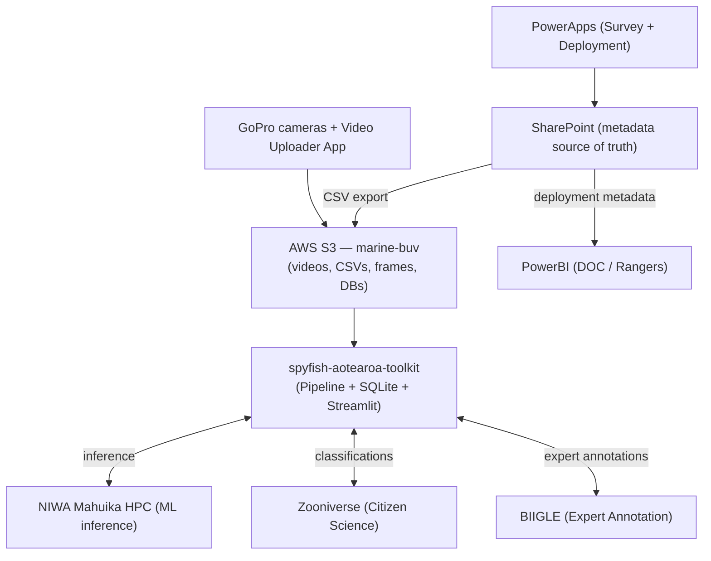


> **PowerBI data sources:** PowerBI connects to SharePoint for deployment metadata. How annotation data (MaxN counts) flows to PowerBI is still being defined — this is a known gap (see §12).

#### Who uses what

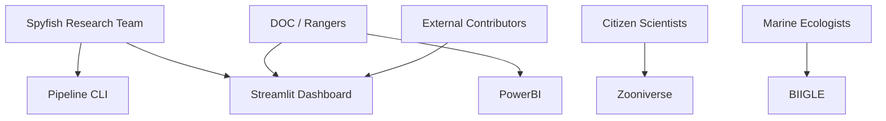


### Actors


| Actor                           | Role                                                                                                           | Primary tool        |
| ------------------------------- | -------------------------------------------------------------------------------------------------------------- | ------------------- |
| **DOC / Rangers**               | Primary data consumers. View fish counts, species distributions, survey progress. Do not operate the pipeline. | PowerBI dashboard   |
| **Spyfish Research Team**       | Pipeline operators. Run ingestion, monitor errors, trigger stages, manage BIIGLE volumes, retrain model.       | Streamlit + CLI     |
| **External contributors**       | Community members without DOC system access who support the project.                                           | Streamlit dashboard |
| **Citizen Scientists**          | Zooniverse volunteers who classify 10-second video clips and image frames into top species + "other".          | Zooniverse          |
| **Marine Ecologists / Experts** | Expert annotators who draw bounding boxes and identify species using the full species list in BIIGLE.          | BIIGLE              |


### Two dashboards, two audiences


| Dashboard              | Technology         | Audience                     | Purpose                                                                                   |
| ---------------------- | ------------------ | ---------------------------- | ----------------------------------------------------------------------------------------- |
| **Streamlit** (`app/`) | Python / Streamlit | Team + external contributors | Pipeline ops: deployment status, error review, annotation export, model metrics           |
| **Reporting app**      | PowerBI            | DOC / Rangers                | Conservation reporting: MaxN counts by species, time, and marine reserve on maps & graphs |


These are complementary tools, not alternatives to each other.

**Streamlit pages (`app/pages/`):**

| Page | Purpose |
| ---- | ------- |
| `⚙️_Deployment_Management.py` | Per-deployment pipeline status, filtering, and per-drop MaxN annotation view (uses `get_maxn_summary()`) |
| `📈_Health_Dashboard.py` | Programme-level health: deployments per year, bad deployment rates (sorted by %, with 10% threshold reference line), validation errors by type and by failing column, pipeline funnel, annotation depth per survey (stacked horizontal funnel: none → ML → CitSci → Expert), video presence, protection status breakdown |
| `🧪_Experiments.py` | Read-only ecological sandbox — 15 experiments grouped by category (reserve effect / programme overview / species deep-dive / source quality / distribution). Global filters at the top (source, year range, reserves) apply to every experiment. Pills navigation. See "Experiments architecture" below for the full list. |
| `🔍_Error_Review.py` | Validation errors per survey |
| `📥_Export_Biigle_Annotations.py` | On-demand annotation download from Biigle API |
| `📊_Model_Metrics.py` | ML training results (mAP, per-class metrics, confusion matrix) |
| `📺_View_Deployment_Videos.py` | Video player for individual deployments |

Species names in `🧪_Experiments.py` are displayed as `"Common name (Scientific name)"` using a lookup loaded from `process_files/training/class_map.json` (`config.class_map_path`) via `load_common_names()`. Species without a common name in the class map fall back to scientific name only.

**Experiments architecture (`🧪_Experiments.py`):**

The page loads MaxN data + sites + class_map once, enriches it (parses `drop_id` → `reserve_code` / `site_id` / `survey_year`, joins `sites.protection_status`, attaches `display_name`), then renders three global filter widgets at the top: source picker (with per-source deployment-count labels: `expert (1049 deps)`), year-range slider, and reserve multiselect.

Two filtered dataframes are passed to every experiment via a `ctx` dict:

- `df` — year/reserve filters + single-source filter applied. Used by most experiments.
- `df_multi` — year/reserve filters only; all sources retained. Used by **Calibration** and **Disagreement**, which by nature need both sources for every comparison point.

`ctx` also carries the project-wide `protection_status → colour` map (blues for protected, warm for unprotected) and the loaded `sites` / `common_names` for experiments that need to re-query (e.g. **Species search**).

| Category | Experiment | Question answered |
| -------- | ---------- | ----------------- |
| Reserve effect | Reserve effect (slope) | Does protection help each species? Up-sloping line = stronger inside reserve. |
| Reserve effect | Heatmap | Which sites have which species, grouped by protection status (vertical divider). |
| Reserve effect | Year trend | Year-on-year MaxN per site for a chosen species. |
| Programme overview | Detection rate | What % of deployments saw each species (common / intermediate / rare). |
| Programme overview | Composition | Top-N species relative abundance per reserve (stacked bar). |
| Programme overview | Diversity | Shannon / Simpson / Evenness per reserve. |
| Programme overview | Leaderboard | Top sites by Sum / Mean / Species richness. |
| Programme overview | Accumulation | Cumulative species discovered vs deployments surveyed (resampled, 95% CI). |
| Species deep-dive | Species search | Per-species lookup → every (drop, time) observation sorted by source priority. Uses `search_species_annotations(scientific_name)` — cached per-species query. |
| Species deep-dive | Bait arrival | Distribution of `time_of_max_seconds` per species (violin). |
| Species deep-dive | Freq × abundance | Hanski plot: each species classified as core / patchy / transient / incidental by median lines. |
| Species deep-dive | Co-occurrence | Species × species heatmap; cell = min-normalised intersection. |
| Source quality | Calibration | ML vs Expert scatter with R², slope, mean bias, MAE. |
| Source quality | Disagreement | |MaxN_A − MaxN_B| heatmap per (drop, species). |
| Distribution | Box plot | Full distribution of reserve effect (complements the slope chart). |

---

## 4. Technical Architecture

### Technology stack


| Layer                    | Technology                                     | Rationale                                                                               |
| ------------------------ | ---------------------------------------------- | --------------------------------------------------------------------------------------- |
| Language                 | Python 3.12+                                   | Ecosystem for ML, data manipulation, and all external platforwhom clients               |
| ML inference             | Ultralytics YOLOv12                            | State-of-the-art real-time object detection; active upstream development                |
| Video processing         | OpenCV + FFmpeg                                | OpenCV for frame extraction (frame parity with YOLO); FFmpeg for clip encoding          |
| Database                 | SQLite (via `sqlite3`)                         | Zero-infrastructure, file-based, trivially synced to S3; sufficient for ~1k/year scale  |
| Cloud storage            | AWS S3 (`marine-buv` bucket, managed by DOC)   | Shared file store for videos, databases, and outputs                                    |
| HPC (ML)                 | NIWA Mahuika (Slurm + GPU)                     | GPU acceleration for YOLO inference; NeSI allocation for NZ-based research              |
| Citizen science          | Zooniverse (panoptes_client)                   | Volunteers classify clips/frames into top species + "other"; intentionally simplified   |
| Volunteer data reduction | Caesar (Zooniverse)                            | Subject-level reduction rules; determines when a subject has sufficient classifications |
| Expert annotation        | BIIGLE (REST API)                              | Full expert species list; bounding boxes; future: substrate analysis + size review      |
| Ops dashboard            | Streamlit + Plotly                             | Python-native; suitable for team + external contributors without DOC system access      |
| Reporting dashboard      | PowerBI                                        | DOC-facing; connects to SharePoint for deployment metadata; MaxN maps & graphs          |
| Metadata input           | PowerApps (BUV Survey app, BUV Deployment app) | Mobile-first field data entry for rangers                                               |
| Video upload             | Video Uploader App (desktop, Gitlab/BytesNZ)   | Concatenates GoPro segments and uploads to S3                                           |
| Configuration            | YAML + python-dotenv                           | Non-secret config in `config.yaml`; secrets in `.env` (never committed)                 |


> **S3 bucket note:** The production bucket is `marine-buv` (DOC-managed). A separate test bucket (`marine-buv-kalindi`) is used for development. The bucket name is configured in `.env`.

### ML model strategy

The ML model starts as a **binary classifier** (fish vs no-fish). Species-specific classes are added incrementally as training data for each species grows to a point where the model can reliably detect that species. This means the model naturally becomes multi-class over time as the annotation pipeline accumulates expert labels, without forcing multi-class detection before the training data supports it.

### Config and orchestration

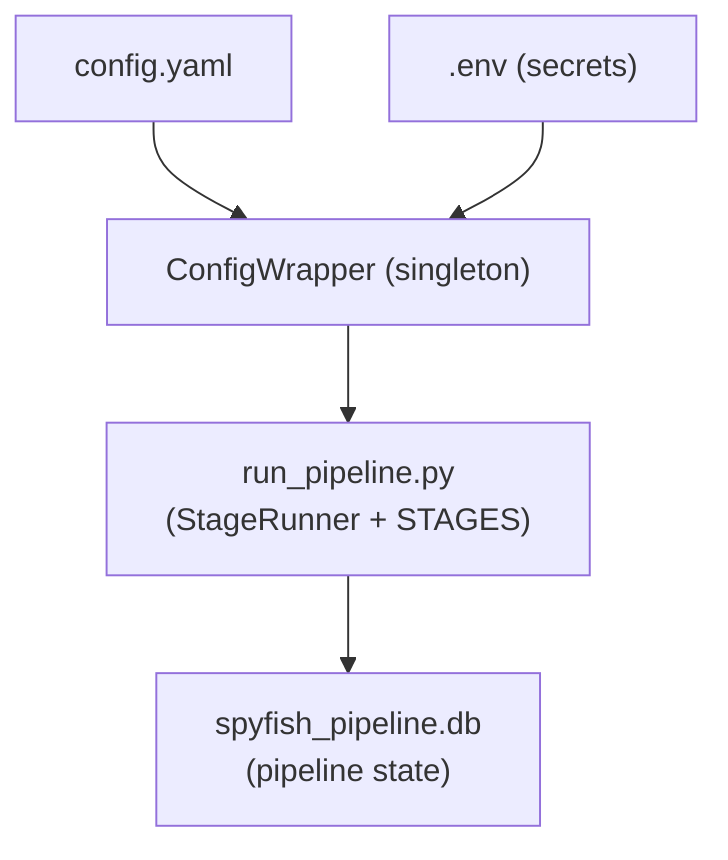


### Processing modules

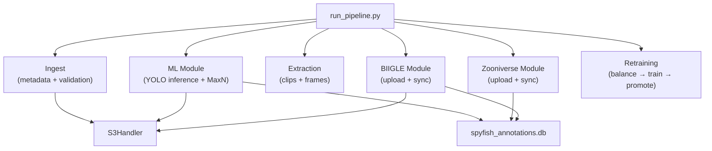


---

## 5. Data Flow

### Pre-pipeline: how videos reach S3

Before the pipeline runs, two independent processes must have completed:

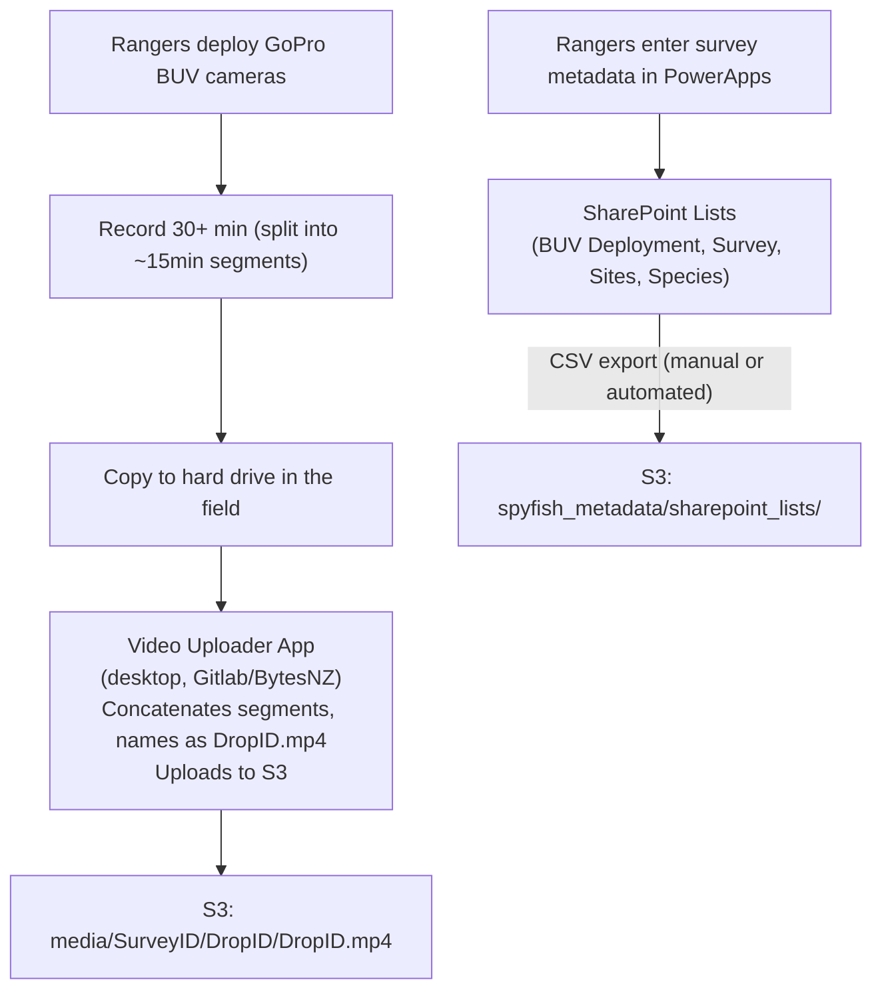


### End-to-end pipeline data flow

```mermaid
flowchart TD
    A["S3: Videos + Metadata CSVs available"]

    A --> D["Step 1: Ingest<br/>Download CSVs from S3<br/>Validate structure and formats<br/>Populate deployments DB<br/>ingest_status: ok / excluded / validation_error<br/>ml_status: ml_ready (video present) or ml_pending"]

    D --> E["Check Arrivals<br/>Poll S3 for video files<br/>ml_status: ml_pending → ml_ready"]

    E --> F["Step 2: ML Inference<br/>Download video from S3<br/>YOLO at 3 FPS → raw detections CSV<br/>ml_status: ml_ready → ml_running → ml_complete"]

    F --> G["Step 3: Post-processing<br/>Aggregate into 10s intervals<br/>Apply confidence threshold 0.50<br/>Compute MaxN per interval × species<br/>Store in annotations DB<br/>annotated_by = model_name"]

    G --> H{"Annotation<br/>path"}

    H -->|"Zooniverse path"| I["Step 4: Zooniverse Clips<br/>Select representative 10s clips<br/>MaxN peaks, confusing, empty, start<br/>Extract MP4 clips via FFmpeg<br/>Upload to Zooniverse subject sets<br/>citsci_status: citsci_pending → citsci_clips_uploaded"]

    I --> K["Step 5: Volunteer Sync<br/>Per-subject-set retirement check via Panoptes API<br/>Fetch classifications for retired clips sets<br/>Aggregate by (subject, species), write MaxN CSV<br/>annotated_by = citsci<br/>citsci_status: citsci_clips_uploaded → citsci_complete"]

    H -->|"Biigle-direct path<br/>(skip Zooniverse)"| L

    K --> L["Step 6: BIIGLE Upload<br/>Frame selection: from volunteer MaxN if citsci_complete,<br/>else from raw ML CSV<br/>Extract JPEGs + COCO JSON<br/>Upload frames to S3<br/>Create BIIGLE image volume<br/>expert_status: expert_pending → expert_uploaded"]

    L --> M["Expert annotates in BIIGLE<br/>Draws bounding boxes<br/>Marks volume Done"]

    M --> N["Step 7: BIIGLE Sync<br/>Detect Done volumes<br/>Download annotation CSV<br/>Parse to annotations DB<br/>annotated_by = expert<br/>expert_status: expert_uploaded → expert_complete"]

    N --> O["Step 8: Retrain<br/>Export BIIGLE labels → YOLO format<br/>Filter excluded drops, identify floor species (rare → 'fish' fallback)<br/>Survey-aware 70/15/15 split (with force-val overrides)<br/>Train YOLOv12 (optimizer/lr/dropout from config)<br/>Evaluate vs production<br/>Promote if mAP improvement ≥ 2%"]

    O --> P["Updated production model<br/>All future inference uses new weights"]
```


### Annotation sources and trust

Three sources of annotation exist. There is **no formal merge step** — expert annotations simply win. When expert annotations exist for a deployment, they are the authoritative record for reporting and retraining. ML and citsci annotations remain in the database for comparison and auditing.

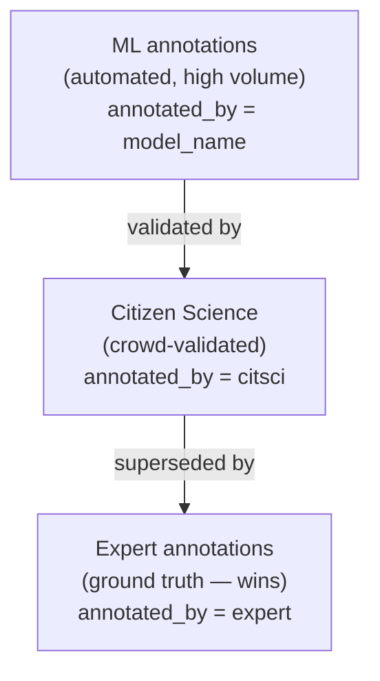


All three are stored in the same `annotations` table. The `annotated_by` field contains `'citsci'` or `'expert'` for those sources, and the **model name** (e.g. `cfd_binary_water_20260301`) for ML annotations — so model versioning is preserved per-record in the `external_id` column.

**Expert review model:** Experts aim to review approximately **~10 frames per deployment** (or at survey level). If the ML + citsci signal looks wrong, a closer per-frame review can be triggered. This keeps expert effort tractable at ~1,000 deployments/year while still producing ground-truth labels for model retraining.

**BIIGLE future scope:** Beyond species identification, BIIGLE is planned for **substrate analysis** and **size review** using the same upload/sync pipeline steps — only the downstream parsing logic changes when downloading annotations.

### S3 bucket layout

```
marine-buv/   (production, DOC-managed)
├── spyfish_metadata/
│   └── sharepoint_lists/
│       ├── BUV Deployment.csv                  # One row per camera drop
│       ├── BUV Survey Metadata.csv             # One row per survey trip
│       ├── BUV Survey Sites.csv                # Site reference data
│       ├── BUV Species.csv                     # Species lookup (AphiaID, common, scientific)
│       ├── Marine Reserves.csv                 # Marine reserve reference
│       └── BUV Annotations Legacy Experts.csv  # Pre-BIIGLE expert annotations (TODO: clarify)
│
├── media/
│   └── {SurveyID}/{DropID}/{DropID}.mp4        # Raw concatenated videos
│
└── process_files/                              # Synced from local after each run
    ├── db/                                     # spyfish_pipeline.db, spyfish_annotations.db
    ├── deployment_data/
    │   └── {SurveyID}/
    │       ├── {DropID}/
    │       │   ├── annotations/                # MaxN CSVs, raw CSVs, selections, COCO JSON
    │       │   ├── clips/                      # 10s MP4 clips for Zooniverse
    │       │   ├── frames/                     # JPEG frames (Zooniverse + BIIGLE disk 134)
    │       │   ├── qa_frames/                  # ML-annotated frames with boxes for QA
    │       │   └── training_frames/            # Bootstrap training JPEGs + raw CSV + COCO JSON
    │       └── training_frames/                # Survey-level S3 prefix flat across drops (BIIGLE disk 134)
    ├── models/                                 # YOLO weights
    └── training/                               # Retraining results
```

### File artifacts per deployment

```
annotations/{DropID}/
  {DropID}_{model}_raw.csv              Raw YOLO detections (one row per bounding box)
  {DropID}_ml_{model}_maxn.csv          ML MaxN aggregations (one row per interval × species)
  {DropID}_zooniverse_maxn.csv          Volunteer MaxN (same 8-column schema as ML MaxN)

  MaxN CSV schema (both ML and Zooniverse):
    DropID, ScientificName, TimeOfMax, MaxInterval, AnnotatedBy,
    IntervalAnnotation, ConfidenceAgreement, TimeOfMaxAbsSeconds
    (TimeOfMaxAbsSeconds = absolute seconds from video start)

  Selections CSV schema (clips and frames):
    DropID, SamplingStart, ClipStartAbsoluteSeconds, ClipEndAbsoluteSeconds,
    TimeOfMaxAbsSeconds, ScientificName, SelectionReason, MaxInterval, ConfidenceAgreement
    (ClipStart/End = relative to SamplingStart; TimeOfMaxAbsSeconds = absolute)

deployment_data/{SurveyID}/{DropID}/
  annotations/
    {DropID}_{model}_raw.csv             Raw YOLO detections
    {DropID}_ml_{model}_maxn.csv         ML MaxN aggregations
    {DropID}_zooniverse_maxn.csv         Volunteer MaxN
    {DropID}_frames_selection.csv        Clip/frame selection manifest
    {DropID}_biigle_frames_selection.csv BIIGLE frame selection manifest
    {DropID}_coco_annotations.json       COCO-format bounding boxes from ML
  clips/                                 10s MP4 clips (Zooniverse)
  frames/                                JPEG frames (Zooniverse + BIIGLE disk 134)
  qa_frames/                             JPEG frames with ML boxes drawn (for review)
  training_frames/                       Bootstrap-extraction artefacts (extract_training_frames):
    {DropID}__frame_{t:.3f}s.jpg           N back-loaded JPEGs (default N=10)
    {DropID}_{kind}_raw.csv                YOLO detections from training_extraction.annotation_type
    {DropID}_coco_annotations_for_biigle.json
                                           COCO sidecar uploaded with the JPEGs to Biigle

models/
  pipeline_model/                        Active production YOLO weights
  base_model/                            Baseline for retraining evaluation

zooniverse/
  legacy_classifications/                Downloaded Zooniverse classifications export CSVs
  legacy_subjects/                       Downloaded Zooniverse subjects export CSVs
  last_run.json                          Tracks last API fetch timestamp for --since auto
  zooniverse_review.csv                  Audit log of all aggregated subjects (every run)
  zooniverse_nothing_here_sample.csv     Sampled NOTHINGHERE subjects for review

S3: process_files/deployment_data/{SurveyID}/{DropID}/frames/   JPEGs served to BIIGLE (disk 134)
```

---

## 6. Data Modeling

### Entity relationships

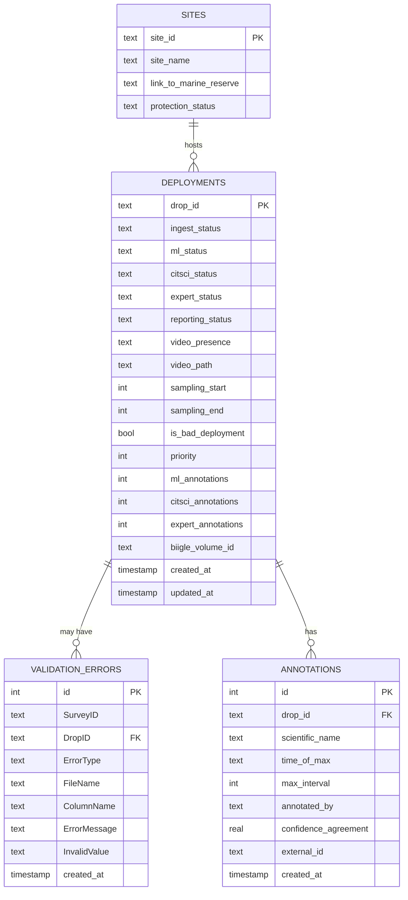


#### `deployments` table columns (`spyfish_pipeline.db`)


| Column               | Type      | Description                                                                                                                     |
| -------------------- | --------- | ------------------------------------------------------------------------------------------------------------------------------- |
| `drop_id`            | TEXT PK   | Unique deployment identifier (`{Reserve}_{YYYYMMDD}_BUV_{Reserve}_{Site}_{Rep}`)                                                |
| `ingest_status`      | TEXT      | Data quality: `ok`, `excluded`, `metadata_error`, `validation_error`, `removed`. Only `ok` advances through stages.             |
| `ml_status`          | TEXT      | ML section: `ml_pending`, `ml_ready`, `ml_running`, `ml_complete`, `ml_error`                                                   |
| `citsci_status`      | TEXT      | Citizen science section: `citsci_pending`, `citsci_clips_uploaded`, `citsci_complete`, `citsci_error`, `citsci_skipped` |
| `expert_status`      | TEXT      | BIIGLE section: `expert_pending`, `expert_uploaded`, `expert_complete`, `expert_error`                                          |
| `reporting_status`   | TEXT      | Reporting section: `reporting_pending`, `reporting_complete`, `reporting_error`                                                 |
| `video_presence`     | TEXT      | `present`, `archived` (DEEP_ARCHIVE — needs restore), `absent`, `no_video_bad_dep`                                              |
| `video_path`         | TEXT      | S3 key of the deployment video                                                                                                  |
| `sampling_start`     | INTEGER   | Start of valid sampling window (seconds) — from PowerApps metadata                                                              |
| `sampling_end`       | INTEGER   | End of valid sampling window (seconds)                                                                                          |
| `is_bad_deployment`  | BOOLEAN   | Flagged as problematic in source CSV; still tracked through pipeline                                                            |
| `priority`           | INTEGER   | Processing priority. Higher = picked up first. Default 0.                                                                       |
| `ml_annotations`     | INTEGER   | Count of ML annotations — **owned by `sync_annotation_counts()`, never set by ingest.** See "Annotation count → status invariant" below. |
| `citsci_annotations` | INTEGER   | Count of volunteer annotations — same ownership rule                                                                            |
| `expert_annotations` | INTEGER   | Count of expert annotations                                                                                                     |
| `biigle_volume_id`   | TEXT      | BIIGLE volume ID, set when the volume is created                                                                                |
| `training_biigle_volume_id` | INTEGER | BIIGLE volume ID for the survey-level training-frames volume (`extract_training_frames`). Non-NULL = drop's training frames + ML annotations are uploaded; used as the "drop is done" gate for re-runs. |
| `created_at`         | TIMESTAMP | Record creation time                                                                                                            |
| `updated_at`         | TIMESTAMP | Last update time                                                                                                                |


#### `annotations` table columns (`spyfish_annotations.db`)


| Column                 | Type       | Description                                                            |
| ---------------------- | ---------- | ---------------------------------------------------------------------- |
| `id`                   | INTEGER PK | Auto-increment                                                         |
| `drop_id`              | TEXT FK    | Links back to `deployments`                                            |
| `scientific_name`      | TEXT       | Scientific name (normalised — see note below)                          |
| `time_of_max`          | TEXT       | `HH:MM:SS` timestamp of the MaxN moment                                |
| `time_of_max_seconds`  | REAL       | Same timestamp as decimal seconds; used for filtering and time-series  |
| `max_interval`         | INTEGER    | Fish count at the MaxN moment                                          |
| `annotated_by`         | TEXT       | Source: model name (ML), `'citsci'` (Zooniverse), `'expert'` (BIIGLE) |
| `confidence_agreement` | REAL       | YOLO confidence (ML) or volunteer agreement % as decimal (citsci)      |
| `external_id`          | TEXT       | Model name for ML records; BIIGLE annotation ID for expert records     |
| `created_at`           | TIMESTAMP  | Record creation time                                                   |


> **`external_id` dual role:** For ML annotations, `external_id` stores the model name (e.g. `cfd_binary_water_20260301`). For expert annotations, it stores the BIIGLE annotation ID. This allows model versioning to be traced per-record without a separate column.

> **`scientific_name` normalisation (citsci path):** Zooniverse volunteers select choice keys (`BLUECOD`, `SNAPPER`, etc.). These are resolved to scientific names by `_zoo_choice_to_scientific()` in `parse_classifications.py` before the MaxN CSV is written. The mapping is derived at runtime from `process_files/biigle/labels/species_labels.csv` (the Biigle label tree export, format `"Common name - Scientific name"`). Choice keys with no match (e.g. `OTHER`, or legacy common-name variants we haven't catalogued) map to the generic `"fish"` fallback — same semantics as the binary-fish floor the ML model uses for rare species. Dropping them would lose meaningful signal ("the volunteer saw a fish but couldn't ID it"). Blank/null choices return `None` and are skipped. Any citsci annotations ingested before this normalisation step was added retain the raw choice key and must be re-ingested from the MaxN CSVs to correct them.

> **`get_maxn_summary()` query:** Returns the canonical peak MaxN per `(drop_id, scientific_name, annotated_by)` using a correlated subquery that selects the row with the highest `max_interval`. This ensures `time_of_max_seconds` and `confidence_agreement` come from the actual peak row rather than an arbitrary row (which is what a plain `GROUP BY` returns in SQLite).

### Annotation count → status invariant

`DatabaseManager.sync_annotation_counts(drop_ids)` is the **single chokepoint** that maintains the invariant:

```
annotations exist for source X on drop D
   ⇒ deployments.<X>_status = '<X>_complete' for drop D
```

After computing per-drop counts from `spyfish_annotations.db` and writing them to the deployments table, it advances the matching section status for any drop that gained annotations. Implementation uses `bulk_update_section_status()` (one `UPDATE` per source, single transaction) and **bypasses the state machine** — data presence overrides intent, so a drop with `expert_skipped` AND `expert_annotations > 0` becomes `expert_complete`. Drops already at COMPLETE are left alone (idempotent). The all-NOTHINGHERE case (zero observations after full citsci review) needs explicit advancement because the count-based rule can't see it; `ingest_zooniverse_annotations` handles this via a direct `bulk_update_section_status` call in the empty-CSV branch.

Every ingest path (`legacy_extract`, `ingest_zooniverse_annotations`, `_ingest_ml_annotations`, future BIIGLE sync, future bootstrap orchestrator) calls `sync_annotation_counts(drops)` at the end and gets status advancement for free. **Future ingest paths should follow the same pattern** — write annotations to the annotations DB, then call `sync_annotation_counts` with the affected drops. No manual status maintenance in the ingest path.

### Two-database design

```
spyfish_pipeline.db          spyfish_annotations.db
────────────────────         ──────────────────────────
deployments  (state)         annotations (observations)
sites        (reference)
validation_errors (QA)
```

**Why two databases?** The pipeline DB tracks *where a deployment is* in the workflow. The annotations DB tracks *what was observed*. Keeping them separate allows annotation data to be queried and exported without locking pipeline state.

### Multi-section pipeline status model

Each deployment has **five independent section columns** that progress separately. This replaces the old single linear `status` field.

```
ingest_status     ml_status           citsci_status         expert_status     reporting_status
─────────────     ─────────           ─────────────         ─────────────     ────────────────
ok                ml_pending → ml_ready   citsci_pending            expert_pending    reporting_pending
excluded          ml_running              citsci_clips_uploaded     expert_uploaded   reporting_complete
validation_error  ml_complete             citsci_complete           expert_complete   reporting_error
                  ml_error                citsci_error
                                          citsci_skipped
```

**Key design decisions:**

- `ingest_status` is the data-quality gate. All `get_deployments_eligible()` queries always filter `ingest_status = 'ok'` — excluded and errored deployments are never picked up by processing stages.
- All sections start at their respective `pending` value at ingest time — no `skipped` values are ever assigned. Whether a deployment needs a section is resolved at runtime by stage prerequisites, not at ingest.
- `video_presence` tracks whether the video actually exists in S3: `present`, `absent`, `no_video_bad_dep`. The `ml_status` starts at `ml_ready` only when `video_presence = present` and `ingest_status = ok`.
- Bad deployments (`is_bad_deployment = True`) are still tracked with all sections at their `pending` values so they remain visible in the dashboard.
- Re-ingestion never resets section statuses. The `ON CONFLICT` upsert only updates metadata fields (video path, sampling window, storage class, etc.) — pipeline progress is always preserved.

**Why this replaces the old single linear `status`:** Zooniverse and BIIGLE can run in parallel on the same deployment — the old linear state machine forced an artificial ordering. Errors were ambiguous (`ERROR` didn't say *which* section failed). Legacy deployments that skipped ML had no way to record that without lying about their progress. Splitting into independent sections fixes all three.

`**ON_HOLD` removed.** The old state machine had an `ON_HOLD` state for manually pausing a deployment. It's gone — runtime pausing is now done by omitting a stage flag (`python run_pipeline.py --ml` with no `--biigle-upload`). If a persistent soft-pause flag is ever needed, an `is_paused BOOLEAN` column is less invasive than encoding it into every section's state machine.

**Error storage.** The old `error_message` column on `deployments` is gone. Errors now live in the `validation_errors` table with section-specific `ErrorType` values: `ML_ERROR`, `CITSCI_ERROR`, `BIIGLE_ERROR`, `PIPELINE_ERROR` (reporting), `VALIDATION_ERROR` (ingest). Each section has a unique error value (`ml_error`, `citsci_error`, `expert_error`, `reporting_error`); `validation_errors` holds the details. `_SECTION_ERROR_TYPES` in `DatabaseManager` maps each section column to its error type so moving out of an error state clears only the matching rows.

**Future cleanup pass:** once `reporting_status = reporting_complete`, any section that never reached its `complete` value (e.g. Zooniverse for a BIIGLE-direct deployment) can be rewritten to its `skipped` value so the dashboard doesn't show ambiguous `pending` states on already-done deployments. Not wired up yet.

`**priority` column.** Integer, default 0, higher = picked first. `get_deployments_eligible()` always applies `ORDER BY priority DESC`. Set per-deployment via `set_status --priority N`, in bulk via the targets CSV + `--set-targets`, or (future) via the Streamlit Deployment Management page.

---

## 7. Pipeline State Machine

### Section overview

Each deployment progresses through five independent sections. Sections are not sequential stages in a single queue — they are separate state machines that can advance independently, with cross-section prerequisites where needed.

```
ingest   ──────────────────────────────────────────────────────── data quality gate (never advances through pipeline)
ml       ml_pending → ml_ready → ml_running → ml_complete → ml_error
citsci   citsci_pending → citsci_clips_uploaded → citsci_complete → citsci_error
biigle   expert_pending → expert_uploaded → expert_complete → expert_error
reporting reporting_pending → reporting_complete → reporting_error
```

A deployment is considered **complete** when `expert_status = expert_complete` OR `reporting_status = reporting_complete`.

### Section state machines

`**ingest_status`** — set at ingestion, never modified by pipeline stages:

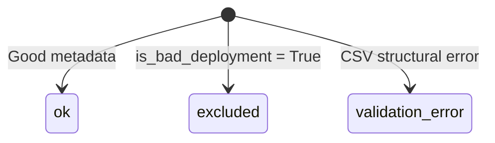


`**ml_status**` — ML inference section:

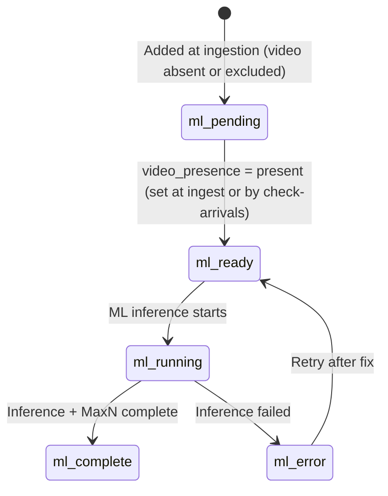


`**citsci_status**` — Citizen science section:

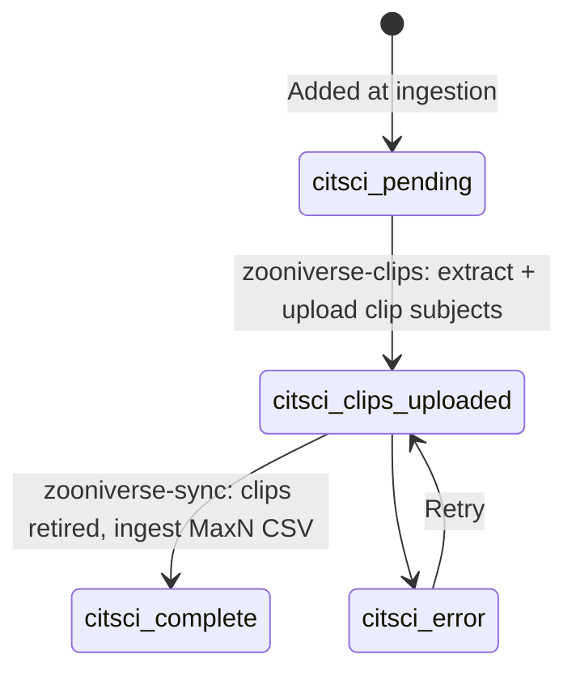


> **Zooniverse subjects are clips only.** Volunteers classify clip subjects; the section transitions are `citsci_pending → citsci_clips_uploaded → citsci_complete`, with the final step driven by `--zooniverse-sync` checking per-subject-set retirement via the Panoptes API. Frame extraction in `select_frames.py` exists only for `--biigle-upload` (expert review on BIIGLE).

`**expert_status`** — expert annotation section. **Source-agnostic.** A drop is `expert_complete` once it has expert annotations from any path (BIIGLE round-trip, legacy CSV ingest, future direct review). Provenance lives on each annotation row's `external_id` field (BIIGLE annotation ID, `"legacy"`, etc.), not in this status.

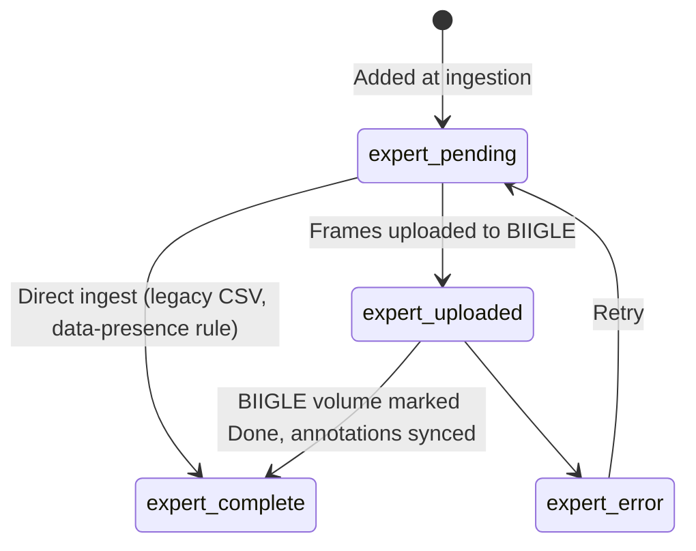

> **Direct `pending → complete` edge for non-BIIGLE paths.** `--legacy-experts` (and any future direct-ingest path) calls `sync_annotation_counts(drop_ids)` at the end, which is the **single chokepoint** that maintains the invariant `annotations exist → status complete`. The data-presence rule lives in `DatabaseManager.sync_annotation_counts()` and uses `bulk_update_section_status()` to advance any drop with non-zero annotations to the section's COMPLETE value, regardless of prior state — including `SKIPPED`, because data presence overrides intent. Idempotent: drops already at COMPLETE are left alone. See "Annotation count → status invariant" below.

`**reporting_status**` — Reporting section (currently placeholder):

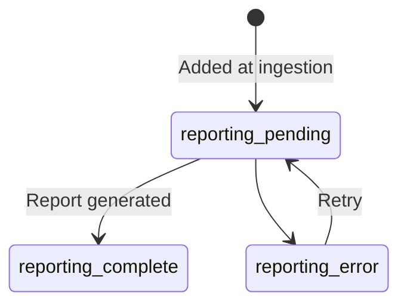


### Cross-section prerequisites

Stage eligibility is resolved at query time via `get_deployments_eligible(section, statuses, prerequisites)`. The `prerequisites` dict (or callable) adds extra `AND` conditions to the query. All queries also always filter `ingest_status = 'ok'`.


| Stage               | `section`       | `input_statuses`          | `prerequisites`                                                                             |
| ------------------- | --------------- | ------------------------- | ------------------------------------------------------------------------------------------- |
| `check-arrivals`    | `ml_status`     | `[ml_pending]`            | `video_presence = absent`                                                                   |
| `ml`                | `ml_status`     | `[ml_ready]`              | —                                                                                           |
| `zooniverse-clips`  | `citsci_status` | `[citsci_pending]`        | `ml_status = ml_complete`                                                                   |
| `zooniverse-sync`   | `citsci_status` | `[citsci_clips_uploaded]` | — (checks clips subject set retirement via Panoptes API)                                    |
| `biigle-upload`     | `expert_status` | `[expert_pending]`        | `ml_status = ml_complete` OR `citsci_status = citsci_complete` (callable, depends on flags) |
| `biigle-sync`       | `expert_status` | `[expert_uploaded]`       | `biigle_volume_id IS NOT NULL`                                                              |


**Biigle-direct path:** Running `--biigle-upload` without any `--zooniverse-`* flags sets the prerequisite to `ml_status = ml_complete`, bypassing the citizen science loop.

### Transition rules

- `db.advance_status(drop_id, section, to_status)` validates against `VALID_TRANSITIONS` on the section's status class (looked up via the `SECTIONS` registry in `base.py`) and raises `InvalidTransitionError` for disallowed moves.
- Moving out of a section's ERROR value automatically clears that section's error rows from `validation_errors` — other sections' errors are not affected.
- The `set_status` admin tool calls `update_section_status()` directly, bypassing transition validation — surgical admin use only.
- Error recovery: set the section back to its `pending` or `ready` value using `set_status`. The next pipeline run picks it up automatically.

---

## 8. Component Design

### Declarative stage framework

Every pipeline stage is declared in a single `STAGES` list in `run_pipeline.py`. The `StageRunner` auto-generates CLI flags, queries eligible drops, advances section status, and captures errors. Adding a new stage requires one list entry and a step function.

```python
# Global stage — runs once, manages own iteration
GlobalStage("ingest", "Step 1: metadata ingestion", _run_ingestion)

# Drop stage — called once per eligible drop; return value = next section status value
DropStage(
    "zooniverse-clips",
    "Step 4: extract and upload Zooniverse clips",
    _step4_process_drop,
    section="citsci_status",
    input_statuses=[CitSciStatus.PENDING],
    prerequisites={"ml_status": MlStatus.COMPLETE},
)
```

`StageRunner._run_drop_stage` calls `db.advance_status(drop_id, stage.section, next_status)` directly — no per-section dispatch needed since `advance_status` uses the `SECTIONS` registry. On exception, it calls `db.update_section_status(drop_id, stage.section, SECTIONS[stage.section].ERROR)`.

### Configuration design

All non-secret configuration lives in `config.yaml` and is accessed through a singleton `ConfigWrapper`. Key rules:

- **No silent defaults** — missing keys raise `ValueError` immediately
- **External contracts in config, internal schema in code** — `config.yaml` holds things that can change between environments or external systems: CSV column names from PowerApps/SharePoint, regex patterns, S3 prefixes, confidence thresholds, API IDs. Internal schema strings (DB column names, pipeline status values, section state machines) live on the status classes in `spyfish/config/base.py` because the state-machine logic depends on their exact values and changing them requires a code + migration pair.
- **No manual path construction** — all file paths generated by config methods
- **Secrets in `.env`** — never committed to git

### Clip selection strategy

The ML-guided clip selection concentrates human review on the most valuable moments. Numbers are configured in `config.yaml` and are initially set higher to maximise manual review coverage:

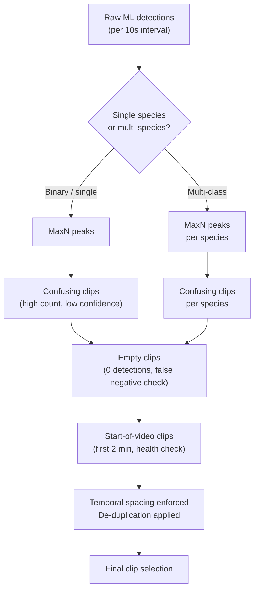


> **Frame selection for BIIGLE expert review.** `--biigle-upload` selects which frames to extract per drop. When `citsci_status = citsci_complete`, it calls `select_frames_from_zooniverse()` — ranks `(subject, species)` rows from the volunteer MaxN CSV by `mean_count × agreement_pct` and picks frames at those timestamps. Otherwise it falls back to `select_frames()` reading the raw ML CSV. Expert review on BIIGLE is anchored to volunteer-validated peak moments when citsci ran, and to ML peaks when it didn't.

### Two specific technical choices

**OpenCV for frame extraction (not FFmpeg):** The YOLO inference stream and frame extraction use the same OpenCV video reader. This guarantees frame parity — the exact pixel values seen by the model are what human annotators see. FFmpeg and OpenCV can produce slightly different frames from the same video.

**CRF probing for clip encoding:** Zooniverse enforces a ~12 MB upload limit. Rather than a fixed quality setting, the pipeline probes a short segment to estimate the CRF value that hits the size target, then encodes the full clip at that quality.

---

## 9. Security & Sensitive Data

### Sensitive data categories

Per the Spyfish project guidelines, the following data must be handled carefully and not exposed in publicly-facing systems:


| Category         | Example                                                  | Risk                                                     |
| ---------------- | -------------------------------------------------------- | -------------------------------------------------------- |
| **Locations**    | GPS lat/lon of deployment sites                          | Could enable targeted illegal fishing at monitored sites |
| **Rare species** | Presence/absence of protected or critically rare species | Could attract poaching or collection                     |
| **PII**          | People's names, contracts, team member details           | Standard privacy obligation                              |


The Streamlit dashboard and any exported data should be reviewed against these categories before being shared externally.

### Credential management

All secrets live in `.env`, loaded at startup via `python-dotenv`. Never committed to git. The `.env_sample` file documents required variables without values.

Required secrets:

- `AWS_ACCESS_KEY_ID` / `AWS_SECRET_ACCESS_KEY` / `AWS_REGION` — S3 access
- `BIIGLE_API_EMAIL` / `BIIGLE_API_TOKEN` — BIIGLE REST API
- `ZOONIVERSE_USER` / `ZOONIVERSE_PASSWORD` — Panoptes upload

### S3 access

The production S3 bucket (`marine-buv`) is DOC-managed. S3 operations never use `--delete` — the bucket is treated as a permanent backup of record. Frames uploaded to `process_files/deployment_data/{SurveyID}/{DropID}/frames/` are served directly to BIIGLE via a configured S3 disk mount (disk 134).

### Path safety

DropIDs are validated against a strict regex (`^[A-Z]{3}_\d{8}_BUV_[A-Z]{3}_\d{3}_\d{2}$`) before being used in path construction, preventing path traversal.

### BIIGLE API timeouts

All BIIGLE API requests enforce a configurable timeout (`request_timeout_secs: 30`) to prevent indefinite hangs if the BIIGLE server is unresponsive.

---

## 10. Alternatives Considered

### Database: SQLite vs cloud database

**Chosen:** SQLite, synced to S3 after each run.

SQLite was chosen because the dataset is small (≤1,000 rows of pipeline state), zero infrastructure is required, and it is trivially backed up by copying to S3. A PostgreSQL or DynamoDB instance would add cost and operational overhead without benefit at this scale. The trigger to migrate would be a need for concurrent writes from multiple workers.

### Architecture: monolithic pipeline vs microservices

**Chosen:** Monolithic pipeline with a declarative stage registry.

A microservices architecture (one Lambda per pipeline stage, event-driven via SQS) would offer independent scaling. However, the team is small, pipeline stages are sequential, and operational complexity would dominate. A well-structured monolith with a declarative stage registry is easy to reason about and extend.

### ML compute: local vs cloud GPU vs HPC

**Current:** NIWA Mahuika HPC (Slurm + GPU).

AWS EC2 GPU instances were considered. HPC was chosen because the research team has existing NeSI allocations, and GPU instance costs at ~1,000 videos/year × ~2 hours each are non-trivial. The pipeline is portable: the ML module can run locally on an NVIDIA GPU without code changes.

### Clip selection: random sampling vs ML-guided

**Chosen:** ML-guided selection (MaxN peaks + confusing + empty + start).

Random sampling would be simpler but wastes volunteer effort on uninformative footage. The ML-guided approach concentrates human review on scientifically and ML-valuable segments. A 30-minute video (180 intervals) is reduced to ~37–100 representative clips.

### Reporting dashboard: Streamlit vs PowerBI

Both are used — for different audiences.

- **Streamlit** serves the research team and external contributors who need pipeline-level access (deployment monitoring, error review, annotation export, model metrics) and do not have DOC system access.
- **PowerBI** serves DOC/Rangers, connecting to SharePoint for deployment metadata, and displaying MaxN counts on maps and charts for conservation reporting.

These are complementary tools, not competing choices.

---

## 11. Milestones

Sequenced by dependency, not assigned dates.

### Phase 1 — Core Pipeline ✅ Complete

- Multi-section pipeline status model (5 independent section columns replacing single linear status)
- Metadata ingestion from S3 (deployment, survey, site, species CSVs) with S3 storage class tracking
- Data validation framework with configurable rules
- YOLO ML inference module (OpenCV streaming, sampling window)
- MaxN post-processing (per-interval, per-species aggregation)
- Declarative stage framework (`GlobalStage` / `DropStage` / `StageRunner`) with cross-section prerequisites
- S3 sync (DB + results after each run)
- Streamlit dashboard (deployment monitoring, error review, annotation export)
- SharePoint → S3 metadata download integrated into pipeline

### Phase 2 — Annotation Platforms ✅ Complete

- Zooniverse clip extraction and upload (binary + multiclass strategy)
- Zooniverse frame extraction and upload
- BIIGLE frame upload and volume creation
- BIIGLE annotation sync (download + parse expert annotations)
- Zooniverse volunteer classification sync-back (`--zooniverse-sync`) — per-subject-set live path wired into `run_pipeline.py`
- Zooniverse choice key → scientific name normalisation via `species_labels.csv` (applied at `write_zooniverse_maxn_csv`)

### Phase 3 — Model Improvement Loop

- BIIGLE annotation → YOLO label conversion
- Training data preparation — drop exclusion + on-disk floor (rare → `fish` fallback)
- Curated drop lists (`excluded_drops.txt`, `force_val_drops.txt`) for QA holds and val-split pinning
- YOLOv12 retraining pipeline (train → evaluate → promote) with config-driven optimizer/lr/dropout
- Composable retrain CLI: `--data-prep` / `--binary` / `--species` flags scope the run
- Slurm wrapper for NeSI submission (`train_job.sl`)
- Per-species evaluation metrics surfaced in Streamlit dashboard
- Formal per-species model promotion tracking
- Training manifest (per-drop fate audit) — deferred; see §12

### Phase 4 — User Interaction & Admin

- Streamlit UI for manual deployment status updates (without CLI access)
- Streamlit UI to trigger individual pipeline stages per deployment
- Audit log view: full status transition history per drop
- In-app validation error resolution workflow

### Phase 5 — Production Hardening

- Environment management on NeSI
- NeSI crontab scheduling — code exists, hardening robustness
- Full integration test suite covering all pipeline stages end-to-end

### Phase 6 — DOC Reporting

- Annotation data export format defined and connected to PowerBI
- Marine reserve monitoring reports and report cards generated automatically from deployments with `expert_status = complete` or `reporting_status = complete`
- BIIGLE substrate and size review parsing (same pipeline, new annotation type)
- ✅ Programme health dashboard (`📈_Health_Dashboard.py`): KPI row, deployments per year, bad deployments per survey (sorted by % desc, 10% reference line), validation errors by type and column, pipeline funnel, per-survey annotation depth funnel, video presence over time, protection status breakdown, survey summary table
- ✅ Ecological experiments page (`🧪_Experiments.py`): 15 experiments across reserve effect (slope chart, heatmap, year trend), programme overview (detection rate, composition, diversity, leaderboard, species accumulation), species deep-dive (search, bait arrival, frequency × abundance, co-occurrence), source quality (calibration, disagreement), and full distribution view (box plot). Global filters (source / year / reserves) apply to all experiments via a shared `ctx` dict.
- Time-series visualisations of species abundance by marine reserve — foundation in place via Experiments page; dedicated DOC-facing page remaining

---

## 12. Known Gaps & Future Work

### Citsci annotations — re-ingestion required for pre-normalisation rows

Zooniverse choice keys (`BLUECOD`, `SNAPPER`, etc.) were stored raw as `scientific_name` in `spyfish_annotations.db` before the normalisation step was added to `write_zooniverse_maxn_csv`. Any citsci rows ingested before this fix have incorrect species names and cannot be compared with ML or expert annotations.

**Fix:** re-run `--zooniverse-sync` (or re-ingest from the existing MaxN CSVs) for all affected drops. The MaxN CSVs on disk also need regenerating if they were written before the fix, since the normalisation only applies at write time. Once re-ingested, the bootstrap orchestrator (`spyfish/orchestrator/bootstrap.py`, planned in PR 3 of `claude_docs/zooniverse_annotations_todo.md`) will handle this in bulk.

### Zooniverse volunteer sync — step 5b pipeline wiring

Classification parsing is fully wired into `run_pipeline.py --zooniverse-sync` (GlobalStage). The live path uses a per-subject-set architecture:

**Live path (`--zooniverse-sync`):**
1. `subject_completion_from_api()` — one API call returns retirement status for every subject set across all source projects (O(num_sets), reads `set_member_subjects_count` and `retired_set_member_subjects_count` directly from the subject set object; subject set → drop_id resolved via display_name convention `clips_{drop_id}`)
2. For each drop at `citsci_clips_uploaded`: find its clips subject set, skip if not fully retired
3. If raw CSV already exists on disk: re-aggregate from disk (idempotent, no API call). Use `--force` to bypass
4. Otherwise: `fetch_classifications_for_set(ss_id)` → `parse_classifications` → write `{drop_id}_zooniverse_raw.csv`
5. `aggregate_by_subject_species` → write `{drop_id}_zooniverse_maxn.csv`
6. `ingest_zooniverse_annotations` → advance to `citsci_complete`

**Historical backfill (`--legacy-zooniverse`):** reads classification + subjects CSVs from `process_files/zooniverse/legacy_classifications/` (configured via `paths.legacy.zooniverse`). Legacy filename resolver handles DMY/YMD date-pattern filenames, `_NEW` upload-suffix normalisation, and year-fuzzy matching for surveys where the Zooniverse filename date differs from the DB date by days or weeks. See `claude_docs/todo.md` resolver audit for unresolvable stems (pre-standard 2011–12 format, surveys not yet ingested). Companion admin flag `--legacy-experts` ingests the legacy expert annotation CSV from S3 — both are off the happy path and called explicitly.

**What is built:**
- Per-subject-set API fetch (not bulk project sweep) — retirement status is the gate, no timestamp cursor needed
- Raw CSV per drop (`{drop_id}_zooniverse_raw.csv`) — re-aggregate without re-fetching; mirrors ML raw CSV pattern
- MaxN CSV per drop in the same 8-column schema as ML MaxN CSVs
- Subject retirement completion checking: `subject_completion_from_api()` (live) / `subject_completion_from_csv()` (legacy)
- Legacy filename resolution via `parse_legacy_classifications` in `spyfish/zooniverse/legacy_extract.py`

**Volunteer quality control (automatic):**

Three exclusions fire in order inside `aggregate_by_subject_species`:

1. **Blank submissions** — `value:[]` payload, excluded from `total_classifiers` and `nothing_here_votes`
2. **High-NH click-through** — users with NH rate ≥ `user_exclusion_nh_pct_threshold` (90%) AND ≥ `user_exclusion_min_classifications` (100) classifications
3. **Dedup by (user_id, subject_id, species)** — collapses CSV export row inflation from subjects in multiple sets

Aggregator emits three count statistics per (subject, species): `mode_count` (training labels / MaxN CSV), `max_count` (ecology peak), `mean_count` (BIIGLE frame ranking). Two advisory flags: `suspicious_minority_find` and `count_disagreement` (`max_count >= mode_count + 2 AND vote_count >= 3`).

**Workflow 17057 — bounding box training data, not citsci:**

Workflow 17057 is a 2012 expert annotation workflow where volunteers drew bounding boxes around pre-labelled species. Filenames use pre-canonical format (`PMR12_2012`, `CON28_2012`) that cannot resolve to current drop_ids. Not citsci — treat as training/expert only if ever used.

**Open items:**
- Validate `--zooniverse-sync` end-to-end against real API data on first production run
- Wire retirement gates (`citsci_clips_done` / `citsci_frames_done`) — see `CitSciStatus` TODO in `base.py`

### PowerBI — annotation data feed is manual

PowerBI connects to SharePoint for deployment metadata. Annotation results (MaxN counts, species) are currently not transferred to PowerBI, there is no automatic pipeline from the annotation databases to the reporting dashboard. This is the critical missing link for scalable DOC reporting.

Future options: direct S3 export in a PowerBI-compatible format, a SharePoint list sync, or an API layer.

### User interaction with the database and pipeline

Currently, all manual database operations require CLI access (`set_status`) or direct SQLite queries. This is a barrier for team members and contributors who aren't comfortable at the command line.

**Planned work:**

- Streamlit UI for viewing and manually updating deployment statuses
- Ability to trigger individual pipeline stages per deployment from the dashboard
- Audit log view showing the full status transition history for any drop
- In-app workflow for reviewing and resolving validation errors
- Controlled manual annotation entry (e.g. for legacy expert data not coming through BIIGLE)

### SharePoint → S3 metadata download

Currently, metadata CSVs must be manually exported from SharePoint and uploaded to S3. A direct SharePoint download option integrated into the pipeline would ensure the pipeline always works from the latest source data without manual export steps.

### GoPro video concatenation — upstream of this pipeline

The video-uploader app (Gitlab/BytesNZ) handles GoPro segment concatenation before videos reach S3. Without it, the pipeline will not find the expected `{DropID}.mp4` file.

> **Review needed:** The pipeline has no validation that the video in S3 is a complete (concatenated) file vs a partial GoPro segment. A duration or size check at the `check-arrivals` stage could catch this early.

### BIIGLE future scope: substrate and size review

BIIGLE volumes can also be used for substrate analysis and fish size estimation. The upload and sync pipeline steps are identical — only the parsing logic when downloading annotations differs. This is planned but not yet implemented.

### NeSI crontab scheduling — hardening in progress

The pipeline runs on NeSI (New Zealand eScience Infrastructure HPC). A NeSI crontab schedule triggers pipeline runs automatically. The scheduling mechanism exists but is being made more robust to handle edge cases cleanly (e.g. overlapping runs, job failures, partial states).

---

## 13. Setup & Prerequisites

### System requirements

- Python 3.10+
- `ffmpeg` (required for video clip extraction — must be on your `$PATH`)
- AWS credentials with access to the S3 bucket (production: `marine-buv`, DOC-managed; development: configure in `.env`)
- BIIGLE API credentials
- Zooniverse credentials

> **Video prerequisite:** The pipeline expects each deployment's video to already exist in S3 as `media/{SurveyID}/{DropID}/{DropID}.mp4`. Getting videos into S3 is handled by the video-uploader app (BytesNZ). If the file isn't there, `check-arrivals` will leave the drop at `ml_status = pending` with `video_presence = absent`.

### Install

```bash
pip install -r requirements.txt
pip install -e .
```

### Environment variables

Create a `.env` file in the project root (see `.env_sample`):

```env
AWS_ACCESS_KEY_ID=your_aws_key
AWS_SECRET_ACCESS_KEY=your_aws_secret
AWS_REGION=ap-southeast-2

BIIGLE_API_EMAIL=your_email@example.com
BIIGLE_API_TOKEN=your_biigle_token

ZOONIVERSE_USER=your_username
ZOONIVERSE_PASSWORD=your_password
```

These are loaded at startup via `python-dotenv`. Secrets never live in `config.yaml`.

### First-run checklist

- `orchestrator.is_test_run` — **set to `false` for real runs**. When `true`, reads from `test_deployment_metadata.csv` instead of S3.
- `ml_inference.limit_processing` — safety cap on videos per run (default: 1). Increase when you trust the pipeline.
- `paths.media_base_dir` — override if you want videos on a separate large disk.

---

## 14. Running the Pipeline

The single entry point is `run_pipeline.py`. Stages are split into two groups:

- **Data pipeline** — runs when no flags are passed (the daily-cron path).
- **Admin / maintenance** — always explicit; `run_in_all=False` so the default invocation never touches metadata or backfills.

```bash
# Typical cron pattern
python run_pipeline.py --ingest    # admin: load new metadata from SharePoint
python run_pipeline.py             # data: process everything in the funnel

# Scope to a single stage
python run_pipeline.py --ml
python run_pipeline.py --biigle-sync --retrain
```

### Data pipeline flags (run by default)


| Flag                  | Section         | Advances                                                                                                           |
| --------------------- | --------------- | ------------------------------------------------------------------------------------------------------------------ |
| `--ml`                | `ml_status`     | `ml_ready → ml_running → ml_complete` (or `ml_error`)                                                              |
| `--zooniverse-clips`  | `citsci_status` | `citsci_pending → citsci_clips_uploaded` (requires `ml_status=ml_complete`)                                        |
| `--zooniverse-sync`   | `citsci_status` | `citsci_clips_uploaded → citsci_complete` — checks per-subject-set retirement via Panoptes API; `--force` to bypass raw CSV cache |
| `--biigle-upload`     | `expert_status` | `expert_pending → expert_uploaded` (requires `citsci_status IN (citsci_complete, citsci_skipped)` on the full-pipeline path, or `ml_status=ml_complete` on the biigle-direct path) |
| `--biigle-sync`       | `expert_status` | `expert_uploaded → expert_complete`                                                                                |
| `--retrain`           | —               | Retrain YOLO model on expert annotations                                                                           |


### Admin / maintenance flags (off the happy path)


| Flag                  | Description                                                                                                  |
| --------------------- | ------------------------------------------------------------------------------------------------------------ |
| `--ingest`            | Refresh metadata from SharePoint CSVs on S3; upsert `deployments`; sets `ingest_status`, `video_presence`, `ml_status=ml_ready` when video is present |
| `--check-arrivals`    | Cheap S3 poll for newly arrived videos — advances `ml_pending → ml_ready` without re-reading SharePoint      |
| `--set-targets`       | Bulk-update deployment statuses from a CSV (`paths.pipeline_targets_csv`)                                    |
| `--legacy-experts`    | Historical backfill: download `BUV Annotations Legacy Experts.csv` from S3 → ingest as `annotated_by='expert', external_id='legacy'` |
| `--legacy-zooniverse` | Historical backfill: read classification CSV exports from `process_files/zooniverse/legacy_classifications/` → parse, aggregate, ingest as `annotated_by='citsci'` per drop |
| `--db-refresh`        | Reconcile DB status with on-disk artifacts and live Zooniverse/Biigle API state (see `spyfish/orchestrator/db_refresh.py`; **needs validation** — see `claude_docs/todo.md`) |


### Common modifiers


| Flag            | Description                                                                                  |
| --------------- | -------------------------------------------------------------------------------------------- |
| `--no-upload`   | Skip the final S3 sync (DB, models, results). Safe for local testing.                        |
| `--test-run`    | Use test dataset. Also controlled by `is_test_run` in `config.yaml`.                         |
| `--force`       | On `--zooniverse-sync`: re-fetch from Panoptes even if raw CSV exists on disk                |
| `--ping`        | Print config summary (bucket, base dir, test mode) and exit — connectivity check.            |


### Biigle-direct path (skip Zooniverse)

Run `--biigle-upload` without any `--zooniverse-*` flags. The callable `prerequisites` function detects that Zooniverse is not in the run and sets the prerequisite to `ml_status = complete`, letting drops bypass the citizen science loop entirely.

### Zooniverse classification sync

```bash
# Live sync — fetches per retired subject set, writes raw + MaxN CSVs, advances status
python run_pipeline.py --zooniverse-sync

# Re-fetch from API even if raw CSV already exists on disk
python run_pipeline.py --zooniverse-sync --force
```

For historical backfill from downloaded export CSVs:

```bash
# Reads *classification*.csv and *subject*.csv from process_files/zooniverse/legacy_classifications/
python run_pipeline.py --legacy-zooniverse
```

### Re-run post-ML processing on a specific drop

Useful if post-ML step failed or needs reprocessing without re-running inference:

```bash
python -c "
from spyfish.ml.process_ml_annotations import run_post_ml
from spyfish.config.wrapper import config
run_post_ml(['AHE_20250513_BUV_AHE_057_01'], video_dir=str(config.media_dir))
"
```

### Upload data to NeSI Mahuika

```bash
rsync -avz --progress -e "ssh" /path/to/local/videos/ mahuika:/nesi/nobackup/uoa04631/Vault/snapper_videos/
```

---

## 15. Admin & Debugging

### Inspect or manually update a deployment

```bash
# Show current record
python -m spyfish.database.set_status AHE_20250513_BUV_AHE_057_01

# Update a specific section status (bypasses transition validation — use carefully)
python -m spyfish.database.set_status AHE_20250513_BUV_AHE_057_01 --ml-status ready
python -m spyfish.database.set_status AHE_20250513_BUV_AHE_057_01 --citsci-status complete
python -m spyfish.database.set_status AHE_20250513_BUV_AHE_057_01 --biigle-status pending
python -m spyfish.database.set_status AHE_20250513_BUV_AHE_057_01 --ingest-status ok

# Update multiple sections + metadata at once
python -m spyfish.database.set_status AHE_20250513_BUV_AHE_057_01 \
    --ml-status ready --sampling-start 0 --sampling-end 1800

# Apply and immediately print the updated record
python -m spyfish.database.set_status AHE_20250513_BUV_AHE_057_01 --ml-status ready --show
```

Available section flags: `--ml-status`, `--citsci-status`, `--biigle-status`, `--ingest-status`, `--reporting-status`.
Optional metadata fields: `--sampling-start`, `--sampling-end`, `--video-path`, `--priority`.

> `set_status` calls `update_section_status()` directly, bypassing `advance_*_status()` transition validation. This is intentional — it's a surgical admin tool, not part of normal pipeline flow.

### Reset a stuck or errored drop

```bash
# Reset ML back to ready after a failed inference
python -m spyfish.database.set_status MY_DROP_ID --ml-status ml_ready

# Reset biigle after a failed upload
python -m spyfish.database.set_status MY_DROP_ID --biigle-status expert_pending
```

Moving out of `error` via the admin tool does **not** automatically clear `validation_errors` rows — that only happens when the pipeline's typed advance methods are used. Use `db.clear_validation_errors(drop_id, error_type)` for manual cleanup if needed.

### Check connectivity / config

```bash
python run_pipeline.py --ping
```

### Export the database to CSV

```python
from spyfish.database.manager import DatabaseManager
db = DatabaseManager()
db.export_to_csv("process_files/db")   # writes deployments.csv, validation_errors.csv, sites.csv
```

---

## 16. Configuration Reference

All non-secret configuration lives in `config.yaml`. Missing keys raise `ValueError` — no silent defaults. Access via `config.*` properties on the `ConfigWrapper` singleton (`from spyfish.config.wrapper import config`).

### ML inference (`ml_inference` section)


| Key                         | Default | Effect                                                                   |
| --------------------------- | ------- | ------------------------------------------------------------------------ |
| `limit_processing`          | 1       | Max videos processed per pipeline run. Increase for production.          |
| `ml_fps`                    | 3       | Frames per second submitted to YOLO. Stride = `actual_fps / ml_fps`.     |
| `confidence_threshold`      | 0.25    | YOLO detection threshold. Lower = more detections, more false positives. |
| `maxn_confidence_threshold` | 0.50    | Min confidence to count a detection in MaxN computation.                 |
| `imgsz`                     | 640     | YOLO inference image size.                                               |


### Extraction (`extraction` section)


| Key                                | Default | Effect                                                                     |
| ---------------------------------- | ------- | -------------------------------------------------------------------------- |
| `clip_length`                      | 10.0 s  | Duration of each extracted clip                                            |
| `clip_cap`                         | 180     | Max clips per video (180 × 10s = full 30-min video)                        |
| `force_binary_strategy`            | false   | If true, always use binary strategy regardless of species count            |
| `frame_multiplier`                 | 2       | Doubles BIIGLE frame count and halves temporal spacing for denser coverage |
| `binary_strategy.maxn_export`      | 30      | Clips at peak fish-count moments                                           |
| `binary_strategy.confusing_export` | 60      | High count + low confidence clips                                          |
| `binary_strategy.empty_export`     | 10      | Clips with zero detections (false negative check)                          |
| `binary_strategy.start_export`     | 3       | Clips from first 2 minutes (deployment health check)                       |


### Zooniverse (`zooniverse` section)


| Key                  | Effect                                                                  |
| -------------------- | ----------------------------------------------------------------------- |
| `project_id`         | Upload target project                                                   |
| `source_project_ids` | List of projects to fetch classifications from (main + EY clone etc.)   |
| `size_limit_mb`      | CRF is calibrated to stay under this per clip (~12 MB Zooniverse limit) |
| `health_check_count` | Evenly-spaced clips when MaxN CSV is empty (no detections)              |
| `min_votes`          | Minimum volunteer agreement to count a detection as valid               |


### Training (`training` section)


| Key                           | Default                                                | Effect                                                                  |
| ----------------------------- | ------------------------------------------------------ | ----------------------------------------------------------------------- |
| `epochs`                      | 100                                                    | Max training epochs                                                     |
| `patience`                    | 25                                                     | Early stopping patience                                                 |
| `imgsz`                       | 640                                                    | Input image size                                                        |
| `batch`                       | 16                                                     | YOLO batch size; drop to 4 at imgsz=1280, raise to 32 on 24GB+ GPUs     |
| `optimizer`                   | `AdamW`                                                | YOLO optimizer; `SGD` is the alternative (use `lr0=0.01` if so)         |
| `lr0`                         | 0.001                                                  | Initial learning rate (paired with optimizer choice)                    |
| `dropout`                     | 0.1                                                    | Head-dropout rate; helps small-dataset overfitting (0.0 = disabled)     |
| `class_floor_min_images`      | 100                                                    | Species appearing in fewer than this many distinct frames are merged into "fish" |
| `excluded_drops_file`         | `process_files/training_lists/excluded_drops.txt`      | DropIDs to skip (one per line; `#` comments OK)                         |
| `force_val_drops_file`        | `process_files/training_lists/force_val_drops.txt`     | DropIDs to force into val (overrides survey-aware donation)             |
| `retrain_min_improvement_pct` | 2.0                                                    | New model must beat production by ≥ this much mAP@0.5 to be promoted    |


### CSV column mapping (`csv_mapping` section)

All column names from metadata CSVs are configured here, not hardcoded in Python. When a column is renamed in the source data, change it in one place. Access via `config.drop_id_column`, `config.survey_id_column`, `config.csv_scientific_name_column`, etc.

---

## 17. Module Reference

### `spyfish/config/wrapper.py` — ConfigWrapper singleton

```python
from spyfish.config.wrapper import config
```

Single access point for all configuration and path construction. Key properties: `config.drop_id_column`, `config.survey_id_column`, `config.csv_scientific_name_column` (and all other CSV column names), `config.media_dir`, `config.data_quality_dir`, `config.get_drop_annotations_dir(drop_id)`, `config.get_maxn_csv_path(drop_id, model_name)`, `config.get_zooniverse_maxn_csv_path(drop_id)`, `config.validate_drop_id(drop_id)`, `config.clip_length`, `config.zooniverse_source_project_ids`, etc.

---

### `spyfish/database/manager.py` — DatabaseManager / AnnotationDatabaseManager

Two database managers with distinct responsibilities:

`**DatabaseManager**` (`spyfish_pipeline.db`):

- `add_or_update_deployment(drop_id, ingest_status, ml_status, ...)` — upsert a deployment. ON CONFLICT only updates metadata fields (video path, sampling window, storage class, is_bad_deployment) — **section statuses are never overwritten on conflict, preserving pipeline progress across re-ingestions**.
- `get_deployments_eligible(section, statuses, prerequisites=None)` — query eligible drops for a pipeline stage. Always filters `ingest_status = 'ok'`. The `prerequisites` dict adds extra `AND` conditions (e.g. `{"ml_status": "ml_complete"}`). Orders by `priority DESC`.
- `advance_status(drop_id, section, to_status)` — validated transition for any section. Looks up the status class via `SECTIONS[section]`, checks `VALID_TRANSITIONS`, raises `InvalidTransitionError` for disallowed moves. Moving out of a section's ERROR value clears that section's error rows from `validation_errors`.
- `update_section_status(drop_id, section, new_status)` — unvalidated update for a specific section column. Used by the `set_status` admin tool and by the `StageRunner` error handler.
- `update_deployment_fields(drop_id, **kwargs)` — update metadata fields on an existing record. Rejects section status columns — use `update_section_status` or `advance_status` for those.
- `get_deployment(drop_id)` — fetch a single deployment record as a dict.
- `sync_annotation_counts(drop_id)` — recompute `ml_annotations`, `citsci_annotations`, `expert_annotations` from the annotations DB.
- `export_to_csv(output_dir)` — dump all tables to CSV.

**Error type isolation:** Each status class has an `ERROR` value (e.g. `MlStatus.ERROR = "ml_error"`) that doubles as the `ErrorType` discriminator in `validation_errors`. When `advance_status` moves out of ERROR, only rows matching that section's ERROR value are deleted. The `SECTIONS` registry in `base.py` is the single lookup — no separate `_SECTION_ERROR_TYPES` dict.

`**AnnotationDatabaseManager`** (`spyfish_annotations.db`):

- Stores one row per species observation from any source (`ml`, `citsci`, `expert`)
- `upsert_annotations(df)` — bulk insert/update annotation records
- `get_annotations_for_drop(drop_id)` — retrieve all annotations for a drop
- `sync_annotation_counts(drop_id)` — recomputes and writes `ml_annotations`, `citsci_annotations`, `expert_annotations` back to `spyfish_pipeline.db` — **this is the only function that should write those counts**

---

### `run_pipeline.py` — Entry point

Defines all pipeline step functions and the `STAGES` list. `StageRunner` reads this list to auto-generate CLI flags and execute stages in order.

---

### `spyfish/orchestrator/stage.py` — Stage framework

```python
@dataclass
class GlobalStage:
    flag: str           # CLI flag → --flag
    description: str
    fn: Callable[[], None]     # Runs once, manages own iteration
    run_in_all: bool = True

@dataclass
class DropStage:
    flag: str
    description: str
    fn: Callable[[str], Optional[str]]   # (drop_id) → new section status value or None
    section: str                         # Which DB column to query and advance
    input_statuses: list[str]            # Status values that make a drop eligible
    prerequisites: dict | Callable | None = None  # Extra AND conditions (static dict or callable)
    run_in_all: bool = True
```

`prerequisites` can be a plain `dict` (e.g. `{"ml_status": "ml_complete"}`) or a callable `(args, run_all) -> dict` for cases where the required conditions depend on which flags were passed (e.g. biigle-upload needing either `ml_status=ml_complete` or `citsci_status=citsci_complete` depending on whether Zooniverse was run).

`StageRunner.run()`: determines active stages from args → calls `db.get_deployments_eligible(section, input_statuses, prerequisites)` → calls `fn(drop_id)` → dispatches to the correct typed advance method via `_ADVANCE_METHOD[section]` → on exception, calls `db.update_section_status(section, drop_id, section_error_status)` using `_SECTION_ERROR_STATUS` mapping.

---

### `spyfish/orchestrator/ingest.py` — Step 1

`**run_ingestion()**`: Downloads the deployments metadata CSV from S3, validates, upserts all records. Sets `ingest_status` (`ok` / `excluded` / `validation_error`) and `video_presence` (`present` / `archived` / `absent` / `no_video_bad_dep` — `archived` maps from `DEEP_ARCHIVE` storage class, which requires an explicit restore before download). New records with `ingest_status=ok` and `video_presence=present` start with `ml_status=ml_ready`; all others start at `ml_pending`. All other section statuses start at their respective `pending` values.

Single S3 scan: `storage.get_objects_from_s3(prefix=config.media_s3_prefix, keys_only=False)` returns the full object list including `StorageClass`. Both `known_files` (set for O(1) membership checks) and `media_file_info` (dict used to map StorageClass → `archived` vs `present`) are built from this one response.

`**check_pending_arrivals(known_files)**`: Queries `get_deployments_eligible("ml_status", [ml_pending], prerequisites={"video_presence": "absent"})`. For each drop, checks whether the video is now in S3 and if so sets `video_presence=present` and advances `ml_status` to `ml_ready`.

---

### `spyfish/orchestrator/ml_runner.py` — Steps 2+3

`**MLRunner**`: `get_inference_targets()` queries `get_deployments_eligible("ml_status", [ml_ready])` → `run_inference_loop(targets)` advances `ml_ready → ml_running` before the batch starts, then `ml_running → ml_complete` on success or `ml_running → ml_error` on failure.

`**run_post_ml(drop_ids, video_dir)**` (`process_ml_annotations.py`): Groups raw detections by 10-second intervals, applies `maxn_confidence_threshold`, computes MaxN per interval × species, stores in `spyfish_annotations.db` with `annotated_by = model_name`.

---

### `spyfish/ml/run_inference.py` — YOLO inference

`**run_yolo_inference(video_path, model_path, conf, imgsz, sampling_start, sampling_end)**`: Streams video via OpenCV at `ml_fps`, only processes frames within `[sampling_start, sampling_end]`. Output: one row per bounding box → saved as `{DropID}_{model}_raw.csv`.

---

### `spyfish/extraction/select_clips.py` — Clip selection

`**select_clips_with_strategy(raw_csv, maxn_csv, drop_id)**`: Two strategies auto-selected by species count (or forced via config):

- **Binary**: `maxn_export` top peaks + `confusing_export` high-count/low-confidence + `empty_export` zero-detection + `start_export` first-2-min clips
- **Multiclass**: same categories per-species, with per-species quotas

`ClipSelector` tracks covered windows and enforces `temporal_spacing_seconds`.

---

### `spyfish/extraction/extract_clips.py` — Clip extraction

`**extract_clips_from_selections(selections_csv_path, video_path)`**: CRF probing estimates a quality setting to stay under `size_limit_mb`, then uses FFmpeg to cut each clip.

---

### `spyfish/extraction/extract_frames.py` — Frame extraction

`**extract_frame(video_path, seek_seconds, out_path)`**: Uses OpenCV (not FFmpeg) — matches the exact frame seen by YOLO. Reads EXIF rotation and applies it.

`**extract_frames_from_selections(selections_csv_path, video_path, raw_csv_path)**`: Extracts one JPEG per selection at `TimeOfMax`, generates a COCO JSON sidecar with bounding boxes from the raw ML CSV.

---

### `spyfish/extraction/select_frames.py` — Frame selection (for BIIGLE)

`**select_frames(raw_csv, output_csv, drop_id)**`: Same MaxN/confusing/start strategy as clips, at frame resolution. Applies `frame_multiplier` for denser BIIGLE coverage.

---

### `spyfish/ml/training/extract_training_frames.py` — Standalone training-data bootstrap

CLI tool, not invoked from `run_pipeline.py`. Pulls N frames per drop directly from S3 via cv2 byte-range seeking (no full-video download), runs the configured detector for pre-annotation, and uploads to a survey-level Biigle volume. Used to seed an annotation campaign when there isn't enough labeled data to retrain. See §18 "Bootstrapping training data" for the design narrative.

`**process_drop(drop_id, *, force=False, no_upload=False, model=None)**`: Full lifecycle for one drop — extract → infer → upload → DB write — with auto-resume from on-disk artefacts. `_try_load_from_disk` checks `training_frames/` for existing JPGs (parses timestamps from filenames, reads dims from one JPG) and the matching `_raw.csv` per current annotation_type config; the function then skips whichever stages are already done.

`**process_survey(survey_id, *, force=False, no_upload=False)**`: Iterates `process_drop` over every eligible drop in a survey (must have `video_presence='present'` AND `sampling_start` AND `sampling_end`); pre-loads the YOLO model once. Continues past per-drop failures, writing a timestamped `training_frames_failures_{YYYYMMDD_HHMMSS}.csv` next to the survey's training-frames area.

`**extract_frames_for_drop(drop_id, *, n_frames=None, force=False)**`: Single `cv2.VideoCapture` open over a presigned S3 URL, N seeks at quadratic-back-loaded timestamps in `[sampling_start, sampling_end]`. Returns an `ExtractionResult` (paths, timestamps, fps, image dims, output dir).

`**run_inference_to_csv(extraction, *, model=None, ...)**`: Batched `model.predict()` across all frames in one call (amortises GPU dispatch). Writes `{drop_id}_{annotation_type}_raw.csv` in the same schema as `ml.run_inference` so `build_coco_from_raw_csv` consumes it without modification.

`**upload_drop_to_survey_volume(extraction, raw_csv_path)**`: Builds COCO, uploads JPGs to `get_training_frames_s3_prefix(survey_id)` (idempotent), calls `find_or_create_volume_and_add_frames` (returns volume_id + filename→biigle_id map), pushes annotations via the map (skipping the per-drop full image fetch).

CLI flags: `--drop-id` / `--survey-id` (required, exclusive), `--force` (bypass DB and on-disk skips), `--no-upload` (stop after inference).

---

### `spyfish/zooniverse/` — Citizen science integration

`**process_zooniverse_clips(maxn_csv, selections_csv, drop_id)**` (`select_zooniverse_clips.py`): Reads MaxN CSV (or generates evenly-spaced health checks if empty), applies clip selection strategy.

`**upload_clips_to_zooniverse(clips_df)**` (`upload.py`): Authenticates with `panoptes_client`, creates or retrieves a `clips_{drop_id}` subject set keyed to the drop, uploads each clip as a subject. Idempotent — skips already-existing subjects.

`**parse_classifications.py**` — core classification parsing and export module. Key functions:

- `connect_to_zooniverse()` — authenticate with Panoptes
- `fetch_classifications_for_set(subject_set_id)` — fetch all retired classifications for one subject set; same dict shape as the old bulk fetch
- `subject_completion_from_api()` — O(num_sets) retirement check; parses `clips_{drop_id}` / `frames_{drop_id}` display_name convention, reads counts from subject set metadata. Returns `subject_set_type`, `drop_id`, `fully_complete` per set
- `parse_classifications(raw)` — strict parse; non-canonical filenames surface as `drop_id=None`
- `aggregate_by_subject_species(parsed_df)` — excludes blank submissions and high-NH users, dedupes by (user_id, subject_id, species), applies `min_agreement_pct` threshold, computes `mode_count`, `mean_count`, `max_count`, `suspicious_minority_find`, `count_disagreement`
- `write_zooniverse_maxn_csv(aggregated_df)` / `write_empty_zooniverse_maxn_csv(drop_id)` — write per-drop MaxN CSV; suspicious_minority rows excluded from export
- `sample_nothing_here_clips(df)` — samples 10% of NOTHINGHERE-dominated subjects per drop for operator review
- `ingest_zooniverse_annotations(drop_id)` — reads MaxN CSV, writes to annotations DB, syncs counts

---

### `spyfish/biigle/` — Expert annotation platform

`**BiigleHandler**` (`biigle_handler.py`): REST API wrapper with request timeouts.

- `create_volume(name, url, disk_id, filenames)` — create image volume
- `export_annotations(volume_id, report_type)` — download annotation CSV (async, with polling)
- `get_pending_volumes()` — volumes not yet marked Done
- `finalize_volume(volume_id)` — mark done

`**upload_frames_to_biigle(drop_id, frames_df)**` (`upload_frames.py`): Uploads JPEGs to S3 at `process_files/deployment_data/{SurveyID}/{DropID}/frames/` (via `config.get_frames_s3_prefix(drop_id)`), creates BIIGLE volume pointing to that S3 folder via the configured S3 disk (production disk ID: **134**), polls for readiness, stores `volume_id` in DB.

**Label defaults:** All ML-detected bounding boxes are uploaded with the "Fish - review required" label (`default_fish_label_id: 531298` in config). To map specific species to specific BIIGLE labels, add entries to `label_mapping` in `config.yaml`.

`**sync_biigle_annotations()`** (`sync_annotations.py`): Queries `get_deployments_eligible("expert_status", [expert_uploaded])` with `biigle_volume_id IS NOT NULL`. Checks for volumes marked "Done", downloads annotation CSV, parses frame filenames (`{DropID}__frame_{seconds}s.jpg`) to timestamps, stores in `spyfish_annotations.db` with `annotated_by='expert'`, advances `expert_status` to `expert_complete`.

---

### `spyfish/validation/data_validator.py` — Data quality

`**DataValidator`**: Applies rules from `config.yaml` (`validation_rules` section). Rule types: `required`, `unique`, `formats` (regex), `foreign_keys`, `relationships`, `value_range`. All errors go to `validation_errors` table and are visible in Streamlit.

---

### `spyfish/storage/` — File storage

`**S3Handler**` (`s3_handler.py`): Boto3 wrapper with exponential backoff.

- `upload_file_to_s3(local_path, key)` / `download_file_from_s3(key, local_path)`
- `get_file_paths_set_from_s3(prefix)` / `read_df_from_s3_csv(key)`
- `sync_directory_to_s3(local_dir, s3_prefix)` — bulk upload (never `--delete`)

`**sync_pipeline_results()**` (`db_sync.py`): Called at the end of every non-`--no-upload` run. Uploads both SQLite DBs, annotation CSVs, and logs to S3.

---

## 18. Model Retraining

Run with `--retrain` (typically after `--biigle-sync`):

```bash
python run_pipeline.py --retrain                              # data prep + binary + species + auto-promote
python run_pipeline.py --retrain --data-prep                  # rebuild dataset only, no training
python run_pipeline.py --retrain --binary                     # binary training using existing data.yaml
python run_pipeline.py --retrain --species                    # species training using existing data.yaml
python run_pipeline.py --retrain --data-prep --species        # rebuild + train species, skip binary
```

**Compose-style flags**: passing no step flag runs all three steps; passing any step flag runs only the named subset. Skipping `--data-prep` reuses the existing `process_files/training/{species,binary}/data.yaml` — useful for fast hyperparameter iteration without re-walking the label tree.

The orchestrator (`spyfish/orchestrator/retrain_runner.py`) chains together:

1. **Export BIIGLE annotations to YOLO format** (`biigle_to_yolo.py`): Reads frame annotation CSVs from `data_quality/{DropID}/biigle_frames/`, converts bounding boxes to YOLO `.txt` format, generates `class_map.json`.
2. **Drop exclusion** (`prepare_from_annotations` + helpers): DropIDs in `excluded_drops_file` (default `process_files/training_lists/excluded_drops.txt`) are filtered out everywhere — MaxN filtering, on-disk box counts, label staging, and extras discovery. Bad drops can't tilt floor decisions or leak labels into training.
3. **Image count + floor identification** (`count_images_per_species_in_source` → `identify_floor_species`): Walks every `<drop>/labels/*.txt` and counts distinct frames-with-species (each frame contributes at most 1 per species, regardless of how many boxes it contains — variety of visual contexts is what drives learnability, not box count). Drops without local frames are skipped (their labels can't reach training). Species appearing in fewer than `class_floor_min_images` (default 100) frames are flagged for the floor. `bait` is exempted from flooring because it must stay its own class so MaxN inference can exclude bait-cage detections from fish counts.
4. **Flatten + remap labels** (`flatten_and_remap_labels`): Stages source labels into `process_files/training/labels_staged/<drop_id>/` with class IDs rewritten to a unified ordering. Floored species are absent from the unified class list, so their bounding boxes redirect to the `"fish"` fallback class.
5. **Survey-aware split** (`split_data.py`): Drop-level 70/15/15 train/val/test. Surveys with ≥5 drops donate one each to val + test; ≥3 drops donate one to val; smaller surveys go entirely to train. DropIDs in `force_val_drops_file` (default `process_files/training_lists/force_val_drops.txt`) are pinned to val regardless. No drop appears in two splits (no leakage).
6. **Assemble** (`assemble_yolo_dataset`): Builds the canonical YOLO directory layout under `process_files/training/{species,binary}/`, copying or symlinking images and remapped labels into per-split `images/` and `labels/` trees. Image lookup is scoped by drop_id (`{drop_id: {stem: Path}}`) so identically-named frames from different drops can never cross-pair. Per-drop frame cap (`cap_frames_per_drop`, default 60) limits each canonical BUV drop to its top-N most-informative frames (dominant-species-only frames are dropped first). **Extras (drops under `extra_no_survey_id/`) bypass the cap** — they're externally curated bulk imports where every annotated frame is high-signal training data.
7. **Train** (`train.py`): YOLOv12 with optimizer / `lr0` / `dropout` from `config.yaml`'s `training:` section (defaults: AdamW + 0.001 + 0.1, validated 2026-04). Underwater-tuned augmentation (HSV shifts, rotation, horizontal flip), `imgsz=640`. AMP disabled (prevents NaN losses on some underwater data). Stability params: `warmup_epochs=5`, `warmup_bias_lr=0.0001`, `nbs=64`, `box=5.0`.
8. **Evaluate + promote** (`evaluate.py`): Evaluates new model vs production model on the val/test split. Promotes if mAP@0.5 improvement ≥ `retrain_min_improvement_pct` (2%). Auto-promotion can be disabled by passing `auto_promote=False` to `run_retraining`.

**Model paths:**

- Production model weights: `process_files/models/pipeline_model/`
- Base model (training starting weights): `process_files/models/base_model/`
- Model name is read from the filename stem and embedded in output CSV names (e.g. `{DropID}_ml_{model_name}_maxn.csv`), so annotations are always traceable to the exact model version that produced them.

### Visibility into retraining decisions

The retrain run prints these markers to the log — scan them to confirm the pipeline did what you expected:

- `Steps: data_prep=..., binary=..., species=...` — which subset of steps will run
- `Excluded N drop(s) per excluded_drops.txt: [...]` — exclusion list applied to MaxN data
- `count_images_per_species_in_source: skipped N excluded drop(s), M drop(s) without local frames` — exclusion list and frame-availability check applied (so floor decisions only count what's actually trainable)
- `flatten_and_remap_labels: skipped N excluded drop(s)` — exclusion list applied to staged labels
- `Loaded class map with X label aliases (Y classes) from ...` — class_map sidecars + global registry resolved
- `=== Pre-floor species composition ===` followed by per-species image counts — `print_species_totals` showing which species cross the floor (those below `class_floor_min_images` are tagged `→ fish`)
- `=== Pre-split species inventory (from labels_staged) ===` — per-drop species counts after the floor remap, useful for verifying class-balance assumptions before the split runs
- `assemble_yolo_dataset: indexed N frame image(s) across M drop(s)` — image index built per drop_id

### NeSI / Slurm

`spyfish/ml/training/train_job.sl` is a Slurm wrapper that runs the full retrain end-to-end under one `sbatch`. Three placeholders need to be set before first use: `--account`, venv path, project dir. To scope the run, edit the `python run_pipeline.py --retrain ...` line in the script with any subset of `--data-prep` / `--binary` / `--species`.

```bash
sbatch spyfish/ml/training/train_job.sl
```

### Bootstrapping training data — `extract_training_frames`

Standalone CLI for seeding an annotation campaign when there isn't yet enough labeled data to retrain (early phase of a new species or new survey area). Pulls N frames per drop directly from S3 via cv2 byte-range seeking — **no full-video download** — runs the configured detector for pre-annotation, and uploads to a survey-level Biigle volume for expert annotation.

```bash
python -m spyfish.ml.training.extract_training_frames --survey-id KSF_20240124_BUV
python -m spyfish.ml.training.extract_training_frames --drop-id  KSF_20240124_BUV_KSF_085_01
python -m spyfish.ml.training.extract_training_frames --survey-id KSF_20240124_BUV --no-upload   # dry run
python -m spyfish.ml.training.extract_training_frames --survey-id KSF_20240124_BUV --force       # bypass skips
```

**Per-drop flow.** N back-loaded timestamps in `[sampling_start, sampling_end]` (`_quadratic_timestamps`, density biased toward the end where bait-attracted fish density peaks; N from `training_extraction.n_frames`, default 10) → cv2 over presigned S3 URL → batched YOLO predict (model from `config.get_pipeline_model(training_extraction.annotation_type)`, `binary` or `species`) → COCO build (reuses `build_coco_from_raw_csv`) → S3 upload at `get_training_frames_s3_prefix(survey_id)` (flat per-survey prefix; filenames carry the drop_id) → Biigle volume `"{survey_id} — Training frames"` (created on first drop, appended to thereafter) → annotation push → write `training_biigle_volume_id` to the deployment row.

**Per-survey volumes, not per-drop.** Annotators reviewing one inbox per drop across 30+ drops would face 30 inboxes. One survey-level volume = one inbox + one set of label-tree decisions. Per-drop traceability lives in the embedded drop_id in every filename.

**Auto-resume.** Re-running on a survey after any partial failure (rate-limit, killed process) resumes automatically — no flag, no manifest. `process_drop` checks state in this order:

1. `training_biigle_volume_id` set in DB → skip the drop entirely.
2. `training_frames/{drop_id}__frame_*.jpg` + matching `_raw.csv` on disk → skip extract + inference, go straight to upload.
3. JPGs but no raw CSV → re-run inference, then upload.
4. Nothing → full pipeline.

Filenames round-trip the timestamp losslessly (`{drop_id}__frame_{t:.3f}s.jpg`), so timestamps are recovered by parsing names; image dimensions come from one `cv2.imread` of the first JPG. `--force` bypasses both the DB skip and the on-disk reuse.

**Biigle call pattern.** `find_or_create_volume_and_add_frames` returns `(volume_id, filename_to_biigle_id)` populated from `add_files_to_volume`'s response. `upload_coco_annotations_to_biigle` accepts the map and skips a per-drop full `get_volume_images` fetch — that fetch was the dominant rate-limit-burner because the volume's image count grows with every drop and the helper does ~N concurrent GETs. Net per-survey cost dropped from O(K²) image fetches (K = drops processed) to O(n_frames) (only on the first-drop-of-fresh-volume case). A defensive fallback fires `get_volume_images` once if the map is incomplete — handles partial-state retries where files were already registered in the volume from a prior crashed run.

**No duplicate-annotation guard, deliberately.** With current config (~50 annotations per drop, well under `upload_image_annotations`'s 100-batch threshold), annotation upload is a single atomic POST. `training_biigle_volume_id` is therefore a reliable "drop is done" signal — re-running can't create duplicates because the failure mode a guard would protect against (mid-batch partial state) isn't reachable. Revisit if `training_extraction.n_frames` scales past ~20 or species detection pushes per-drop annotations past 100 (see `claude_docs/todo.md`).

### Biigle Rectangle → YOLO HBB conversion (`biigle_rect_to_yolo`)

Each Biigle Rectangle is stored as 8 flat floats — the 4 corner points of a quadrilateral. **The Biigle drawing tool allows rotation**, so corners are not guaranteed to be axis-aligned: a "Rectangle" can be a rotated parallelogram. Volume 32392 (a recent SLI image volume) showed 33.5% of its 1497 Rectangles rotated >5°, with a max of 45° — so this is current annotator behaviour, not a hypothetical.

The converter applies three transforms in pixel space, then normalises:

1. **AABB envelope.** `min/max` over all four corner x's and y's. Correct for both axis-aligned and rotated inputs; an earlier version of the function picked fixed indices (`points[0,1,2,5]`) and produced 7-pixel slivers for any rotated box. The AABB has more background than a true OBB, but downstream training is HBB-only so the trade is right.
2. **Image-bound clamp.** `max(0, min(img_w, x))` on every corner before computing the centre/size. Rotated rectangles can have corners outside the frame (volume 26571 had a snapper with `y=-33`, above the top edge); YOLO rejects labels whose box edges fall outside `[0,1]`, so we must clip in pixel space rather than after normalisation.
3. **Per-axis shrink.** For each AABB axis, find the closest non-corner edge midpoint to the AABB edge — those midpoints are the visible fish features (head/tail tips and back/belly midpoints). Shrink each axis by `SHRINK_SAFETY × midpoint_margin`, where `SHRINK_SAFETY = 0.5` uses half the geometric safety margin. Axis-aligned rectangles get exactly zero shrink (midpoints sit on the AABB edges and the formula self-disables). Rotated rectangles recover background pixels — up to ~20% on each axis at high rotation — without clipping anatomy.

`SHRINK_SAFETY` is a module-level constant; set to `0` to disable the shrink entirely (e.g. for an A/B retrain comparison).

### Legacy BIIGLE volumes (outside the pipeline)

For BIIGLE volumes that were created manually (not through the pipeline), use:

```bash
python -m spyfish.biigle.biigle_to_yolo download-volume --volume-id 12345 --output-dir process_files/old_labels
```

This downloads the annotation CSV and converts to YOLO `.txt` label files alongside a `class_map.json`. Use it to incorporate historical annotation data into a training run.

> **TODO:** The `download-volume` subcommand currently writes YOLO labels only — it does not write to `spyfish_annotations.db`. Clarify whether legacy volume annotations should also be ingested into the annotations DB for reporting/auditing, or whether YOLO labels for training is the only use case.

---

## 19. Web Dashboard

Two dashboards for different audiences:

- **Streamlit** (this repo) — research team + external contributors: pipeline monitoring, error review, annotation export, model metrics. Does **not** require DOC system access.
- **PowerBI** (separate) — DOC/Rangers: biodiversity reporting on maps and charts. Connects to SharePoint for deployment metadata.

```bash
streamlit run "app/🐟_Spyfish_Data_Tools.py"
```

### Pages


| Page                         | Description                                               |
| ---------------------------- | --------------------------------------------------------- |
| 🐟 Spyfish Data Tools        | Home / navigation                                         |
| ⚙️ Deployment Management     | Live pipeline status; trigger stage transitions           |
| 🔍 Error Review              | Browse `validation_errors` by drop, survey, or error type |
| 📺 View Deployment Videos    | Stream S3 videos via presigned URL; extract custom-range MP4 clips for download (PyAV byte-range seek, no full download); shareable via `?drop_id=` |
| 📊 Model Metrics             | Training results and mAP scores                           |
| 📥 Export BIIGLE Annotations | Download expert annotation data as CSV                    |


### Sensitive data reminder

Before sharing Streamlit access or exporting data: do not expose GPS lat/lon of sites (illegal fishing risk), rare species presence (poaching risk), or PII (names, contracts).

---

## 20. Testing

```bash
pytest                          # Run all tests
pytest tests/unit/              # Unit tests only
pytest tests/integration/       # Integration tests only
pytest -v tests/                # Verbose output
```

Tests use real SQLite databases (not mocked). Integration tests use a full ephemeral environment set up in `tests/conftest.py`. Always use realistic, validation-passing IDs in fixtures (e.g. `KSF_20240124_BUV_KSF_085_01`), not placeholder strings.

For manual testing: set `is_test_run: true` in `config.yaml` and use `set_status` to create test records. The test deployment metadata CSV lives at `process_files/orchestration/test_deployment_metadata.csv`.

---

## 21. Adding a New Pipeline Stage

Only two things need changing:

1. Write a step function in `run_pipeline.py`
2. Add one entry to the `STAGES` list

Everything else (CLI flag, eligibility querying, status transitions, error handling, logging) is automatic.

### GlobalStage — runs once, manages its own iteration

```python
def _run_my_new_step() -> None:
    db = DatabaseManager()
    records = db.get_deployments_eligible("ml_status", [MlStatus.COMPLETE])
    for r in records:
        do_something(r["drop_id"])

GlobalStage("my-step", "My new step description", _run_my_new_step)
# → gives you --my-step as a CLI flag automatically
```

### DropStage — called once per eligible drop

```python
def _step_my_processing(drop_id: str) -> str | None:
    if not_ready:
        return None  # Leave status unchanged; runner will try again next run
    return MyStatus.COMPLETE  # Returned value is passed to advance_*_status()

DropStage(
    "my-processing",
    "My per-drop processing",
    _step_my_processing,
    section="my_status",                   # Which DB column to query and advance
    input_statuses=[MyStatus.PENDING],
    prerequisites={"ml_status": MlStatus.COMPLETE},  # Optional cross-section filter
)
```

For prerequisites that depend on which flags were passed (e.g. Biigle needing either citsci or ML complete):

```python
def _my_prerequisites(args, run_all) -> dict:
    if run_all or args.some_flag:
        return {"citsci_status": CitSciStatus.COMPLETE}
    return {"ml_status": MlStatus.COMPLETE}

DropStage(..., prerequisites=_my_prerequisites)
```

### If you need a new status value or section

1. Add the status constants and `VALID_TRANSITIONS` to the relevant class in `spyfish/config/base.py`
2. Add the corresponding `advance_*_status()` method to `DatabaseManager`
3. Add the new section to `_ADVANCE_METHOD` in `stage.py` and `_SECTION_ERROR_TYPES` in `manager.py`
4. Add the column to the `CREATE TABLE` statement and the `add_or_update_deployment()` upsert

### Checklist

- Step function written and tested locally
- `STAGES` entry added with correct `section`, `input_statuses`, and `prerequisites`
- New status constants added to `base.py` with `VALID_TRANSITIONS` updated
- New `advance_*_status()` method added if needed
- `_ADVANCE_METHOD` and `_SECTION_ERROR_TYPES` dicts updated in `stage.py` / `manager.py`
- `config.yaml` updated if the stage needs new config values
- Stage is idempotent (safe to re-run on already-processed drops)

---

## 22. Legacy Data Retrieval

This section covers how to get historical annotation data — from Zooniverse (volunteer classifications collected before or outside the current pipeline run), from BIIGLE (expert annotations from manually-created volumes), and from pre-pipeline expert sources — into the system.

### Zooniverse legacy classifications

Zooniverse stores two types of exports, both downloadable from the project's **Data Exports** page at `zooniverse.org/lab/{project_id}/data-exports`:


| Export type                | What it contains                                            | Used for                                                     |
| -------------------------- | ----------------------------------------------------------- | ------------------------------------------------------------ |
| **Classifications export** | Every volunteer classification submitted                    | Parsing species counts and timestamps                        |
| **Subjects export**        | Every subject (clip/frame) uploaded, with retirement status | Completion gate: knowing when all clips in a set are retired |


**Download steps:**

1. Go to `zooniverse.org/lab/{project_id}/data-exports`
2. Request a fresh "Classifications export" and "Subjects export" (they are generated asynchronously — refresh after a few minutes)
3. Download the CSV files

**Where to place files:**

```
process_files/zooniverse/
├── legacy_classifications/     ← classifications export CSVs go here
└── legacy_subjects/            ← subjects export CSVs go here
```

**Run the backfill:**

```bash
# Backfill from all CSVs in legacy_classifications/ (subjects auto-detected from legacy_subjects/)
python run_pipeline.py --legacy
```

Legacy backfill logic lives in `spyfish/zooniverse/legacy_extract.py` (entry: `run_legacy_zooniverse_backfill()`). It's deliberately separate from the live path so filename-format drift can be patched in one place. Key helpers: `resolve_legacy_drop_id` (DMY/YMD + `_NEW` normalisation + year-fuzzy pass), `subject_completion_from_csv` (retirement gate from subjects CSV export).

The completion gate will use the subjects CSV to ensure only fully-retired subject sets are exported. If no subjects CSV is found, it logs a warning and exports all matched drop_ids (useful for quick exploratory runs).

> **TODO:** Confirm whether historical Zooniverse uploads (before the current pipeline) use the same `#VideoFilename` metadata field, or whether some older subjects have a different metadata schema that needs special handling in `parse_classifications.py`.

**After backfill:** manually advance each completed drop using `set_status`:

```bash
python -m spyfish.database.set_status AHE_20250513_BUV_AHE_057_01 --citsci-status complete
```

### BIIGLE legacy volumes (created outside the pipeline)

For BIIGLE volumes that were created manually (e.g. from pre-pipeline annotation campaigns) and don't have a corresponding pipeline record:

```bash
python -m spyfish.biigle.biigle_to_yolo download-volume \
    --volume-id 12345 \
    --output-dir process_files/old_labels
```

This downloads the raw annotation CSV from BIIGLE, converts bounding boxes to YOLO `.txt` label files, and writes a `class_map.json`. The output can be used directly as training data alongside pipeline-generated labels.

> **TODO:** `download-volume` currently writes YOLO labels only — does not write to `spyfish_annotations.db`. See `claude_docs/todo.md` for the per-row drop_id resolution plan.

### Legacy expert annotations (pre-BIIGLE)

There is a file `BUV Annotations Legacy Experts.csv` in S3 at `spyfish_metadata/sharepoint_lists/`.

> **TODO:** Clarify what this file contains and how it was generated. Is it manually entered expert data from before BIIGLE was set up? Does it need to be ingested into `spyfish_annotations.db`? There is currently no automated ingestion path for expert data that didn't come through BIIGLE — if this data needs to be in the DB, an import script will need to be written. See §12 "User interaction" known gap for the planned Streamlit-based manual annotation entry feature.
